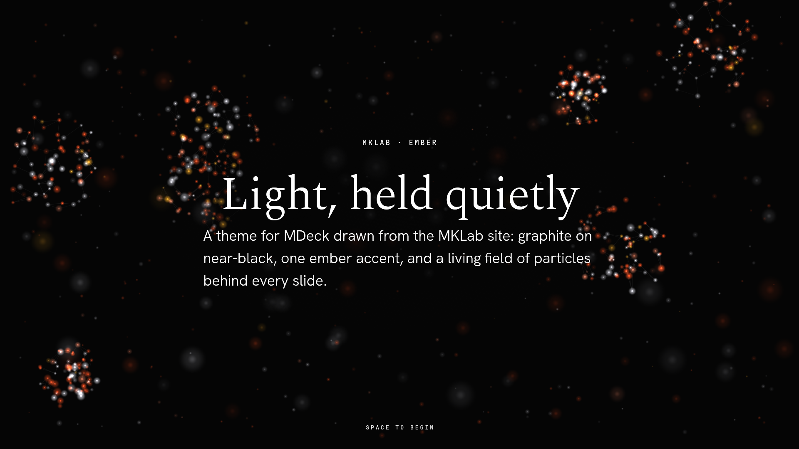
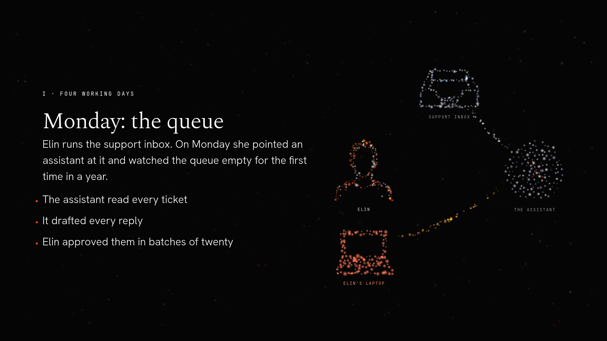
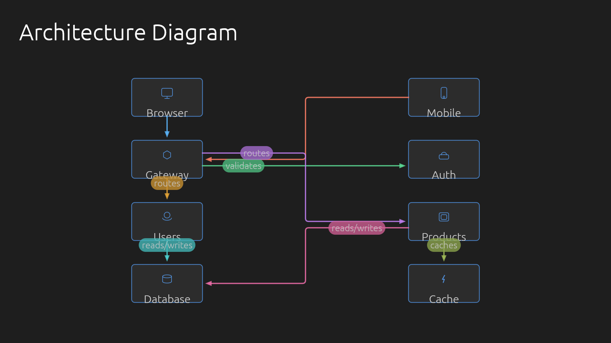
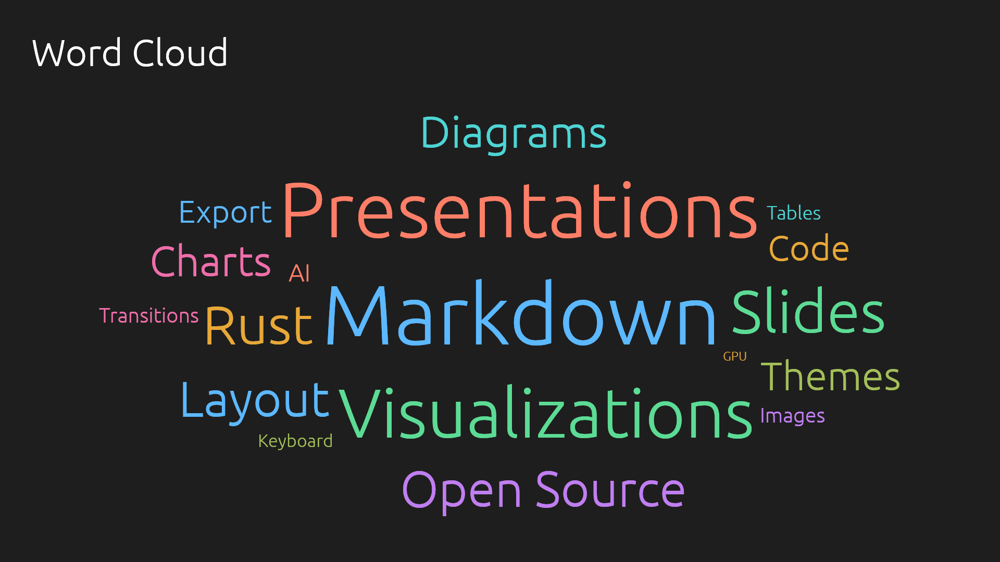
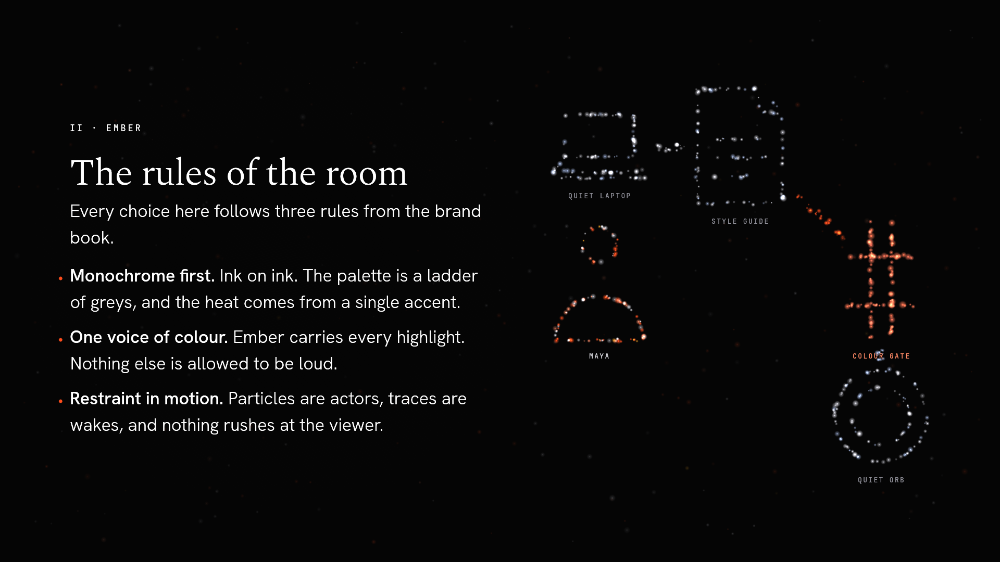
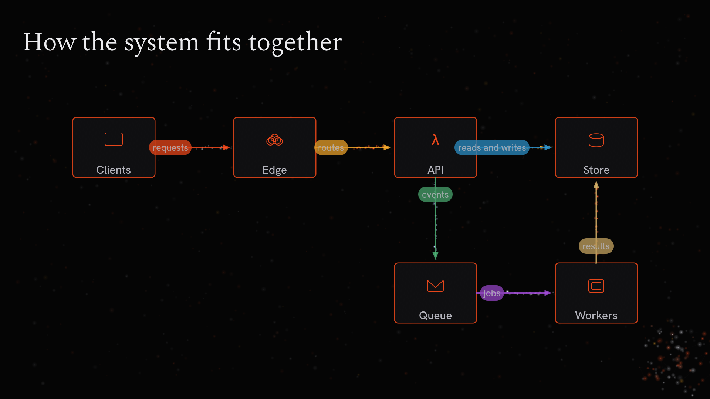

<p align="center">
  
</p>

<h1 align="center">MDeck</h1>

<p align="center">
  Stunning presentations from plain markdown.<br>
  Write the content. MDeck does the design.
</p>

<p align="center">
  <a href="https://github.com/mklab-se/mdeck/actions/workflows/ci.yml"></a>
  <a href="https://crates.io/crates/mdeck"></a>
  <a href="https://github.com/mklab-se/mdeck/releases/latest"></a>
  <a href="https://github.com/mklab-se/homebrew-tap/blob/main/Formula/mdeck.rb"></a>
  <a href="https://github.com/mklab-se/mdeck/blob/main/LICENSE.md"></a>
</p>

<p align="center">
  <a href="GALLERY.md"><strong>Gallery</strong></a> &middot;
  <a href="crates/mdeck/doc/mdeck-spec.md"><strong>Format Spec</strong></a> &middot;
  <a href="CHANGELOG.md"><strong>Changelog</strong></a> &middot;
  <a href="BACKLOG.md"><strong>Roadmap</strong></a>
</p>

---

## Why MDeck?

You already write markdown: notes, READMEs, design docs, meeting minutes. MDeck
turns any of those into a polished, animated presentation, with nothing to
install in your document and nothing to learn beyond a handful of conventions.

- **Any `.md` file is presentable.** Headings split slides, and each slide picks
  its own layout from what it contains: title, section, bullets, code, quote,
  image, gallery, two-column, table, or diagram. Long slides scroll instead of
  overflowing.
- **Seventeen visualizations from plain text.** Bar, line, pie, donut, stacked,
  scatter, radar, funnel, KPI cards, progress bars, timelines, word clouds, Venn
  diagrams, org charts, Gantt charts, git graphs, and routed architecture
  diagrams. Every one animates in and supports step-by-step reveal.
- **A real presenter tool.** Smooth transitions, grid overview, blackout,
  freehand pen and arrow annotations, live reload while you edit, speaker
  notes, multi-monitor support, and clicker-friendly keys.
- **Pixel-exact export.** `mdeck export` renders every slide to PNG at any
  resolution, on any display, ready for slides.com, a PDF, or a README like
  this one.
- **AI when you want it.** Turn a PDF, DOCX, or a one-line prompt into a full
  deck with speaker notes, and generate images and diagram icons in your own
  style. Everything is optional and lives behind `mdeck ai`.
- **Ember.** A theme with a living field of glowing particles behind every
  slide that follows your content, tells stories you describe in English, and
  opens with a countdown. See [Ember](#ember) below.
- **Built in Rust.** A single fast binary, GPU-accelerated rendering, 60 fps
  animations, no runtime dependencies.

<p align="center">
  &nbsp;&nbsp;
  
</p>
<p align="center">
  &nbsp;&nbsp;
  
</p>

<p align="center"><em>See the <a href="GALLERY.md">Gallery</a> for every layout and visualization type.</em></p>

---

## Sixty-second start

Install:

```bash
brew install mklab-se/tap/mdeck      # macOS / Linux
cargo install mdeck                  # anywhere with Rust 1.95+
cargo binstall mdeck                 # pre-built binary via cargo-binstall
```

Or download a binary for macOS (Intel and Apple Silicon), Linux, or Windows
from [GitHub Releases](https://github.com/mklab-se/mdeck/releases).

`cargo install` builds from source; on Windows that needs [NASM](https://www.nasm.us/) and
[CMake](https://cmake.org/) on `PATH` (plus the Visual Studio Build Tools most Rust installs already
have) to compile [`aws-lc-rs`](https://github.com/aws/aws-lc-rs), the TLS crypto backend used
transitively via `ailloy`. macOS and Linux need nothing extra, and `brew install` / `cargo binstall`
skip this entirely by using a pre-built binary.

<details>
<summary>Software bill of materials (SBOM)</summary>

Every release archive has a matching CycloneDX 1.5 SBOM listing the exact crate versions
compiled into that platform's binary:

```
mdeck-vX.Y.Z-<target>.cdx.json
```

The binaries are also built with [`cargo auditable`](https://github.com/rust-secure-code/cargo-auditable),
so the dependency list travels inside the executable itself. Check a downloaded binary against the
RustSec advisory database with:

```sh
cargo install cargo-audit --features=fix
cargo audit bin ./mdeck
```

`syft` and `trivy` also understand this format.

</details>

Write `talk.md`:

```markdown
---
title: "My Talk"
@theme: dark
---

# Welcome

The first heading with a subtitle becomes a title slide.

## Key Points

- Write in standard markdown
- Headings start new slides
+ Items marked with `+` reveal one step at a time

## Traffic by Region

​```@barchart
- Europe: 42
- Americas: 35
- Asia: 23
​```

## Architecture

​```@architecture
- Client -> API: requests
- API -> Database: queries
​```
```

Present it:

```bash
mdeck talk.md
```

Edit the file while presenting and MDeck reloads it in place, staying on the
current slide.

---

## Presenting

| Key | Action |
|-----|--------|
| Space, N, Right, PageDown, Enter | Next slide or reveal step |
| P, Left, PageUp, Backspace | Previous slide |
| Up, Down, scroll wheel | Scroll a long slide |
| Home, End | First / last slide |
| G | Grid overview (click a slide to jump to it) |
| T | Cycle transition (slide, fade, spatial, none) |
| Shift+T | Cycle theme (light, dark, nord, ember) |
| F | Toggle fullscreen |
| M | Move to the next monitor |
| `.` or B | Blackout |
| H | Presenter HUD with shortcuts (and the current story beat's line) |
| S | Ember: write an AI story for this slide |
| Esc | Clear drawings; press twice to quit (Q twice and Ctrl+C twice also quit) |

| Mouse | Action |
|-------|--------|
| Left click | Next slide |
| Right click | Previous slide |
| Left drag | Freehand pen |
| Right drag | Arrow |

Drawings fade away after a few seconds. Presentation clickers that send
PageUp/PageDown or Enter work out of the box, and keys pressed during a
transition are queued rather than lost.

Start options:

```bash
mdeck talk.md --windowed     # in a window instead of fullscreen
mdeck talk.md --slide 7      # start on slide 7
mdeck talk.md --overview     # start in the grid overview
mdeck talk.md --check        # validate the deck without opening a window
```

---

## Ember

Ember is MKLab's brand as a theme: graphite on near-black, one ember accent,
an editorial serif for headings, and a living field of glowing particles
behind every slide. Set `@theme: ember` and any deck you already have gets it.

<p align="center">
  &nbsp;&nbsp;
  
</p>

**The field follows your content.** A title slide opens on a constellation. A
bullet slide lights one cluster per item as you reveal them. Quotes burn like
a candle, code slides rain. On charts and diagrams the particles serve what is
drawn: embers rise off bars, runners travel the edges of a diagram, sparks
circle a pie. Behind it all the dark is space: a star field drifting slowly
forward, dust, a galaxy, or a nebula, rotating by slide so a run of bullet
slides never repeats itself. None of this needs a line of authoring.

**It can tell a story.** Describe a scene in English in a ```` ```@story ````
fence on a slide, run `mdeck ai story talk.md`, and the particles form a cast
of people and props with flows between them and beats you release with Space,
each with a line you can say out loud (`H` shows it). Scripts land in
`talk.scenes.yaml` next to the deck; edit one by hand and mark it
`pinned: true` to keep it. Stories play on bullet, content, quote and section
slides, where there is room beside the copy.

**It can draw a thing.** Put `@illustration: server` at the top of a slide
and the particles settle into a server beside the copy (behind it, faded, on
a title slide). Thirty-eight illustrations are built in, from `person` and `laptop`
to `robot`, `rocket`, `lightbulb` and `account`; `mdeck illustration generate --name server
--description "A server rack"` asks the image model for a new one and reduces
it to a point cloud file you keep next to the deck or in your user library.
Story casts draw from the same library, so a cloud you make can act in a
story too. Made one worth sharing? `mdeck illustration contribute <name>`
opens a prefilled issue; drag the file in and it can become a built-in.

**It opens and closes.** A 3-2-1 countdown counted in particles (any key
skips it, `@countdown: false` turns it off) and an ending where the field
spells THE END before it bursts into black. Nord gets a plain countdown too.

Try the decks in `samples/ember/`: plain text, visualizations, images,
illustrations, and stories. The format spec has the full vocabulary.

## Writing slides

### Slides and layouts

Three things create a new slide, and they combine freely:

1. A `---` line with blank lines around it
2. Three blank lines
3. A heading. If the file has one `#` title and `##` sections, both levels split; set `@slide-level: 2` in the frontmatter to control it explicitly.

Each slide gets a layout from its content:

| Content | Layout |
|---------|--------|
| Heading + subtitle | Title |
| Lone heading | Section divider |
| Heading + bullet list | Bullet |
| Heading + code block | Code |
| Blockquote + attribution | Quote |
| Single image | Full-screen image |
| Two or more images | Gallery |
| Bullets + image | Split layout |
| `+++` separator | Two columns |
| `@architecture` block | Architecture diagram |
| `@barchart`, `@piechart`, ... | Visualization |
| Anything else | Content |

Override with `@layout: name` on the first line of a slide when you want a
specific one.

### Progressive reveal

List items that start with `+` appear one per key press; `*` items appear
together with the previous `+` item. The same markers work inside every
visualization, so a bar chart can grow bar by bar and a diagram can build up
connection by connection.

### Math

Formulas are LaTeX between dollar signs, typeset with KaTeX's fonts and sharp
at any resolution: `$E = mc^2$` inline, `$$...$$` centred on its own line.

```markdown
The roots of $ax^2 + bx + c = 0$ are

$$x = \frac{-b \pm \sqrt{b^2 - 4ac}}{2a}$$
```

Dollar amounts such as `$5 and $10` stay text.

### Visualizations

Fenced code blocks with an `@` tag become charts:

| Type | Tag | Example line |
|------|-----|--------------|
| Bar chart | `@barchart` | `- Python: 48` |
| Line chart | `@linechart` | `- Revenue: 100, 150, 200` |
| Pie chart | `@piechart` | `- Frontend: 35%` |
| Donut chart | `@donutchart` | `- Complete: 78` |
| Stacked bar | `@stackedbar` | `- Product A: 40, 45, 50` |
| Scatter plot | `@scatter` | `- Alice: 80, 90` |
| Radar chart | `@radar` | `- Speed: 9, 7, 5, 3` |
| Funnel | `@funnel` | `- Visitors: 10000` |
| KPI cards | `@kpi` | `- Revenue: $4.2M (trend: +12%)` |
| Progress bars | `@progress` | `- Design: 100%` |
| Timeline | `@timeline` | `- 2024: Project launch` |
| Word cloud | `@wordcloud` | `- AI (size: 50)` |
| Venn diagram | `@venn` | `- Design & Business: Product` |
| Org chart | `@orgchart` | `- CEO -> CTO` |
| Gantt chart | `@gantt` | `- Design: 8d, after Research` |
| Git graph | `@gitgraph` | `- branch main -> develop` |
| Architecture | `@architecture` | `- Client -> Server: requests` |

Values may carry units and separators (`$4,200`, `12%`, `40 users`). Charts
pick round axis limits, size their labels to fit, and share one colour palette
per theme. Options such as `# x-label:`, `# orientation: horizontal`, or
`# axes:` go on comment lines inside the block; the
[format spec](crates/mdeck/doc/mdeck-spec.md) lists them all.

### Architecture diagrams

```markdown
​```@architecture
- Browser   (icon: browser,  pos: 1,1)
- API       (icon: api,      pos: 2,1)
- Database  (icon: database, pos: 2,2)

- Browser -> API: requests
- API -> Database: queries
​```
```

Grid or automatic placement, 20+ built-in icons, five arrow types
(`->`, `<-`, `<->`, `--`, `-->`), colour-coded labels, and A* routed edges
that avoid nodes and each other. Node icons can also be AI-generated.

### Themes and transitions

Built-in themes **light**, **dark**, **nord** and **ember**; transitions
**slide**, **fade**, **spatial**, and **none**. Set them in the frontmatter or cycle them
live with `Shift+T` and `T`. Every theme draws symbols (①, ✓, →) from bundled fallback
faces, and Chinese, Japanese and Korean from a font on your system (`mdeck --check` tells
you if none was found):

```yaml
---
@theme: dark
@transition: spatial
---
```

### Speaker notes

Everything after a `???` line is a note for the presenter and is never shown
on screen. AI-generated decks include detailed notes on every slide.

```markdown
# Key Decision

- We chose microservices for team autonomy

???

Emphasise that this was about letting teams ship independently, not scale.
```

### Images

Standard markdown images work, with optional directives in the alt text:
`@fill`, `@fit`, `@width:80%`, `@left`, `@right`. A slide with one image
becomes a full-screen image slide, two to four become a gallery, and bullets
plus an image become a split layout. Images decode in the background, so big
photos never stall a transition.

---

## Export

```bash
mdeck export talk.md                              # slide-01.png ... at 1920x1080
mdeck export talk.md --width 3840 --height 2160   # 4K
mdeck export talk.md --output-dir slides/         # choose the folder
mdeck export talk.md --debug                      # one PNG per reveal step
mdeck export talk.md --slide 7                    # just slide 7 (file names keep the deck numbering)
mdeck export talk.md --range 3-5 --debug          # slides 3 to 5, every step
```

Output is always exactly the requested size, independent of your screen's
size or DPI: slides larger than the display are rendered in tiles and stitched.

---

## AI features

MDeck uses [ailloy](https://github.com/mklab-se/ailloy) to talk to OpenAI,
Anthropic, Azure OpenAI, Ollama, and others. Run `mdeck ai enable` once to
pick a provider; everything below is optional.

### Create a presentation from anything

```bash
mdeck ai create --input "Git Flow for software teams" --output git-flow/
mdeck ai create --input company-report.pdf --output report.md
mdeck ai create --input camera-manual.docx --output manual.md
cat research-notes.txt | mdeck ai create --output research.md
mdeck ai create -i --input environment-report.md        # interactive: audience, purpose, mood
mdeck ai create --input hobbits.md --prompt "For 10-year-olds, focus on the adventures"
```

MDeck extracts the text, analyses it for key points and visualization
opportunities, and writes a concise deck with varied layouts, charts, image
placeholders, and speaker notes. The source stays the handout; the deck tells
the story.

### Generate images

Add placeholders, then generate them all at once:

```markdown

```

```bash
mdeck ai generate slides.md          # generates every placeholder, rewrites the paths
mdeck ai generate-image --prompt "A database server" --icon --output db.png
```

Control the look with named styles or an inline description:

```yaml
---
@image-style: "Cinematic photography, vivid colours, dramatic lighting"
@icon-style: "Clean minimalist icon, subtle 3D feel"
---
```

```bash
mdeck ai style add Cinematic "Vivid colours, dramatic lighting, sweeping vistas"
mdeck ai style set-default Cinematic
mdeck ai style list
```

Diagram nodes can request their own icons:

```markdown
- Gateway (icon: generate-image, prompt: "An API gateway router")
```

### AI agents

`mdeck ai skill` prints a setup guide for coding agents such as Claude Code;
`mdeck ai skill --emit` writes a ready-to-use skill file and
`mdeck ai skill --reference` prints the complete format reference for an
agent to read.

---

## Command reference

```bash
mdeck <file.md>                    # present (add --windowed, --slide N, --overview, --check)
mdeck export <file.md>             # PNG export (--width, --height, --output-dir, --debug, --slide, --range)
mdeck illustration generate --name <n> --description "..."  # New point cloud illustration via AI (--user, --force)
mdeck illustration import <image> --name <n>                # Convert an image of light strokes on dark
mdeck illustration list            # Every illustration visible from here (deck, user, built-in)
mdeck illustration show <n>        # Preview an illustration
mdeck illustration contribute <n>  # Offer one to the built-in set (prefilled GitHub issue, --no-open)
mdeck spec                         # full format specification
mdeck spec --short                 # quick reference card
mdeck config show                  # show configuration
mdeck config set <key> <value>     # defaults.theme, defaults.transition, defaults.start_mode, ...
mdeck completion <shell>           # bash, zsh, fish, powershell
mdeck version                      # version banner

mdeck ai                           # AI status
mdeck ai enable | disable | test   # provider setup and check
mdeck ai config                    # interactive provider and model wizard
mdeck ai create ...                # deck from a file, prompt, or stdin
mdeck ai generate <file.md>        # generate all image placeholders (--force, --style)
mdeck ai generate-image --prompt   # single image (--icon, --output, --style)
mdeck ai style list | add | remove | clear | set-default | set-icon-default | show-defaults
mdeck ai skill [--emit | --reference]
```

Global flags: `-q/--quiet`, `-v/--verbose`, `--no-color`.

Shell completions:

```bash
mdeck completion zsh > ~/.zfunc/_mdeck        # static
source <(COMPLETE=zsh mdeck)                  # dynamic (recommended)
```

---

## Documentation

- **[Gallery](GALLERY.md)** shows every layout and visualization as exported slides.
- **[Format specification](crates/mdeck/doc/mdeck-spec.md)** is the complete reference for the markdown dialect, directives, visualization syntax, diagram features, and keyboard shortcuts. It is embedded in the binary: `mdeck spec`.
- **[Changelog](CHANGELOG.md)** lists what changed in each release.
- **[Roadmap](BACKLOG.md)** collects larger ideas and open decisions.
- **[Contributing](CONTRIBUTING.md)** explains how to work on MDeck.

---

## Development

```bash
cargo build                                 # build
cargo test --workspace                      # tests
cargo clippy --workspace --all-targets -- -D warnings   # lint (CI-enforced)
cargo fmt --all -- --check                  # formatting (CI-enforced)
cargo run -p mdeck -- samples/gallery.md    # run the app on a sample
```

Sample decks live in `samples/`, with one file per layout and visualization
type for quick visual checks.

## Releasing

Releases are driven by the [`/release`](.claude/skills/release/SKILL.md) skill (run it in Claude
Code with `major`, `minor`, or `patch`). It updates the toolchain and dependencies, runs the CI
gates, bumps the version, updates the changelog, then commits, pushes, and tags `vX.Y.Z`. Pushing
the tag triggers `.github/workflows/release.yml`, which:

1. Re-runs the full CI suite
2. Builds [auditable](https://github.com/rust-secure-code/cargo-auditable) binaries for Linux, macOS
   (Intel + ARM), and Windows, with a CycloneDX SBOM per target
3. Creates a GitHub Release with the archives and SBOMs (see the
   [SBOM notes](#sixty-second-start) above for how to read them)
4. Publishes `mdeck` to crates.io
5. Updates the Homebrew formula in [`mklab-se/homebrew-tap`](https://github.com/mklab-se/homebrew-tap)

### Required secrets

Configure these once on the GitHub repository (the same secrets are used by the other MKLab tools):

| Secret | Where | Purpose | How to create |
| --- | --- | --- | --- |
| `CARGO_REGISTRY_TOKEN` | Environment **`crates-io`** | Publish to crates.io | [crates.io/settings/tokens](https://crates.io/settings/tokens) → new token with publish scope |
| `HOMEBREW_TAP_TOKEN` | Repository secret | Push the formula to the tap | A GitHub PAT with `repo` scope for `mklab-se/homebrew-tap` |

If `HOMEBREW_TAP_TOKEN` is missing, the release still succeeds — the Homebrew step just logs a warning.

---

## License

MIT
