<p align="center">
  
</p>

<h1 align="center">Beautiful presentations from plain markdown</h1>

<p align="center">
  Write your talk in any markdown editor. MDeck turns it into slides that look amazing:<br>
  laid out, animated and themed, with charts, diagrams, illustrations and seven presentation engines.
</p>

<p align="center">
  <a href="https://github.com/mklab-se/mdeck/actions/workflows/ci.yml"></a>
  <a href="https://crates.io/crates/mdeck"></a>
  <a href="https://github.com/mklab-se/mdeck/releases/latest"></a>
  <a href="https://github.com/mklab-se/homebrew-tap/blob/main/Formula/mdeck.rb"></a>
  <a href="https://github.com/mklab-se/mdeck/blob/main/LICENSE.md"></a>
</p>

<p align="center">
  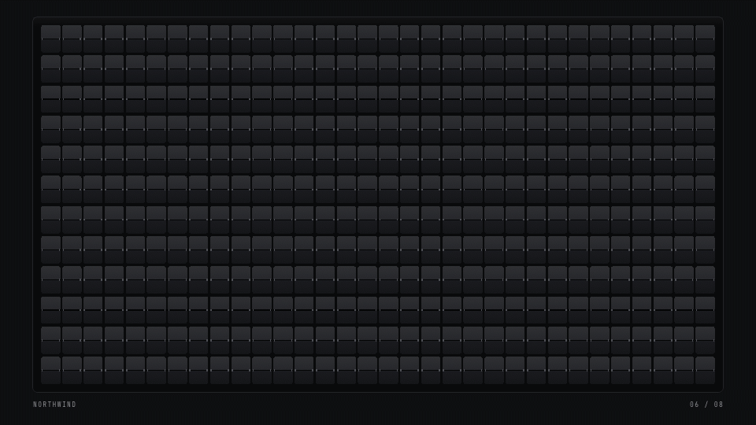
  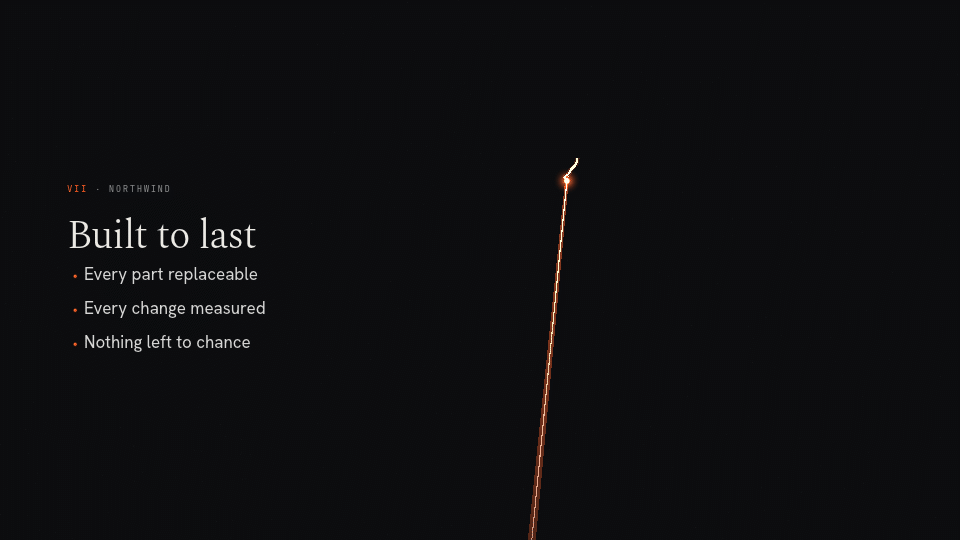
</p>

<p align="center"><em>Every slide on this page comes from one markdown file,
<a href="samples/showcase/launch.md">samples/showcase/launch.md</a>, in different themes and engines.</em></p>

<table>
  <tr>
    <td width="50%">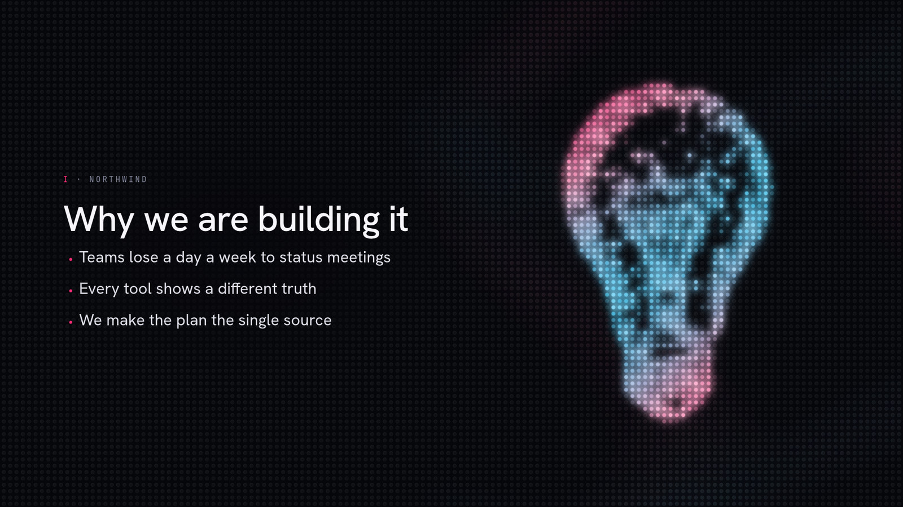<br><sub><b>LED wall</b>: illustrations power on LED by LED</sub></td>
    <td width="50%">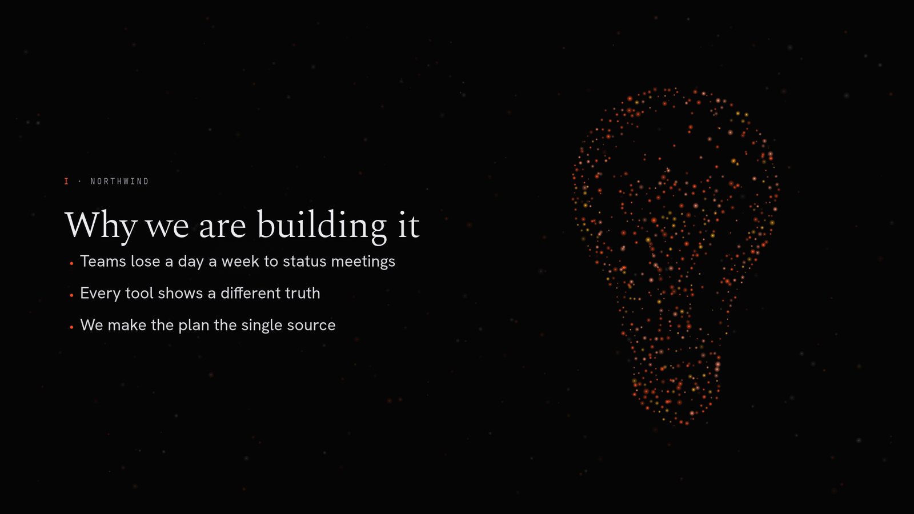<br><sub><b>Ember</b>: the same slide in a living field of particles</sub></td>
  </tr>
  <tr>
    <td>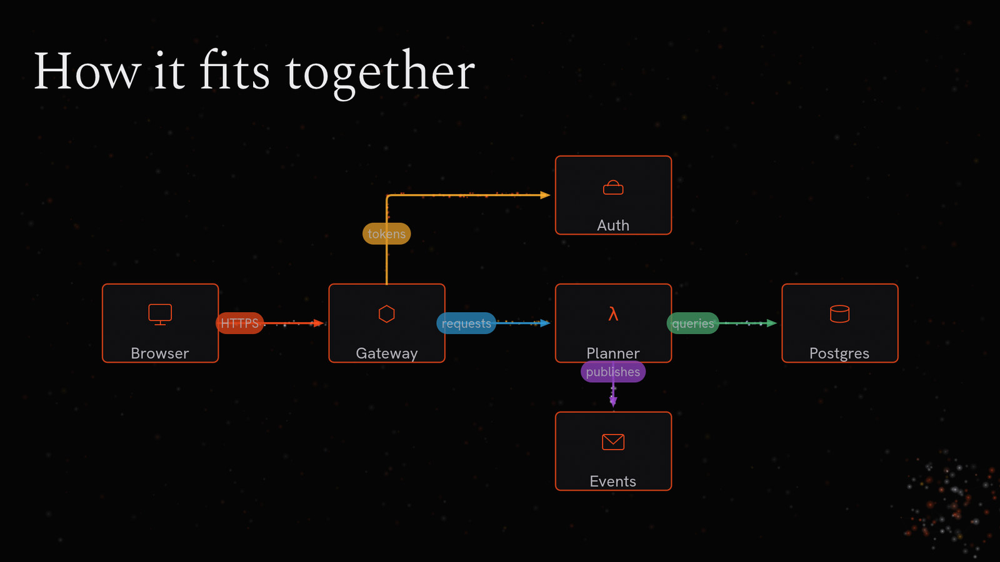<br><sub><b>Architecture diagrams</b> from a few lines of text, edges routed for you</sub></td>
    <td><br><sub><b>Departure board</b>: every slide on split flaps</sub></td>
  </tr>
  <tr>
    <td>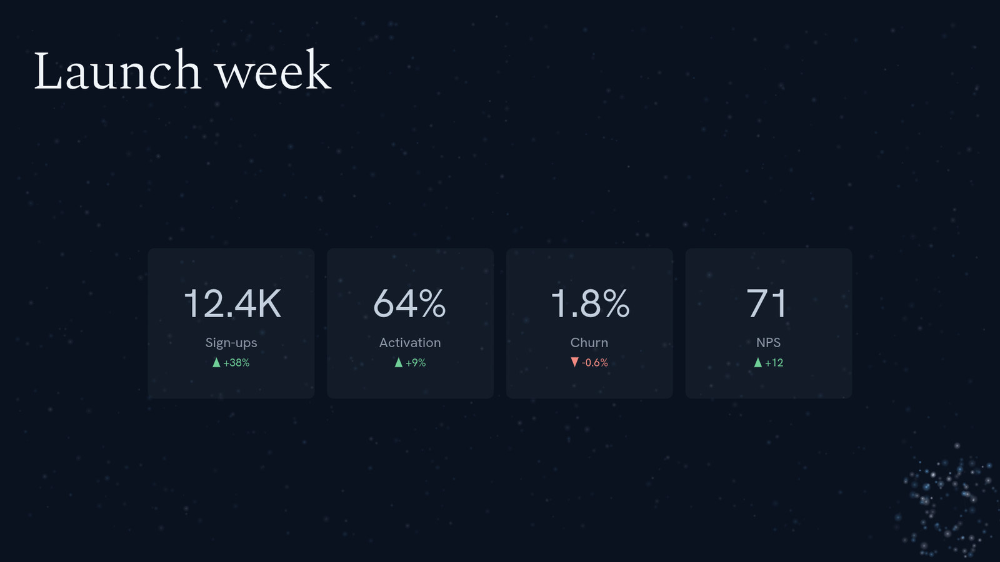<br><sub><b>KPI cards</b> on the Winter theme</sub></td>
    <td>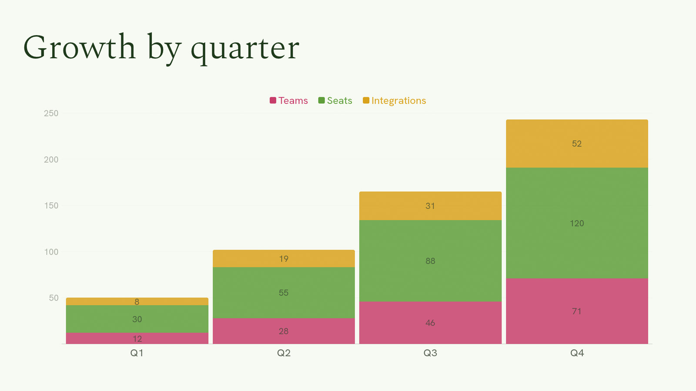<br><sub><b>Seventeen charts</b>, here on the Spring theme</sub></td>
  </tr>
  <tr>
    <td>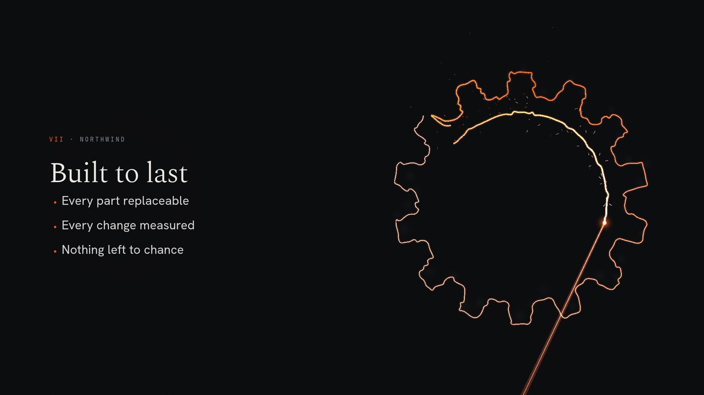<br><sub><b>Laser</b>: a beam etches each illustration</sub></td>
    <td>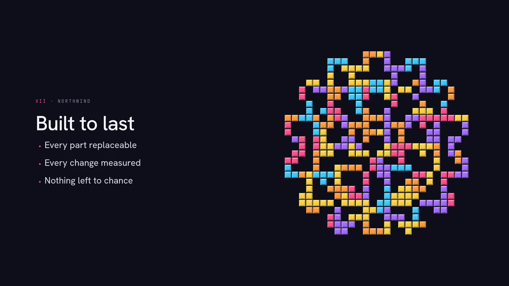<br><sub><b>Falling blocks</b>: pictures built block by block</sub></td>
  </tr>
  <tr>
    <td>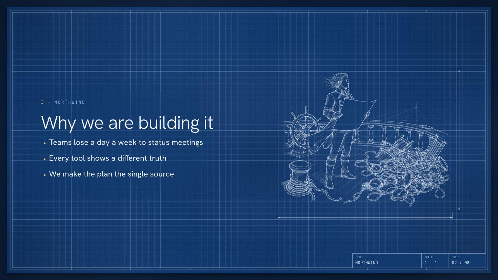<br><sub><b>Blueprint</b>: a drawing made for every slide with <code>mdeck ai art</code></sub></td>
    <td>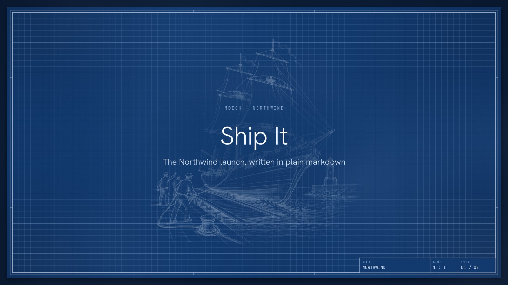<br><sub>The title sheet, its drawing dim behind the copy</sub></td>
  </tr>
</table>

<p align="center"><a href="GALLERY.md"><strong>See the full gallery</strong></a></p>

---

## From this

```markdown
# Why we are building it
@illustration: lightbulb

- Teams lose a day a week to status meetings
- Every tool shows a different truth
- We make the plan the single source
```

## To this

<p align="center">
  
</p>

No layout, no design work: the heading starts a slide, the list makes it a
bullet slide, `@illustration` puts a picture beside it, and the theme (here
`marquee`, on the LED engine) does the rest. Change one line to
`@theme: ember` and the same slide becomes a field of glowing particles.

---

## Get started

**1. Install** (macOS, Linux or Windows; [more options](docs/install.md))

```bash
brew install mklab-se/tap/mdeck      # or: cargo install mdeck
```

**2. Write `talk.md`**

````markdown
---
title: "My Talk"
@theme: ember
---

# Hello, MDeck
@illustration: rocket

Presentations from plain markdown

# Why it works

- Headings start new slides
- Layouts are picked for you
+ Items marked with `+` appear one at a time

# Where we are

```@barchart
- Europe: 42
- Americas: 35
- Asia: 23
```
````

**3. Present it**

```bash
mdeck talk.md
```

Space moves forward, `G` shows every slide, `Shift+T` cycles themes and `Esc`
twice quits. Keep MDeck open on a second screen while you write: every time you
save, the slide you are looking at updates.

**4. Share it**

```bash
mdeck export talk.md --format pdf    # export/talk.pdf, one page per slide
```

**New here?** The [tutorial](docs/tutorial.md) builds a first presentation step
by step, with a picture of every step: themes, charts, diagrams,
illustrations, engines, and how to keep MDeck open on a second screen so it
updates every time you save.

---

## Why MDeck

- **Any markdown file is a deck.** Headings split slides and every slide picks
  its layout from its content. Nothing to learn but a few conventions.
  [Writing slides](docs/writing-slides.md)
- **Charts and diagrams from text.** Seventeen visualizations, from bar charts
  to Gantt charts and routed architecture diagrams, all animated.
  [Visualizations](docs/visualizations.md)
- **Thirteen themes, and yours.** Your brand in a few lines of YAML, or converted
  from your design system. [Themes](docs/themes.md)
- **Seven engines.** A particle field, an LED wall, a departure board, a laser,
  falling blocks, a blueprint that inks a drawing made for every slide, or a
  clean flat page: one line switches. [Engines](docs/engines.md)
- **A real presenter tool.** Transitions, grid overview, pen and arrows,
  speaker notes, multiple monitors, clickers. [Presenting](docs/presenting.md)
- **Pixel-perfect export.** PNG at any resolution, and PDF with or without
  speaker notes. [Export](docs/export.md)
- **AI when you want it.** A full deck from a PDF, a document or one sentence;
  images and icons in your own style; a drawing made for every slide, generated
  once and presented offline. [AI features](docs/ai.md)
- **One fast binary.** Written in Rust, GPU rendered, 60 fps, no runtime
  dependencies.

---

## Learn more

| Page | What is in it |
|---|---|
| [Tutorial](docs/tutorial.md) | Your first presentation, step by step, with pictures |
| [Install](docs/install.md) | Homebrew, cargo, binaries, Windows notes, SBOMs |
| [Writing slides](docs/writing-slides.md) | Slides, layouts, reveal, math, images, speaker notes |
| [Visualizations](docs/visualizations.md) | Every chart and diagram, with its syntax |
| [Themes](docs/themes.md) | Built-in themes, your own theme, logos, design systems |
| [Engines](docs/engines.md) | Ember's particles, stories and illustrations, and the other engines |
| [Presenting](docs/presenting.md) | Keys, mouse, start options |
| [Export](docs/export.md) | PNG and PDF |
| [AI features](docs/ai.md) | Decks from documents, image generation, art for every slide, AI agents |
| [Commands](docs/commands.md) | Every command and flag |
| [Gallery](GALLERY.md) | Every layout, visualization, theme and engine as exported slides |
| [Format specification](crates/mdeck/doc/mdeck-spec.md) | The complete reference (also `mdeck spec`) |
| [Changelog](CHANGELOG.md) and [Roadmap](BACKLOG.md) | What changed, and what is next |
| [Contributing](CONTRIBUTING.md), [Development](docs/development.md), [Writing an engine](crates/mdeck/doc/engines.md) | Working on MDeck itself |

---

## License

MIT
