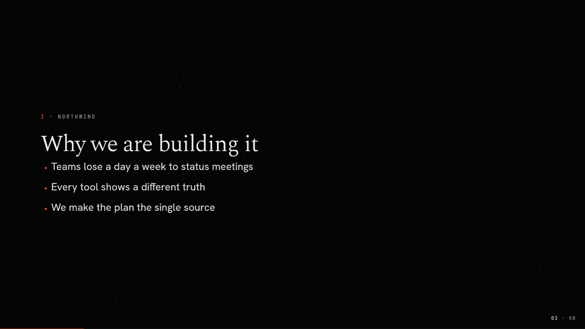
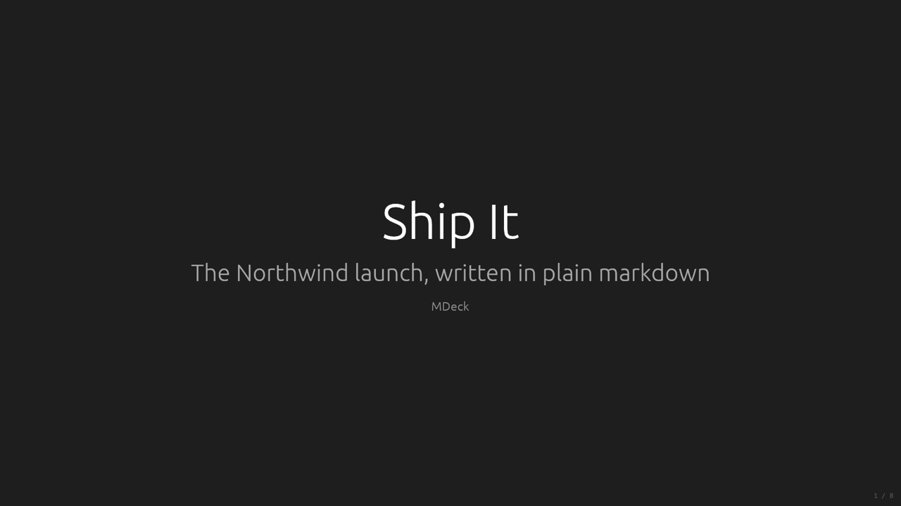
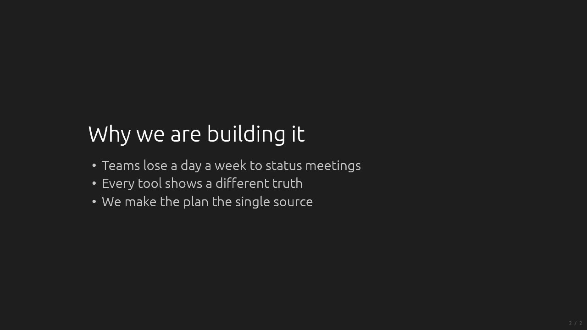
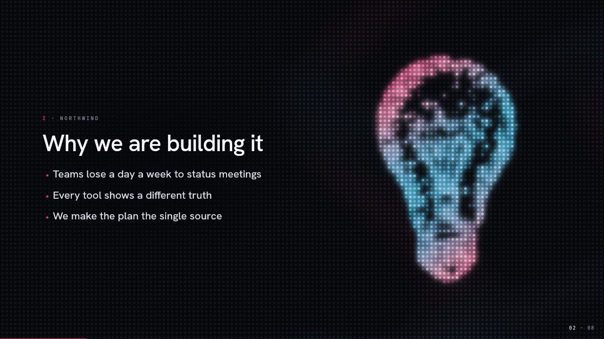
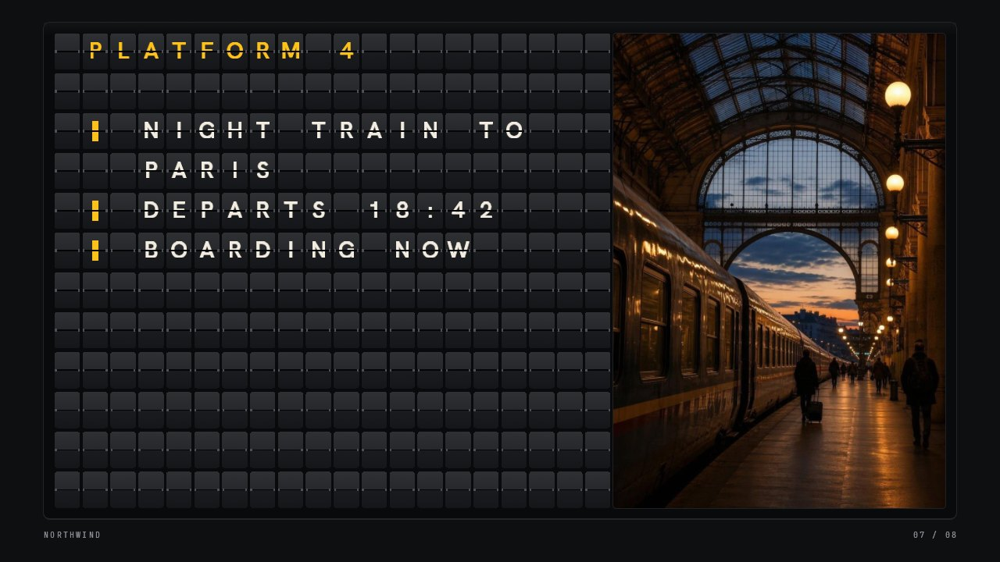
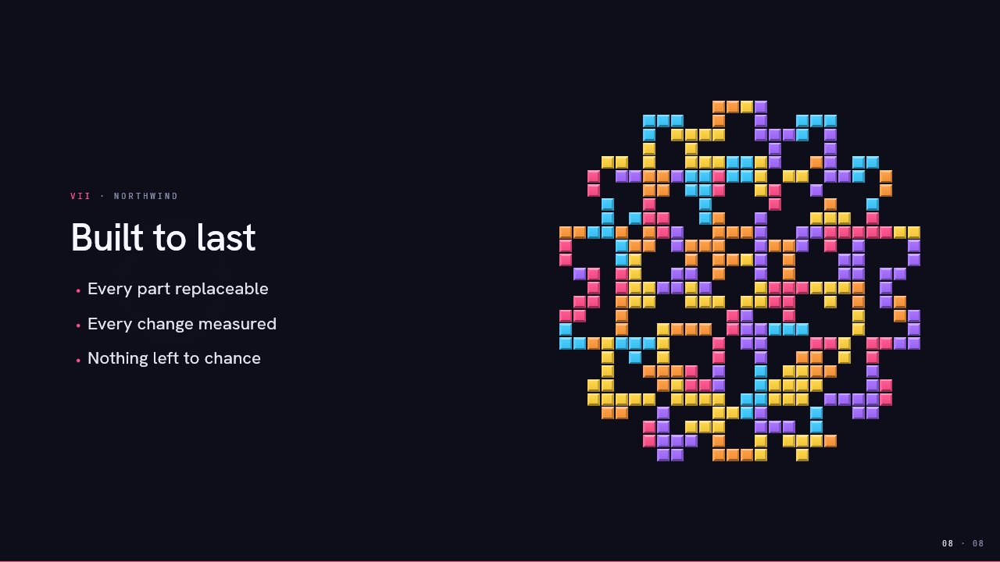
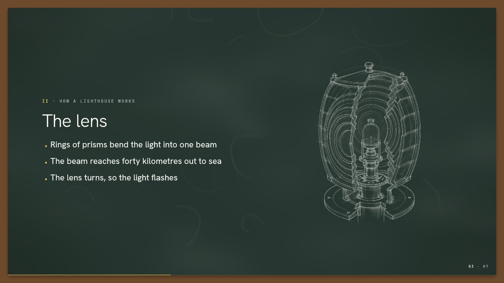
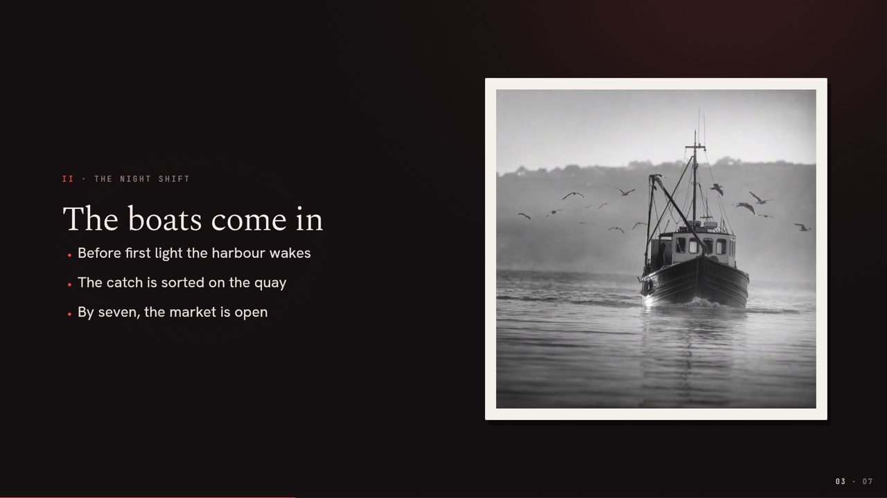
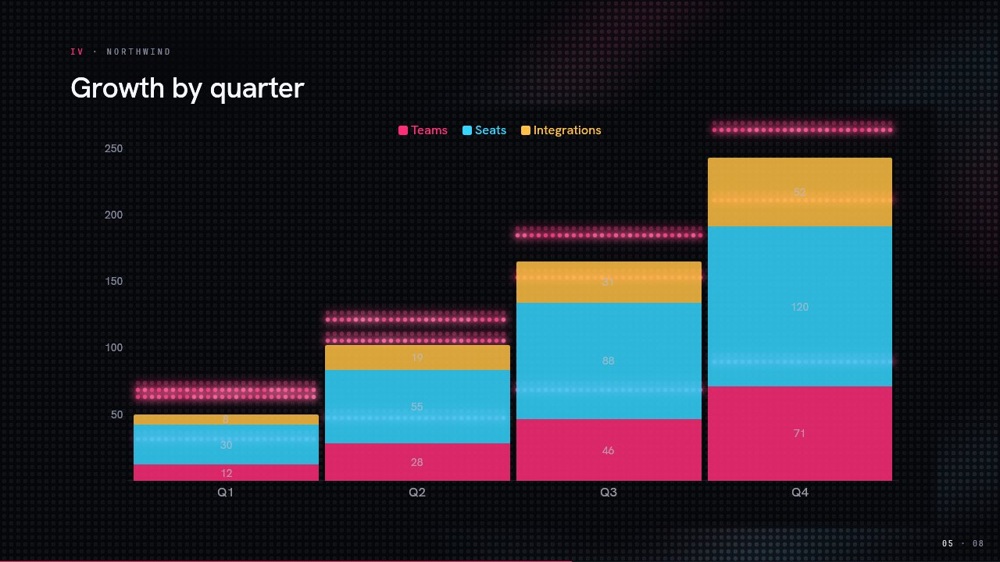
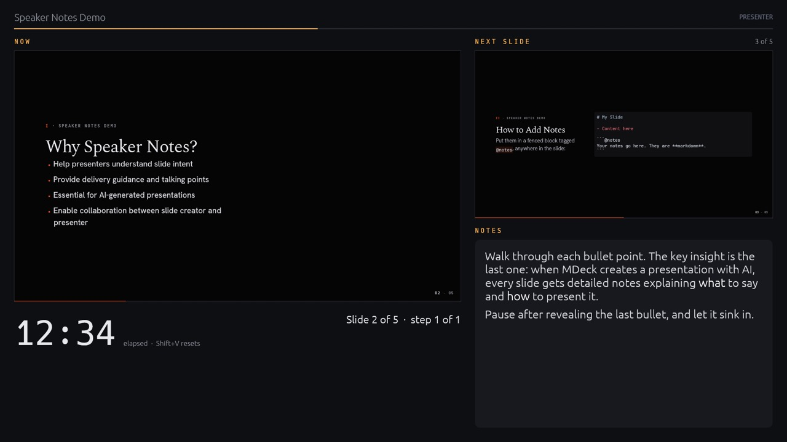

<p align="center">
  
</p>

<h1 align="center">Markdown in. A presentation people remember out.</h1>

<p align="center">
  Write your talk as an ordinary markdown file. mdeck reads its structure, picks a design for every
  slide and presents it: still and clean, or alive with particles, LEDs, split flaps and ink.
</p>

<p align="center">
  <a href="https://github.com/mklab-se/mdeck/actions/workflows/ci.yml"></a>
  <a href="https://crates.io/crates/mdeck"></a>
  <a href="https://github.com/mklab-se/mdeck/releases/latest"></a>
  <a href="https://github.com/mklab-se/homebrew-tap/blob/main/Formula/mdeck.rb"></a>
  <a href="https://github.com/mklab-se/mdeck/blob/main/LICENSE.md"></a>
</p>

<p align="center">
  
</p>

<p align="center">
  <strong>mdeck 2</strong> is here: slide designs recognised from your content, a presenter view,
  cleaner markdown and private extensions.<br>
  <a href="CHANGELOG.md"><strong>What's new</strong></a> &middot;
  <a href="docs/upgrading-from-v1.md">Upgrading from v1</a> &middot;
  <a href="GALLERY.md">Gallery</a>
</p>

---

## Sixty seconds to your first talk

**Install** (macOS, Linux or Windows; [all options](docs/install.md))

```bash
brew install mklab-se/tap/mdeck      # or: cargo install mdeck
```

**Write** `talk.md`, in any editor:

```markdown
# Ship It

The Northwind launch

## Why we are building it

- Teams lose a day a week to status meetings
- Every tool shows a different truth
- We make the plan the single source
```

**Present** it:

```bash
mdeck talk.md
```

That is all you need to know. Space moves forward, `G` shows every slide and `Esc` twice quits.
Keep mdeck open while you write: every time you save, the slide on screen updates.

<p align="center">
  
  
</p>

<p align="center"><em>A plain file opens in the default theme: dark, calm and readable.</em></p>

---

## Make it yours

Add one line to the top of the file and the same slides become a different show:

```yaml
---
theme: ember
---
```

<table>
  <tr>
    <td width="50%"><br><sub><b>ember</b>: a living field of particles that forms your pictures</sub></td>
    <td width="50%"><br><sub><b>marquee</b>: a wall of RGB LEDs</sub></td>
  </tr>
  <tr>
    <td><br><sub><b>departures</b>: every slide on split flaps</sub></td>
    <td><br><sub><b>stack</b>: pictures built block by block</sub></td>
  </tr>
  <tr>
    <td><br><sub><b>thermal</b>: infrared images with palettes and measured spots</sub></td>
    <td><br><sub><b>blueprint</b>: line art inked on a drafting sheet</sub></td>
  </tr>
  <tr>
    <td><br><sub><b>chalkboard</b>: drawn in chalk on a slate</sub></td>
    <td><br><sub><b>sketchbook</b>: pencilled in as the slide opens</sub></td>
  </tr>
  <tr>
    <td><br><sub><b>watercolour</b>: paintings that bloom on the page</sub></td>
    <td><br><sub><b>darkroom</b>: photographs that develop under a safelight</sub></td>
  </tr>
</table>

A **theme** is the look: colours, fonts, a design set and an engine. The **engine** is what moves
behind and around your slides. mdeck has ten:

| Engine | What it does | Themes |
|---|---|---|
| `plain` | A still, clean page | `dark` (the default), `light`, `nord` |
| `particles` | A field of particles that forms pictures and reacts to charts | `ember`, with the variants `autumn` and `winter` |
| `led` | A wall of RGB LEDs | `marquee` |
| `splitflap` | Every slide on a departure board | `departures` |
| `blocks` | Pictures built from falling blocks | `stack` |
| `thermal` | A heat field; headings form in heat | `thermal` |
| `line` | Line art on a sheet or a slate | `blueprint`, `chalkboard` |
| `sketch` | Graphite on a sketchbook page | `sketchbook` |
| `watercolour` | Paint that blooms on paper | `watercolour` |
| `darkroom` | Prints that develop in a tray | `darkroom` |

`Shift+T` cycles themes while you present, and `mdeck talk.md --theme marquee` tries one without
touching the file. Your own theme is a short YAML file next to the deck.
[Themes](docs/themes.md) &middot; [Engines](docs/engines.md)

---

## What your markdown becomes

**A design for every slide, recognised from what is on it.** A heading and a sentence is a
statement in large type, a heading and a list is a points slide, an image beside text is a split,
a quote is a quote. Thirteen designs in all, and nothing you write is ever dropped. When you want
a say, it goes in a comment that GitHub never shows: `<!-- design: quote -->`.
[Writing slides](docs/writing-slides.md)

**Charts and diagrams from fenced blocks.** Twenty kinds, from bar charts and Gantt charts to
routed architecture diagrams and thermal images, drawn in the theme's colours and animated in
steps.

````markdown
```@bar
+ Status meetings: 6
+ Updating slides: 4
+ Writing the talk: 2
```
````

<p align="center">
  
  
</p>

[Visualizations](docs/visualizations.md)

**Steps and notes, in plain markdown.** Items written with `+` appear one press at a time; a
```` ```@notes ```` block holds speaker notes, written in markdown.

**A presenter view.** `V` opens your notes, the next slide and a timer on a second screen. Jump to
any slide by typing its number, draw on the slide with the mouse, black out the room with `B`.
[Presenting](docs/presenting.md)

<p align="center">
  
</p>

**Export that matches the screen.** PNG at any resolution, and PDF with or without notes pages,
showing exactly what the window shows. [Export](docs/export.md)

```bash
mdeck export talk.md --format pdf --notes
```

**A check that tells you what will not show.** `mdeck --check talk.md` reports misspelt settings
with a "did you mean", content that will not show as written, and v1 syntax with its v2 form.

---

## Extend it, privately

mdeck is built to be extended by anyone, without forking it and without publishing anything.

- **Packs** bundle themes, designs, point clouds, styles and fonts: `mdeck pack install ./acme-brand`.
- **Rust extensions** add engines, visual kinds, design sets and transitions:
  `mdeck sdk new engine glow` starts one, and `mdeck build --with ./glow` builds your own mdeck
  with it.
- **Visuals in any language**: map a fence tag to a program that writes a PNG.

Start with the [SDK guide](docs/sdk/README.md) and its [getting started](docs/sdk/getting-started.md).

---

## AI, when you want it

Every AI feature is optional, runs on your own provider, and never runs while you present: what it
makes is stored next to the deck. `mdeck ai deck` writes a deck from a document or a sentence,
`mdeck ai images` fills `` placeholders, `mdeck ai pictures` draws a picture
for every slide on the art engines, and `mdeck ai skill` teaches your AI agent to write decks.
[AI features](docs/ai.md)

---

## Learn more

| Page | What is in it |
|---|---|
| [Tutorial](docs/tutorial.md) | Your first deck, step by step |
| [Install](docs/install.md) | Homebrew, cargo, binaries, Windows notes, SBOMs |
| [Writing slides](docs/writing-slides.md) | Slides, designs, settings, steps, notes, images, math |
| [Visualizations](docs/visualizations.md) | Every chart and diagram, with its syntax |
| [Themes](docs/themes.md) | Built-in themes, variants, design sets, your own theme, packs |
| [Engines](docs/engines.md) | The ten engines and the pictures they draw |
| [Presenting](docs/presenting.md) | Keys, mouse, the presenter view, start options |
| [Export](docs/export.md) | PNG and PDF |
| [AI features](docs/ai.md) | Decks, images, icons, pictures, styles, the agent skill |
| [Commands](docs/commands.md) | Every command and flag |
| [Upgrading from v1](docs/upgrading-from-v1.md) | Every v1 construct and its v2 form |
| [Gallery](GALLERY.md) | Every design, engine and visual as exported slides |
| [Sample decks](samples/README.md) | Decks for every feature |
| [Format reference](crates/mdeck/doc/mdeck-spec.md) | The complete format (also `mdeck spec`) |
| [SDK](docs/sdk/README.md) | Writing extensions in Rust |
| [Changelog](CHANGELOG.md) and [Roadmap](BACKLOG.md) | What changed, and what is next |
| [Contributing](CONTRIBUTING.md), [Development](docs/development.md) | Working on mdeck itself |

---

## License

MIT
