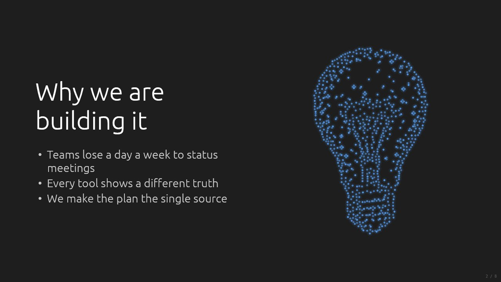
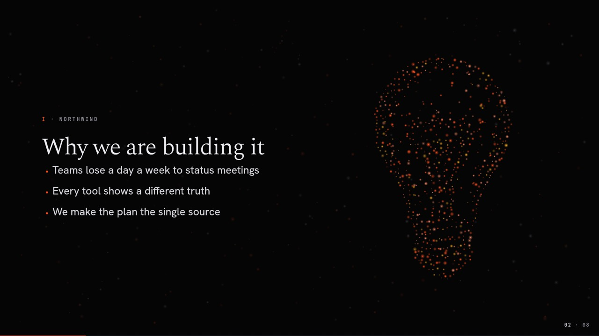
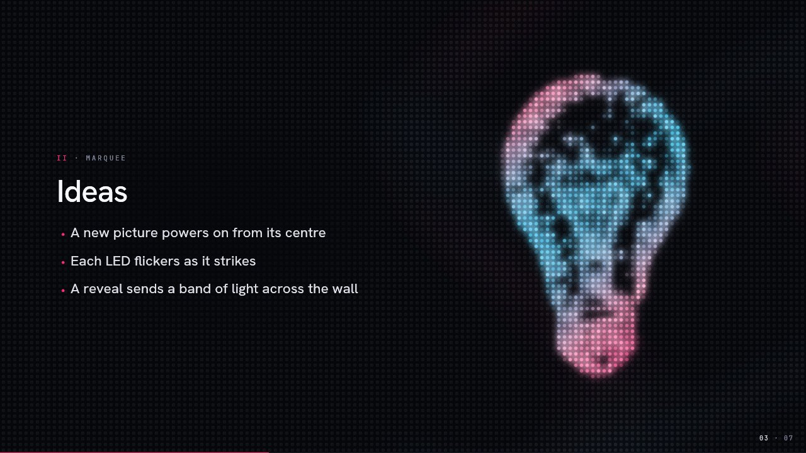
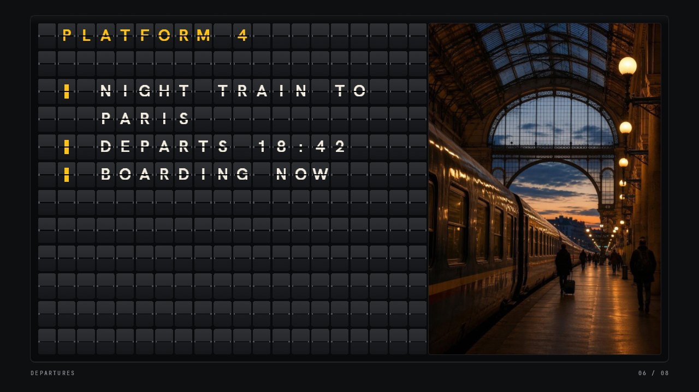
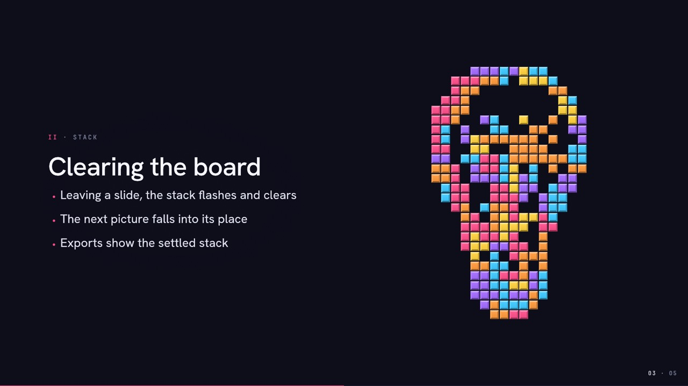
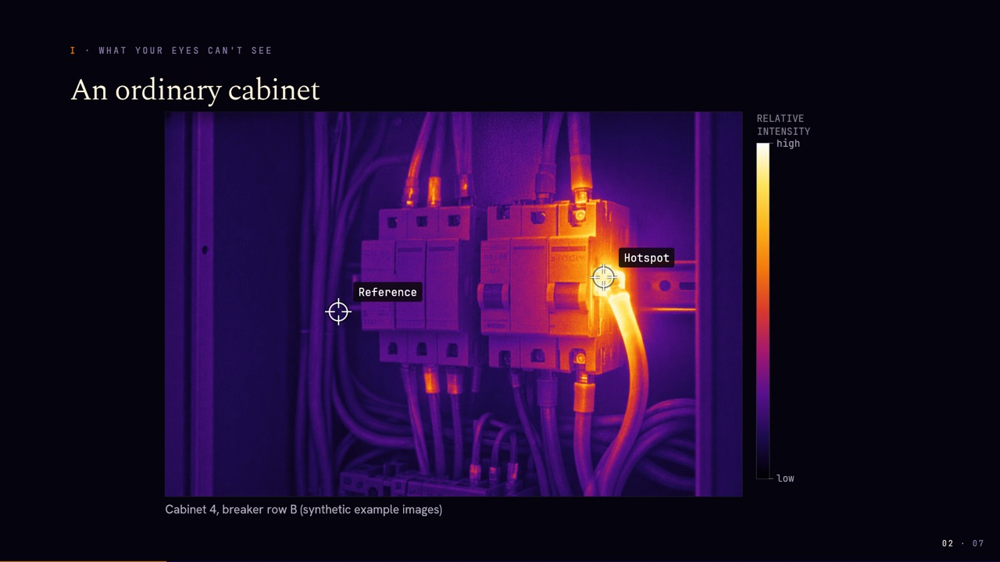
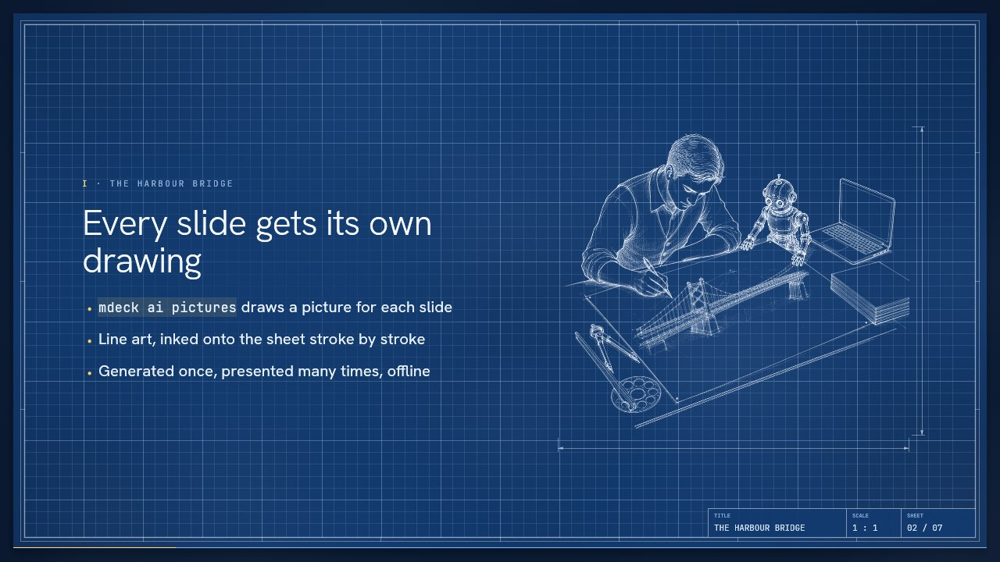
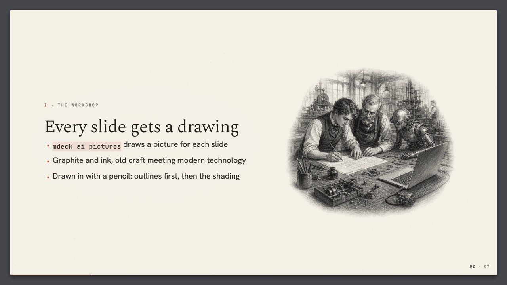
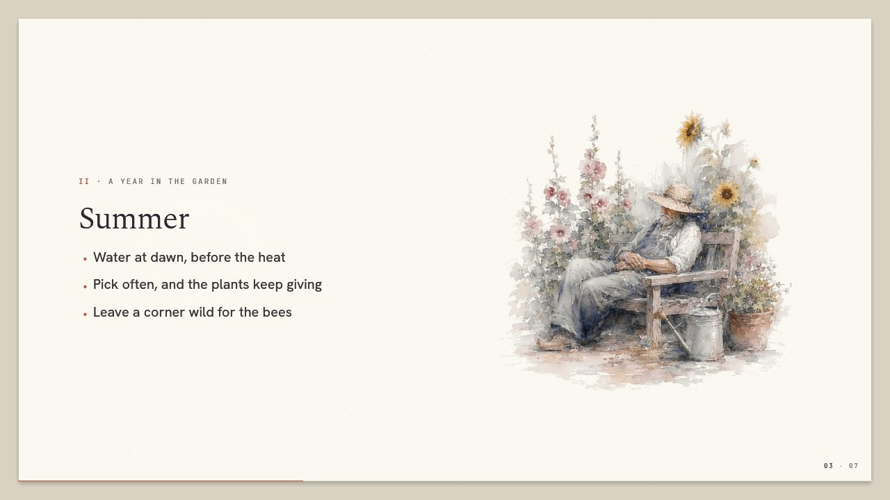

<p align="center"><a href="../README.md">MDeck</a> &middot; <a href="tutorial.md">Tutorial</a> &middot; <a href="install.md">Install</a> &middot; <a href="writing-slides.md">Writing slides</a> &middot; <a href="visualizations.md">Visualizations</a> &middot; <a href="themes.md">Themes</a> &middot; <a href="engines.md">Engines</a> &middot; <a href="presenting.md">Presenting</a> &middot; <a href="export.md">Export</a> &middot; <a href="ai.md">AI</a> &middot; <a href="commands.md">Commands</a></p>

# Engines

A theme's colours and type say what a deck looks like. Its **engine** says what it does: the
living layer under the slides, how a slide's picture appears, and what plays for the opening
countdown and the end. mdeck has ten engines, and each has a theme made to show it off:

| Engine | What it does | Showcase themes |
|---|---|---|
| `plain` | slides on a calm background, nothing moving | `dark` (the default), `light`, `nord`; variants `spring`, `summer` |
| `particles` | a living field of glowing particles that follows the content | `ember`; variants `autumn`, `winter` |
| `led` | a wall of RGB LEDs that light up pictures | `marquee` |
| `splitflap` | every slide on a split-flap departure board | `departures` |
| `blocks` | pictures built from falling blocks | `stack` |
| `thermal` | the deck through a thermal camera; headings form in heat | `thermal` |
| `line` | line art inked on a blueprint sheet, or drawn in chalk on a slate | `blueprint`, `chalkboard` |
| `sketch` | graphite drawings pencilled in on a sketchbook page | `sketchbook` |
| `watercolour` | watercolours that bloom onto paper | `watercolour` |
| `darkroom` | photographs that develop under a red safelight | `darkroom` |

Pick a theme, and you get its engine:

```yaml
---
theme: marquee
---
```

Or keep your theme and run it on another engine, with `engine:` in the frontmatter or, without
editing anything, `mdeck talk.md --engine blocks`. Your theme's colours and fonts come along.
`--engine` wins over the deck's `engine`, which wins over the theme's.

Engines differ in what they can show: the plain engine draws no pictures, and the departure board
shows text only. `mdeck talk.md --check` lists every slide that loses something on the chosen
engine (category `engine`), and presenting prints one summary line when there is any.

## Pictures

Most engines can draw a **picture** on a slide: a named point cloud that the particles settle
into, the LEDs light up, the blocks build, or the pen and chalk trace. Ask for one with a setting
under the slide's heading:

```markdown
## Our new server
<!-- picture: server -->

- 5 TB of RAM
- 100 cores
```

The picture goes on the design's **stage**. In the editorial design set (Ember and the other
engine themes) statement, points, quote, section and text-only content slides show it on the
right, beside the copy; a title slide puts it behind the copy, large and dim. Slides that show an
image, code, a chart, a table or columns have no stage, and neither does the standard set (`dark`,
`light`, `nord`). `<!-- picture: none -->` keeps a slide empty. `--check` warns when a slide asks
for a picture it cannot show, or one that does not exist.

`picture` resolves in this order: the slide's generated artwork on an art engine (below), then a
point cloud of that name, then an image file at that path, relative to the deck
(`<!-- picture: art/bridge.png -->`). mdeck draws an image itself, framed on the stage (or dim
behind a title), so it shows on every engine, `plain` included; only the split-flap board, which
draws the whole slide, leaves it out.

Thirty-eight pictures are built in: people (`person`, `man`, `woman`, `hooded`,
`thermographer`, `presenter-up`, `presenter-down`), things (`laptop`, `server`, `phone`, `globe`,
`rocket`, `gear`, `camera`, `lightbulb`, `lock`, `robot`, ...) and ideas (`ai`, `question`,
`blackhole`, ...). `mdeck point-cloud list` shows them all, and `mdeck point-cloud show <name>`
previews one.

**Your own pictures.** A name resolves in the deck's `point-clouds/` folder first, then your
user folder, then installed packs, then the built-ins:

```bash
mdeck ai point-cloud talk.md                    # every name the deck uses that exists nowhere (AI)
mdeck ai point-cloud --name kettle --description "A kettle on a stove"   # one for your library
mdeck point-cloud import sketch.png --name sketch   # from an image of light strokes on dark
mdeck point-cloud contribute kettle            # offer it to the built-in set (a GitHub issue)
```

On the art engines (`line`, `sketch`, `watercolour`, `darkroom`) a slide can also have an
**artwork**: a picture generated for that slide alone. See [Art engines](#art-engines-a-picture-made-for-every-slide).

## plain

<p align="center"></p>

Slides on a flat background in the theme's colours: nothing moves but the transitions and
reveals. It is the engine of the default theme, because a deck should be able to be just a
deck. With `countdown: on` it counts down in plain numerals.

## particles

<p align="center"></p>

A living field of glowing particles behind every slide, and the engine of `ember`, `autumn` and
`winter`. **The field follows your content.** A title slide opens on a constellation, a points
slide lights one cluster per item as you reveal them, a quote burns like a candle, a code slide
rains. On charts and diagrams the field serves what is drawn: embers rise off bars, runners travel
the edges of a diagram, sparks circle a pie. Behind it all the dark is space (a slowly drifting
star field, dust, a galaxy or a nebula), changing from slide to slide. A `picture` is drawn as
particles settling into its shape. The deck opens with a 3-2-1 counted in particles and ends with
the field spelling THE END before it bursts into black. None of it needs a line of authoring.

## led

<p align="center"></p>

The slide sits on a wall of LEDs, their unlit lenses just visible (theme `marquee`). Nothing
moves: a `picture` powers on from its centre, each LED flickering as it strikes, and shimmers
between the theme's colours. Title slides get a marquee border of chasing bulbs, bars get peak
markers like a level meter, and the countdown is lit digit by digit before a white-hot ring runs
out over the wall.

## splitflap

<p align="center"></p>

Every slide is a departure board (theme `departures`): its text in capitals on a fixed grid of
flaps, headings in timetable yellow, tables as timetables, progress bars in solid flaps. The next
slide never slides in: every flap turns through its wheel of characters until it shows the new
one. A board says what a timetable says, so agendas, schedules, status and numbers read best;
charts, code, formulas and pictures are not shown, and `--check` names each one.

## blocks

<p align="center"></p>

A `picture` is cut into bright bevelled blocks that drop from above and settle, bottom row first
(theme `stack`). Leaving a slide, the stack flashes and clears row by row, like a completed line.

## thermal

<p align="center"></p>

The deck as a thermal instrument sees it (theme `thermal`): a heat field under the slides, drawn
in contour bands in the theme's heat palette. It keeps its motion for the moments that matter:

- **The cold opening.** On title and section slides the heading forms in heat, readable in under
  a second, then the crisp type rises into it and the heat settles into a faint halo.
- **Heat signatures.** A `picture` glows like a warm body (the built-in `thermographer` fits);
  the countdown digits heat up and cool off.
- **Calm evidence.** The field stays dark around charts, diagrams, images and thermal images.
  `drift: true` in the theme's engine block lets a few embers drift through the dark.
- **The heat trace.** Pen strokes arrive white-hot and cool away.

It pairs with `@thermal` blocks, which work on every engine: a thermal image in a palette, a lens
that finds the problem in an ordinary photo, threshold reveals and measured spots. See
[Visualizations](visualizations.md#thermal-images).

## Art engines: a picture made for every slide

The four art engines draw a picture **made for each slide** by the image model you configured,
and draw it in as the slide opens. You write a slide about a harbour bridge, and a draughtsman
inks one onto the sheet. Without an artwork, the slide's `picture` is drawn in the same medium,
so a deck works before any art exists.

### line

<table>
  <tr>
    <td width="50%"></td>
    <td width="50%"></td>
  </tr>
</table>

Line art on a surface the theme picks with `surface:` in its engine block. **`sheet`** (theme
`blueprint`): a Prussian blue drawing sheet with a fine grid, a ruled border and a title block;
faint construction lines run ahead, the ink follows stroke by stroke under a drafting machine's
crosshair, and dimension lines are ruled around the finished drawing. **`slate`** (theme
`chalkboard`): a green slate in a wooden frame, the ghosts of earlier lessons wiped off it, and
the art drawn in chalk that breaks up on the slate. Both surfaces use the same pictures, so a deck
switches between them for free.

### sketch

<p align="center"></p>

A sheet of drawing paper on a desk (theme `sketchbook`). The slide's graphite drawing is drawn
in by a pencil you can see: the outlines first, then the shading laid in stroke by stroke.

### watercolour

<p align="center"></p>

Cold-press paper on a table (theme `watercolour`). The slide's watercolour blooms onto it: a pale
first wash, then the colour spreading from where the paint is heaviest, the dark accents last.

### darkroom

<p align="center"></p>

A red safelight glows over the bench (theme `darkroom`), and the slide's black-and-white
photograph develops as a print, shadows first; then the white light comes on and the print shows
its true greys. Without an artwork, the `picture` becomes a photogram.

### Making the art

The art is made once, when you ask, and kept next to the deck. Presenting never calls the AI: no
waiting, no cost, and it works offline.

```bash
mdeck ai pictures talk.md            # a picture for every slide that takes one
mdeck ai pictures talk.md --dry-run  # which slides, and where each scene comes from
mdeck ai pictures talk.md --stale    # redraw the slides you edited since
mdeck ai pictures talk.md --slide 4  # redraw one
```

Say what a slide's picture shows with `picture-prompt`, or let the chat model write the scene
from the slide's copy and notes. `art-world` in the frontmatter sets the deck's world (setting,
era, recurring characters), and every scene keeps to it. Pictures never contain text, and only
slides with a stage get one:

```markdown
---
theme: blueprint
art-world: A Victorian harbour town where a small team builds modern machines.
---

# The Harbour Bridge
<!-- picture-prompt: A great iron suspension bridge under construction across a harbour. -->
```

The pictures go in `talk.assets/artworks/`, recorded in `talk.assets/manifest.yaml`
([AI](ai.md#generated-assets)). Edit a slide and its picture goes stale: it is still shown, and
`--check` says so. Press `S` while presenting to draw the current slide's picture in the
background. A theme sets its house style for pictures in its engine block
([Themes](themes.md#the-engine-and-its-settings)).

## Smaller builds and your own engines

Every engine except `plain` is a cargo feature, all on by default. A build without one also
leaves out its themes; a deck that asks for it runs on `plain` with a warning
([Install](install.md)). To write your own engine, privately or to share, see the
[SDK](sdk/README.md): `mdeck sdk new engine glow` scaffolds one and `mdeck build --with ./glow`
builds an mdeck with it inside.
