<p align="center"><a href="../README.md">MDeck</a> &middot; <a href="tutorial.md">Tutorial</a> &middot; <a href="install.md">Install</a> &middot; <a href="writing-slides.md">Writing slides</a> &middot; <a href="visualizations.md">Visualizations</a> &middot; <a href="themes.md">Themes</a> &middot; <a href="engines.md">Engines</a> &middot; <a href="presenting.md">Presenting</a> &middot; <a href="export.md">Export</a> &middot; <a href="ai.md">AI</a> &middot; <a href="commands.md">Commands</a></p>

# Engines

The engine is what a theme does beyond colours and type: the layer it paints under
your slides, and what it plays for the countdown and the end. Every theme looks
like itself on every engine, and any deck switches with one line:

```yaml
---
@engine: led        # plain, particles, led, splitflap, blocks, line, sketch,
                    # watercolour, darkroom or thermal
---
```

`mdeck talk.md --engine blocks` tries one without editing the deck, and
`mdeck talk.md --check` lists anything the chosen engine does not show. Want to
build one? Read [Writing an engine](../crates/mdeck/doc/engines.md).

## Ember and the particle field

Ember is MKLab's brand as a theme: graphite on near-black, one ember accent,
an editorial serif for headings, and a living field of glowing particles
behind every slide. Set `@theme: ember` and any deck you already have gets it.
The field is the **particles engine**, and any theme can run on it: the
built-in `autumn` and `winter` do, in their own colours, and so can yours.

<p align="center">
  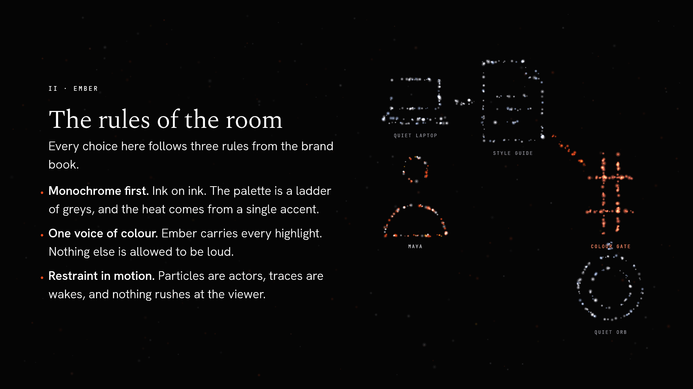&nbsp;&nbsp;
  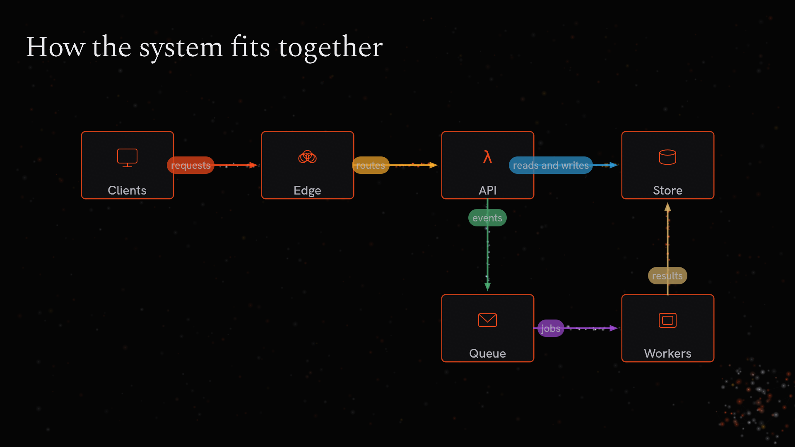
</p>

**The field follows your content.** A title slide opens on a constellation. A
bullet slide lights one cluster per item as you reveal them. Quotes burn like
a candle, code slides rain. On charts and diagrams the particles serve what is
drawn: embers rise off bars, runners travel the edges of a diagram, sparks
circle a pie. Behind it all the dark is space: a star field drifting slowly
forward, dust, a galaxy, or a nebula, rotating by slide so a run of bullet
slides never repeats itself. None of this needs a line of authoring.

**It can tell a story.** Describe a scene in English in a ```` ```@story ````
fence on a slide, run `mdeck ai story talk.md`, and the particles form a cast
of people and props with flows between them and beats you release with Space,
each with a line you can say out loud (`H` shows it). Scripts land in
`talk.scenes.yaml` next to the deck; edit one by hand and mark it
`pinned: true` to keep it. Stories play on bullet, content, quote and section
slides, where there is room beside the copy.

**It can draw a thing.** Put `@illustration: server` under a slide's heading
and the particles settle into a server beside the copy (behind it, faded, on
a title slide). Thirty-eight illustrations are built in, from `person` and `laptop`
to `robot`, `rocket`, `lightbulb` and `account`; `mdeck illustration generate --name server
--description "A server rack"` asks the image model for a new one and reduces
it to a point cloud file you keep next to the deck or in your user library.
Story casts draw from the same library, so a cloud you make can act in a
story too. Made one worth sharing? `mdeck illustration contribute <name>`
opens a prefilled issue; drag the file in and it can become a built-in.

**It opens and closes.** A 3-2-1 countdown counted in particles (any key
skips it, `@countdown: false` turns it off) and an ending where the field
spells THE END before it bursts into black. Nord gets a plain countdown too,
and any theme can ask for one.

Try the decks in `samples/ember/`: plain text, visualizations, images,
illustrations, and stories. The format spec has the full vocabulary.

## More engines

**LED wall** (`led`, theme `marquee`). The slide sits on a wall of RGB LEDs,
their unlit lenses just visible. Nothing moves: illustrations power on from
their centre, each LED flickering as it strikes, and shimmer between the
theme's colours. Title slides get a marquee border of chasing bulbs, charts
get peak markers floating over their bars, and the countdown is lit digit by
digit before a white-hot ring runs out over the wall.

<p align="center">
  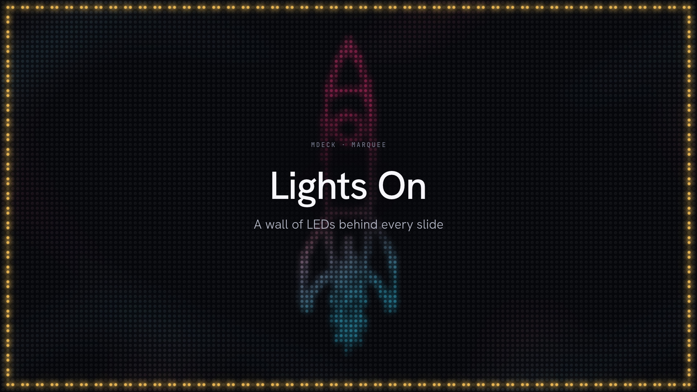&nbsp;&nbsp;
  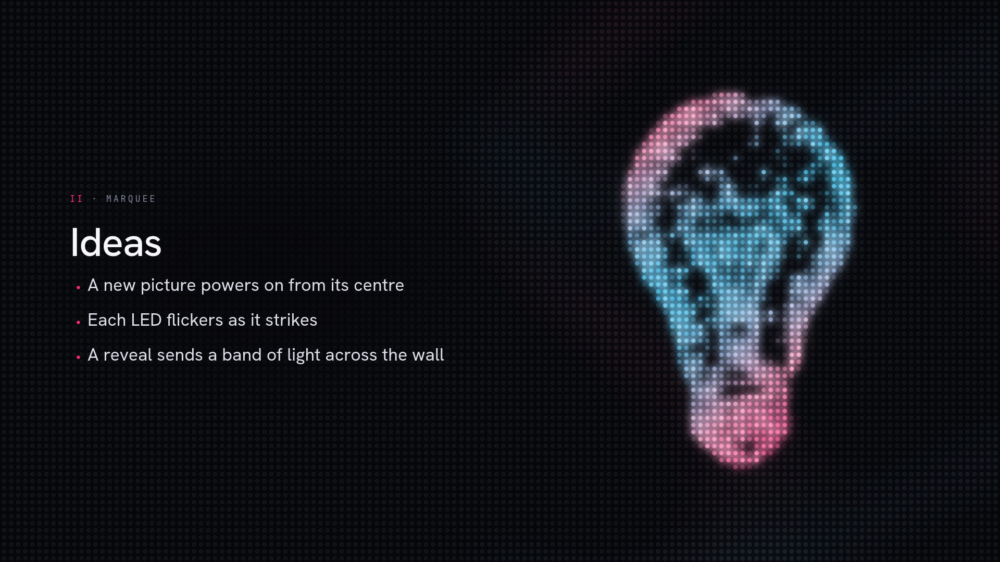
</p>

**Departure board** (`splitflap`, theme `departures`). The slide is a
split-flap board: every piece of text on a fixed grid of flaps, headings in
timetable yellow, tables as timetables, progress bars in solid flaps. The next
slide never slides in: every flap turns through its wheel of characters until
it shows the new one.

<p align="center">
  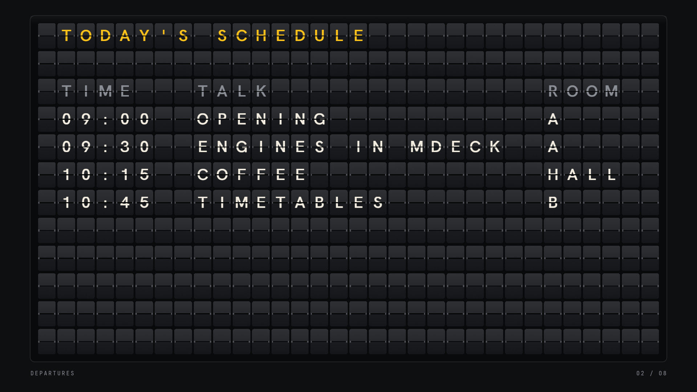&nbsp;&nbsp;
  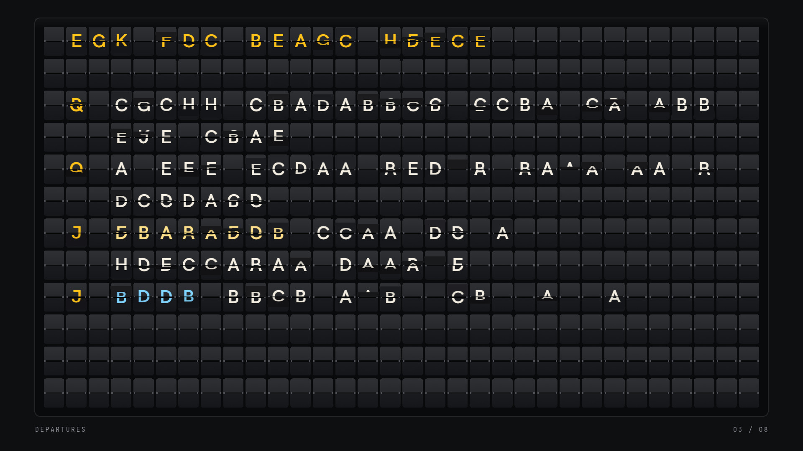
</p>

**Falling blocks** (`blocks`, theme `stack`). Illustrations are built from
bright bevelled blocks that drop from above and settle, bottom row first; the
next slide clears the stack like a completed line.

<p align="center">
  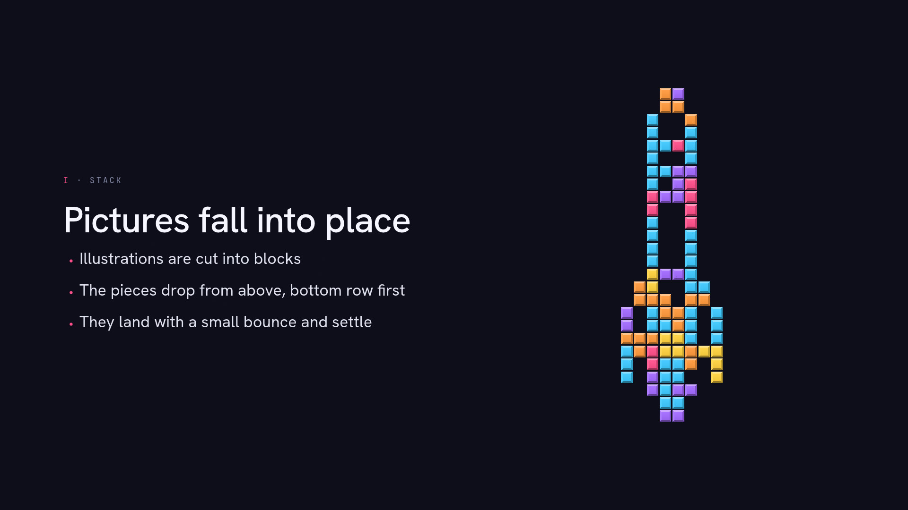&nbsp;&nbsp;
  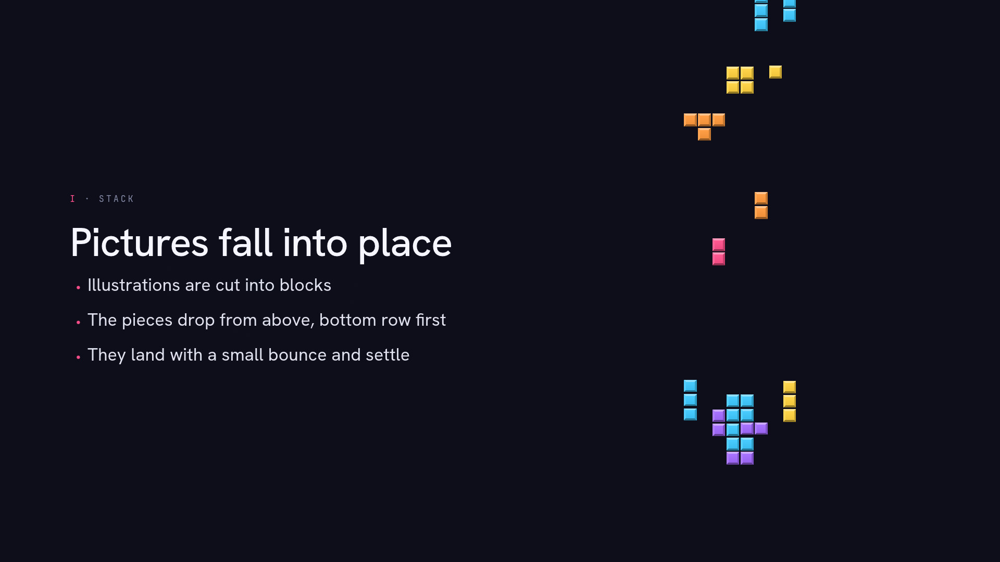
</p>

## Art engines: a drawing made for every slide

The engines above draw what is already there. **Art engines** draw a picture
made for each slide by the image model you configured, and draw it in as the
slide opens. You write a slide about a harbour bridge, and a draughtsman
inks one onto the sheet.

**Line** (`line`, themes `blueprint` and `chalkboard`). Line art drawn on a
surface the theme picks with `surface: sheet` or `surface: slate`; the same
pictures serve both, so a deck switches between the two for free.

*Blueprint* (`surface: sheet`, theme `blueprint`). Every slide is a Prussian
blue drawing sheet on a drafting table: a fine grid, a ruled border, a title
block with the deck's title and the sheet number. The slide's line art is
inked the way a draughtsman works: faint construction lines run ahead, the
ink follows stroke by stroke under the crosshair of a drafting machine, and
dimension lines are ruled around the finished drawing. On a title slide the
drawing sits large and dim behind the title.

<p align="center">
  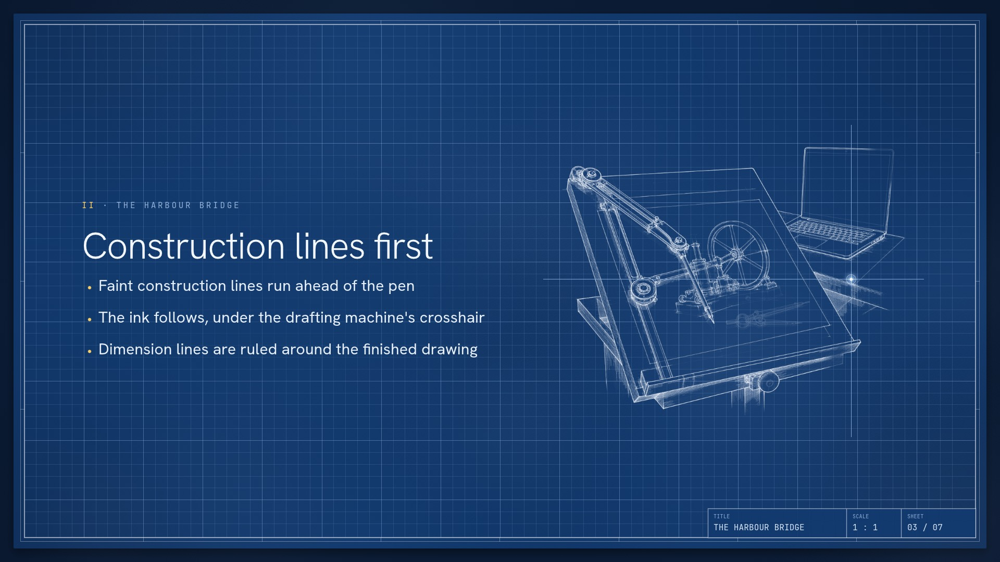&nbsp;&nbsp;
  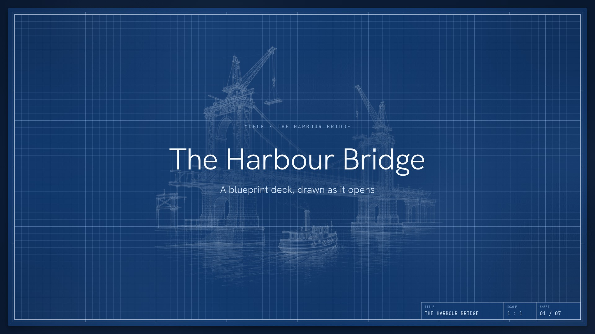
</p>

**Sketchbook** (`sketch`, theme `sketchbook`). Every slide is a sheet of
drawing paper on a desk, and the slide's drawing, graphite and ink in the
MKLab house style where old craft meets modern technology, is drawn in by a
pencil you can see: the outlines first, then the shading laid in stroke by
stroke as the pencil sweeps across the page.

<p align="center">
  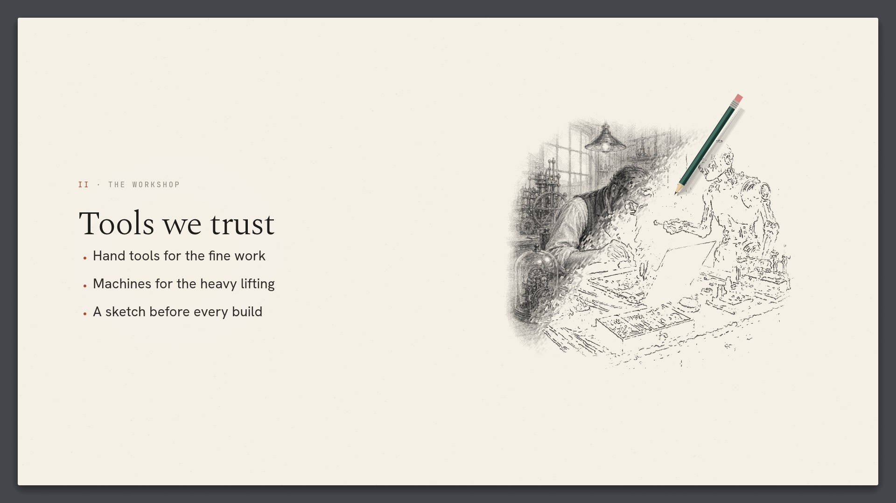&nbsp;&nbsp;
  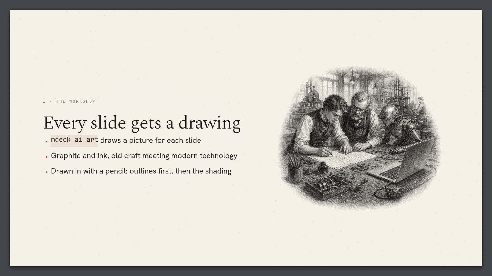
</p>

*Chalkboard* (`surface: slate`, theme `chalkboard`). A green slate in a
wooden frame, with the ghosts of earlier lessons wiped off it. The slide's
line art is drawn in chalk, breaking up on the slate, a stick of chalk at
the point and dust falling from it. It uses the same pictures as the
blueprint, so a deck switches between the two for free.

<p align="center">
  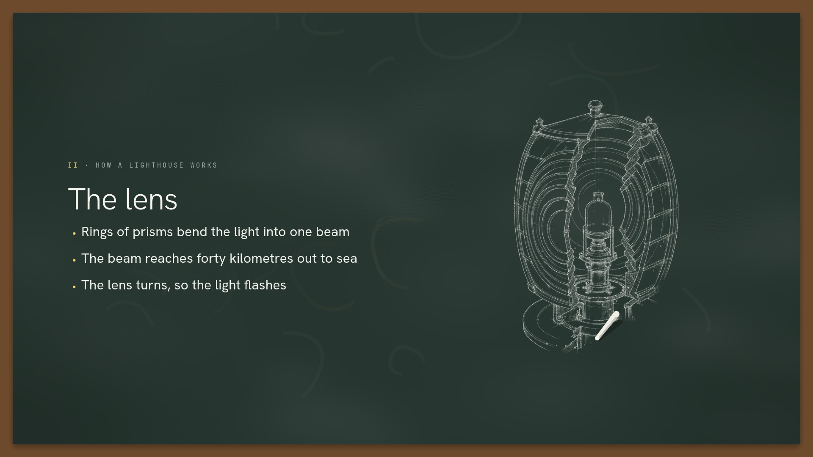&nbsp;&nbsp;
  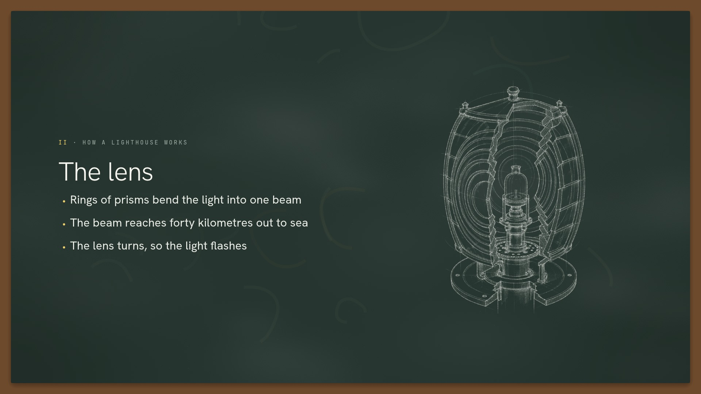
</p>

**Watercolour** (`watercolour`, theme `watercolour`). Cold-press paper on a
table. The slide's watercolour blooms onto it: a pale first wash, then the
colour spreading from where the paint is heaviest, soft wet edges, the dark
accents last.

**Darkroom** (`darkroom`, theme `darkroom`). A red safelight glows over the
bench, and the slide's black-and-white photograph develops as a print,
shadows first; then the white light comes on and the print shows its true
greys. Without a photograph, the `@illustration` becomes a photogram.

<p align="center">
  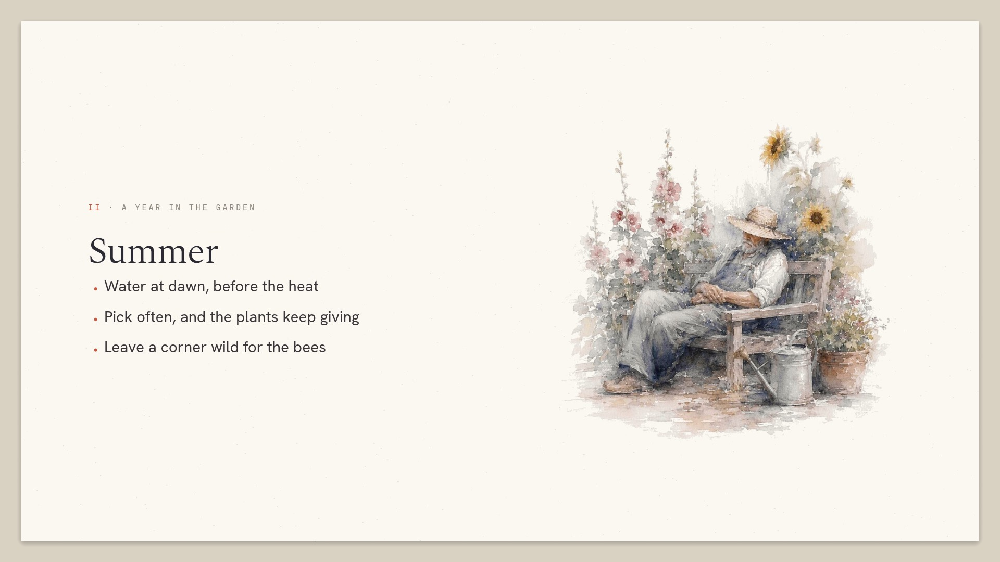&nbsp;&nbsp;
  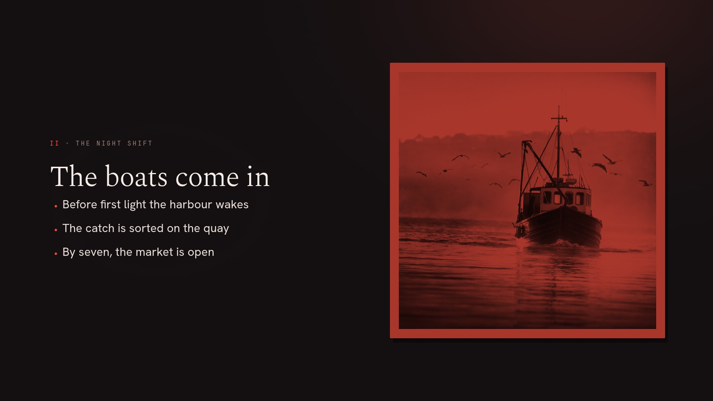
</p>

**Making the art** is one command, and it only runs when you ask:

```bash
mdeck ai art talk.md            # a picture for every slide that takes one
mdeck ai art talk.md --dry-run  # which slides, and where each scene comes from
mdeck ai art talk.md --slide 4  # redraw one
```

Say what a slide's picture shows with `@art:` under its heading, or let the
chat model write the scene from the slide's copy and notes. `@art:` in the
frontmatter sets the deck's world (setting, era, recurring characters), and
`@art: none` keeps a slide free of art. Pictures never contain text, and
only slides with room beside or behind the copy get one:

```markdown
---
@theme: blueprint
@art: A Victorian harbour town where a small team builds modern machines.
---

# The Harbour Bridge
@art: A great iron suspension bridge under construction across a harbour.
```

The pictures go in `art/` next to the deck and `talk.art.yaml` records which
slide each belongs to. Presenting never calls the AI: no waiting, no cost,
and it works offline. Edit a slide and its picture goes stale (still shown,
and `mdeck talk.md --check` says so; `mdeck ai art talk.md --stale` redraws
those). Press `S` while presenting to draw the current slide's picture in
the background. A slide without a picture still works: its `@illustration`
is drawn in the medium: a technical pen, pencil, chalk, ink and wash, or a photogram.

`mdeck talk.md --engine led` tries an engine without touching the deck, and
`mdeck talk.md --check` lists anything the chosen engine does not show. Try
`samples/engines/`.

## Thermal: the deck through a thermal camera

The `thermal` engine (theme `thermal`) shows the deck as a thermal instrument
would: a heat field under the slides in the theme's heat palette, drawn in
contour bands. It saves its motion for the moments that tell the story:

- **The cold opening.** On title and section slides the heading forms in
  heat: points of heat inside the letters spread into contours, the words are
  readable within a second, then the crisp type rises into the settling heat,
  which stays as a faint contour halo.
- **Heat signatures.** An `@illustration` glows like a warm body (the built-in
  `thermographer` fits); the countdown digits heat up and cool off.
- **Calm evidence.** The field stays dark around charts, diagrams, images and
  thermal images. `heat: { drift: true }` in a theme lets a few embers drift
  through the dark on ordinary slides.
- **The heat trace.** Pen strokes arrive white-hot and cool away.

<p align="center">
  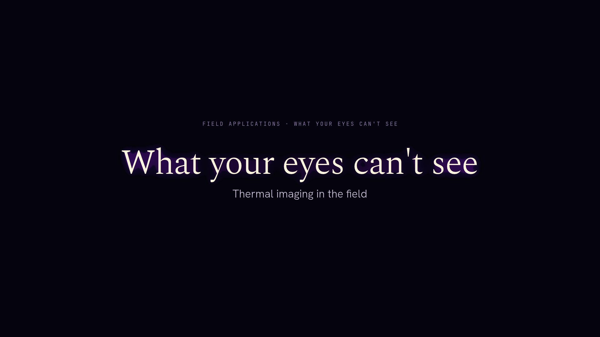&nbsp;&nbsp;
  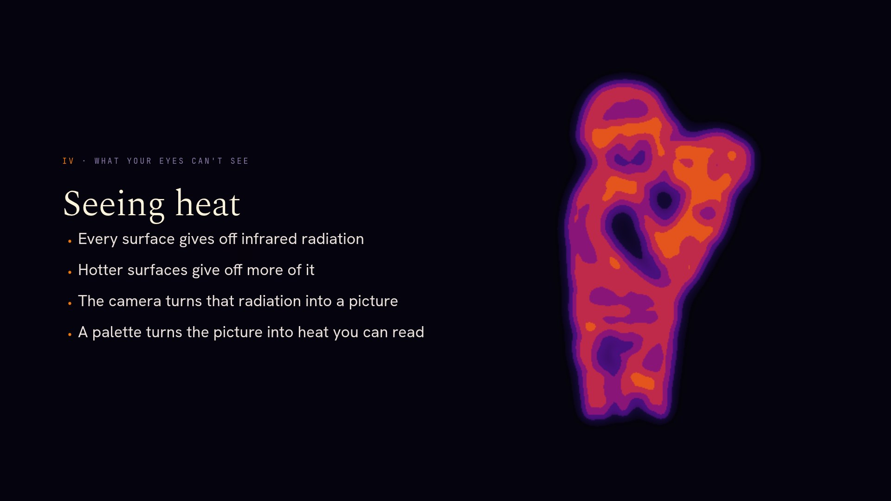
</p>

It pairs with `@thermal` blocks, which work on every engine: a thermal image
in a palette (`C` cycles palettes live), a lens that finds the problem in an
ordinary photo, threshold reveals, spots with measured values, and
comparisons on one scale. See [Visualizations](visualizations.md#thermal-images).

<p align="center">
  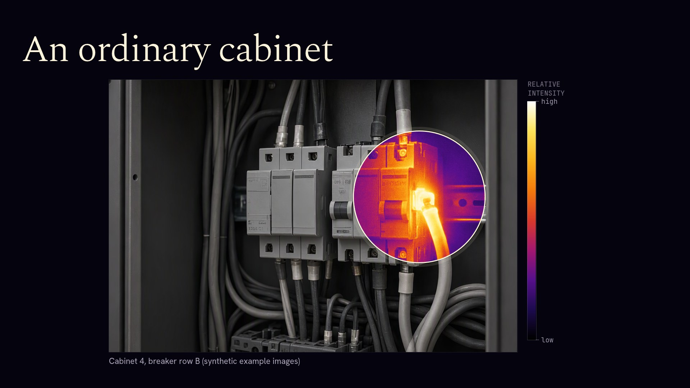&nbsp;&nbsp;
  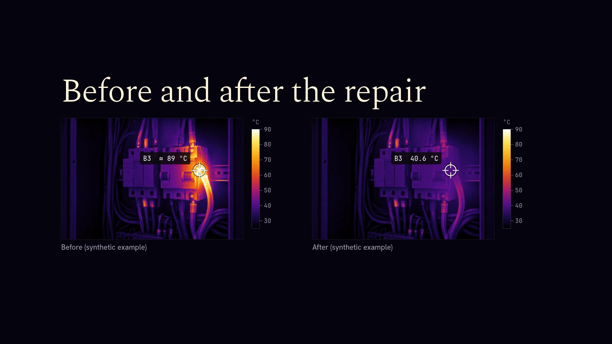
</p>
