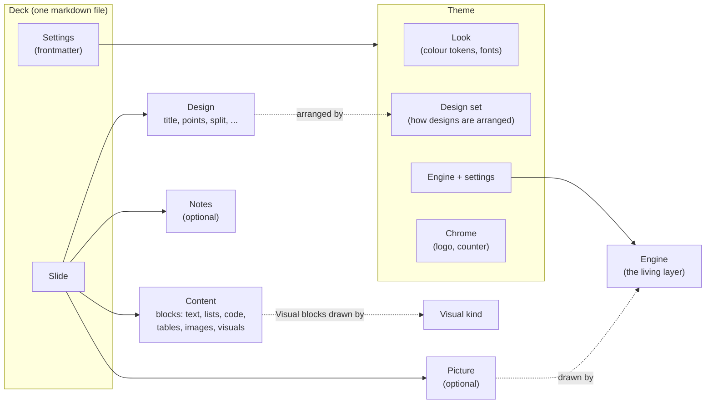
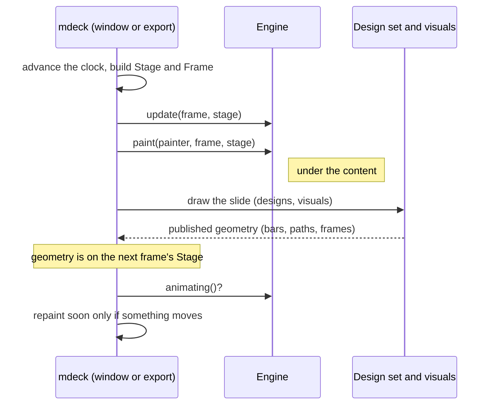

# Concepts

The model an extension lives in. Every term here is mdeck's own vocabulary: the code, the CLI,
`--check` and these docs use the same words.

## The model

Read it from the inside out: a **deck** has **slides**; a slide has **content**; a **design**
arranges that content; a **theme** decides how the design looks and which **engine** brings it to
life.



| Term | Meaning | Extension point |
|---|---|---|
| **Deck** | One markdown file presented as slides, plus the files next to it | |
| **Slide** | One screen, with content, a design, maybe a picture and notes | |
| **Block** | One piece of content: heading, paragraph, list, quote, code, table, image, visual | |
| **Visual** | A block mdeck draws from structured text in a fence (```` ```@bar ````) | `Visual` |
| **Design** | A named kind of slide (`title`, `points`, `split`, ...) with roles (title, body, media) | |
| **Design set** | A complete set of arrangements for every design | `DesignSet` |
| **Theme** | A look, a design set, an engine with its settings, and chrome | data (YAML), registered by any extension |
| **Engine** | The code that brings the slide to life around its content | `Engine` + `EngineDef` |
| **Board engine** | An engine that draws whole slides in its own medium (the split-flap board) | `EngineDef::board` |
| **Picture** | The one image on a slide's stage: a point cloud, a generated artwork or an image | read by engines |
| **Transition** | How one slide gives way to the next | `Transition` |
| **Decoration** | What an engine adds by itself, never authored | (engine internals) |

## What the core does and what the extension does

The core reads files, parses markdown, picks designs, resolves pictures, lays out text, keeps the
clock and talks to the window and the exporter. An extension never parses markdown, never reads
the deck file, never calls the network: it receives everything it needs as arguments.

| The core | An engine |
|---|---|
| Splits the deck into slides and recognises each slide's design | Paints the living layer under the content |
| Lays the content out with the theme's design set | Draws the slide's picture in its medium (if it declares `picture`) |
| Resolves the picture and places it where the design has a stage | Draws the countdown and the end act (if it declares `countdown`, `ending`) |
| Collects the geometry visuals publish | Reacts to that geometry without drawing over it |
| Builds the `Stage` and the `Frame` each frame | Keeps its own state, derived from the stage |
| Owns the window, the exporter, the clock and repaint scheduling | Says whether it still moves (`animating`) |

## The frame lifecycle

Every frame, for the slide on screen (and for both slides during a transition), the host does this:



- `update` brings the engine's state up to date. It never draws.
- `paint` draws into `frame.rect`, under the slide's content.
- `animating` tells the host whether to schedule another frame. A settled slide costs nothing.

The engine is created once per presentation (and once per export) with `EngineDef::create`, which
also receives the theme's engine settings.

### The stage: what is shown

`Stage` is everything about *what* is on screen:

| Field | Meaning |
|---|---|
| `moment` | `Slide`, `Countdown { digit, mask, progress }`, `Burst { progress }` or `End { elapsed, words }` |
| `index`, `step`, `count` | The slide's number, its reveal step, the number of slides |
| `slide` | The slide's content (absent during the burst and on the end slide) |
| `title` | Whether the slide reads as a title page |
| `picture` | The resolved picture and the box (`Place`) its design gives it, for engines with `picture` |
| `geometry`, `geometry_key` | What the slide's visuals drew last frame, and a fingerprint that changes when it does |
| `deck_title` | The deck's title, for engines that print it |

`Moment::look()` reduces a moment to what it shows (`Look::Slide`, `Look::Digit(3)`, ...). Key
expensive work on it and rebuild only when it changes.

### The frame: where and how

`Frame` is everything about *how* to draw:

| Field | Meaning |
|---|---|
| `rect` | The slide's rect on screen or on the export canvas |
| `scale` | `min(w / 1920, h / 1080)`: multiply every pixel size by it |
| `opacity` | The slide's opacity during transitions |
| `dt` | Seconds since the last frame |
| `still` | An export still: settle at once, show the finished look |
| `reduced_motion` | The presenter asked for no motion: show settled states |
| `tokens` | The theme's colours |
| `settings` | The theme's `engine:` settings |

`frame.settled()` is `still || reduced_motion`: when it is true, show the settled pose.

## The contract

Every extension keeps the same quality contract as mdeck's built-ins. The SDK's test helpers and
the tutorial engines show how.

1. **Deterministic stills.** An export, at any moment, produces the same image every time. No
   wall-clock time, no unseeded randomness: derive variation from the slide number or a hash.
2. **Reduced motion.** Under `frame.reduced_motion`, show the settled state and return `false`
   from `animating`.
3. **Scale with the slide.** Design at 1920 by 1080 and multiply every size by `frame.scale`.
   Position in slide fractions (`rect.lerp_inside(u, v)`) where you can.
4. **Theme colours.** Take colours from `frame.tokens`. On a light theme (`tokens.light`), added
   light vanishes into the page: draw ink instead (`SpriteBlend::Normal`).
5. **Paint only inside the slide** and keep the content readable: stay dark or calm inside the
   frames visuals publish (images, cards) and behind the copy.
6. **Report your own problems** to `--check`: wrong or unknown settings, content you cannot show.
7. **Work in export.** Export uses the same code path as the window, with `frame.still` set.
8. **Performance.** Hold 60 frames per second at 4K on an integrated GPU. Derive expensive state
   only when its input changes, draw many lights with `Painter::sprites` (one GPU pass), and
   return `false` from `animating` as soon as nothing moves. An engine that always moves (a
   particle field) may say so.
9. **Fall back gracefully.** Without a picture, show your ground. A missing optional input never
   produces an empty or broken slide.

## Capabilities: what the core does differently for you

An engine declares `Capabilities` in its definition. Each one changes what the *core* does:

| Capability | The core then |
|---|---|
| `picture` | resolves the slide's picture and hands it over in `stage.picture` |
| `countdown` | lets the engine draw the opening countdown (`Moment::Countdown`, `Moment::Burst`) |
| `ending` | plays the engine's end act instead of the plain "The End" (`Moment::End`) |
| `board` | draws every slide through the engine's design set (see [design sets](design-sets.md)) |
| `transition` | lets the engine own the transitions between slides |
| `medium` | prepares generated artworks for the engine's medium (art engines) |

`Needs` says what the engine needs from the theme (for example `page: true` for a sheet on a
surface); `mdeck theme check` reports a theme that selects the engine without it.

## Drawing

Extensions draw through `mdeck_sdk::paint::Painter` with mdeck's own types (`Color`, `Pos2`,
`Rect`, `Mesh`, `Texture`, `Font`). No egui type appears in the SDK, so mdeck can upgrade its UI
library without breaking you. Colours are premultiplied: `premul(c, a)` blends normally,
`additive(c, k)` adds light. See [compatibility](compatibility.md) for the promise and the
`unstable-egui` escape hatch.
