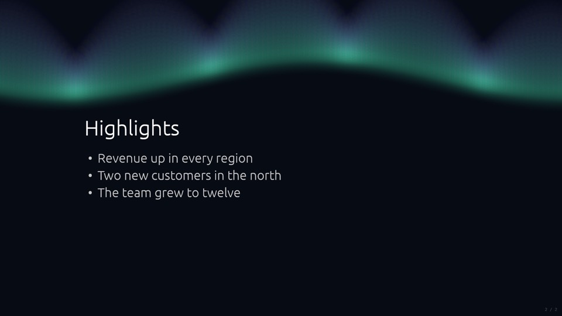
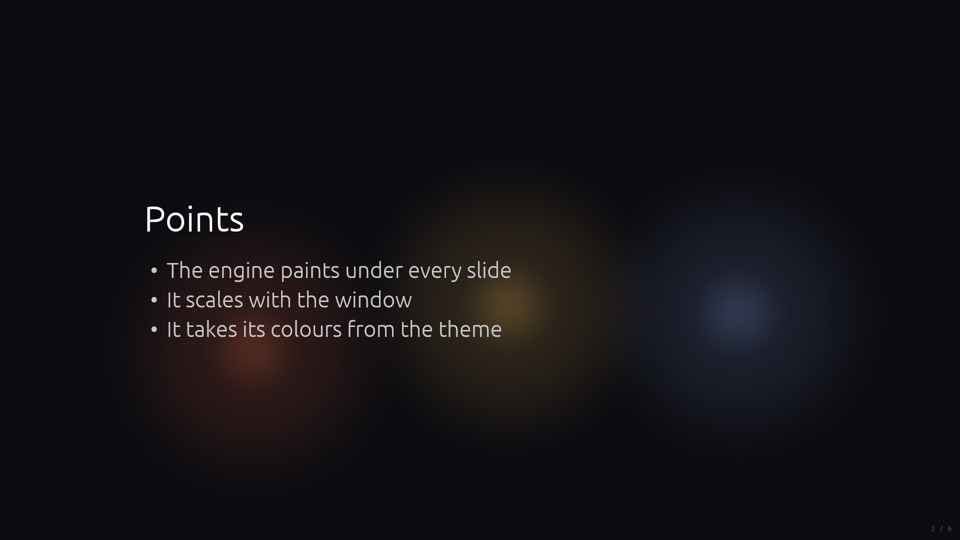
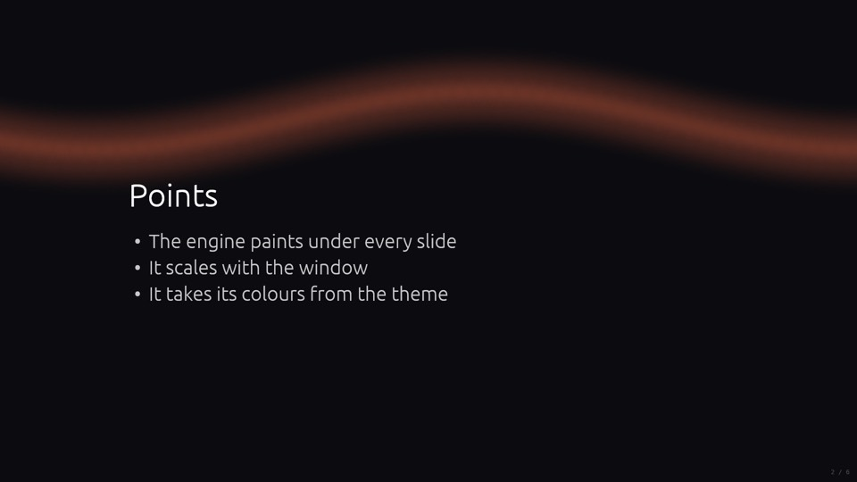
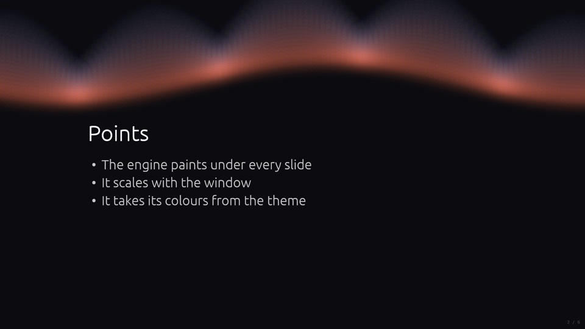
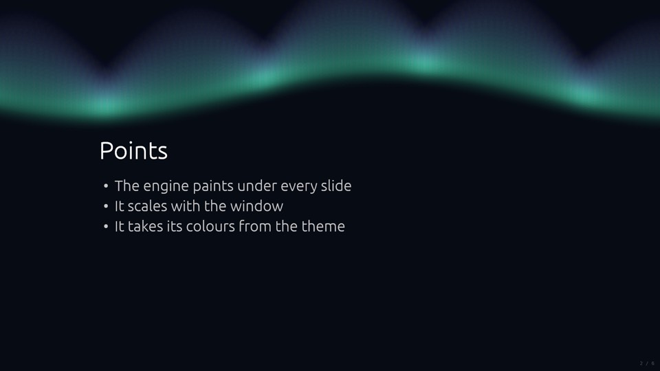
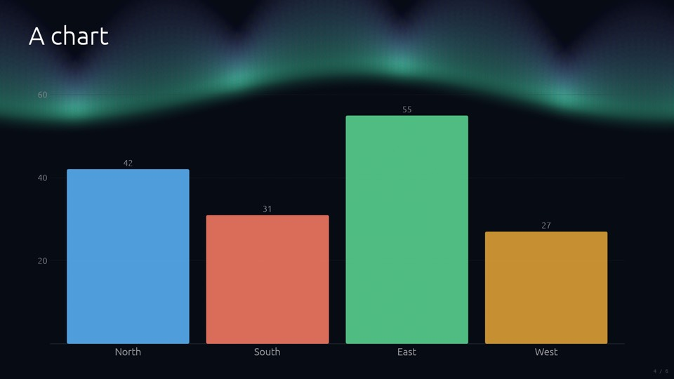
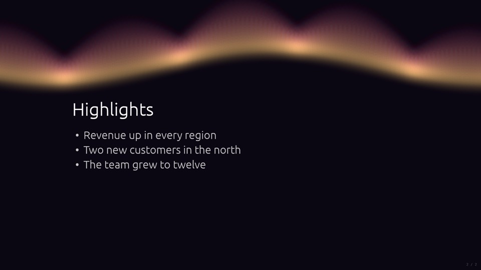

# Your first engine, from an empty folder to your colleagues' decks

This tutorial walks the whole cycle once, slowly: create an engine, change it in small steps and
look at the result after each one, test it, put it under version control, share it with your
colleagues, and use it in a real deck. Nothing is skipped and nothing is assumed beyond the
[prerequisites](prerequisites.md).



**What you will build:** `aurora`, an engine that draws slowly rippling northern lights across the
top of every slide, with its own theme, two settings a theme can tune, tests with a golden image,
and a private git repository your colleagues build their mdeck from.

**What you will learn:**

- what `mdeck sdk new` generates, file by file, and what each part does;
- the build-and-look loop: `mdeck build`, present, export stills;
- drawing with the SDK's painter, in slide fractions and scaled sizes;
- taking colours from the theme, and reading settings from it;
- tests and golden images;
- git, versions, and how your engine's version relates to mdeck's;
- sharing privately through git, or as a built binary;
- using the engine in a real deck, so `--check` tells colleagues what they need.

**Before you start:** work through [Prerequisites](prerequisites.md) (mdeck 2, Rust 1.95 or newer
via rustup, a C toolchain, git). You do not need the mdeck source code. Plan an hour or two; the
first build alone takes from one to ten minutes, depending on your computer.

**No Rust experience?** You can still follow along: every piece of code is given in full, and each
step says exactly where it goes. The [Rust book](https://doc.rust-lang.org/book/) is the place to
learn the language properly afterwards.

## How to read the code blocks

Every code block is labelled with **where it belongs** and **what you do with it**:

- **TYPE** `path/to/file`: write this yourself. The label says whether you create the file, replace
  a part of it, or add to it. Copying and pasting is fine.
- **READ** `path/to/file`: generated or unchanged code, shown so you understand it. Do not type
  it; it is already there.
- **RUN** in `folder`: commands for your terminal, run from that folder.

All paths are relative to the engine's folder, `aurora/`, unless a label says otherwise. The
complete engine as it stands at the end of this tutorial is in
[`examples/engine-aurora`](../../examples/engine-aurora): if you get lost, compare your files
with those.

---

## Part 1. Create the engine

### 1.1 Make the crate

An extension is a Rust **crate**: a folder with a `Cargo.toml` (its name, version and
dependencies) and source files. `mdeck sdk new` creates one that already works.

**RUN** in your home folder (or wherever you keep code):

```bash
mkdir -p ~/code
cd ~/code
mdeck sdk new engine aurora
cd aurora
```

`mdeck sdk new` prints what it made and the next commands. Engine names are lowercase letters,
digits and hyphens, starting with a letter.

### 1.2 A tour of what was generated

```text
aurora/
├── Cargo.toml          the crate: its name, version and the one dependency, mdeck-sdk
├── README.md           the commands you will use, for you and your colleagues
├── deck.md             a sample deck that shows the engine on common slide designs
├── theme.yaml          a theme named `aurora` that selects the engine
├── src/
│   └── lib.rs          the engine itself
└── tests/
    └── golden.rs       a test that renders the engine and compares it with a saved image
```

**READ** `Cargo.toml` (generated):

```toml
[package]
name = "aurora"
version = "0.1.0"
edition = "2024"
description = "The aurora engine for mdeck"
publish = false

[dependencies]
# SDK 2.x works with every mdeck 2.x.
mdeck-sdk = "2.0.0"
```

- `name` is the crate's name; `mdeck build` uses it to call your code.
- `version` is **your engine's** version. It starts at 0.1.0 and has nothing to do with mdeck's
  version (Part 5 explains both).
- `publish = false` stops an accidental `cargo publish` to crates.io. Your engine stays private
  unless you decide otherwise ([Packaging and sharing](packaging-and-sharing.md)).
- `mdeck-sdk = "2.0.0"` means "SDK 2.0.0 or any newer 2.x". The number is the version of the mdeck
  that created the crate.

**READ** `src/lib.rs` (generated), the first part: the engine's definition and the entry point.

```rust
/// The engine as mdeck sees it. A theme selects it with `engine: aurora`.
pub static DEF: EngineDef = EngineDef::new(
    "aurora",
    "A few slow glows breathing under every slide.",
    |_settings: &EngineSettings| Box::new(Glow::default()),
)
.with_capabilities(Capabilities::NONE) // it only decorates
.with_settings(&[])                    // it reads no settings (yet)
.with_needs(Needs::NONE)
.with_ending_caption_delay(1.0);

/// The entry point `mdeck build --with` calls: register what this crate brings.
pub fn register(r: &mut Registry) -> Result<(), RegistryError> {
    r.engine(&DEF)?;
    r.theme("aurora", include_str!("../theme.yaml"))
}
```

- `DEF` describes the engine to mdeck: its name (what themes write after `engine:`), what it can
  do, which settings it reads and how to start one (`create`).
- `register` is the **one function mdeck calls** in your crate. It registers everything the crate
  brings: here the engine, and the theme from `theme.yaml`, which `include_str!` copies into the
  compiled program so it needs no file at run time.

The second part is the running engine: a struct with its state, and three functions mdeck calls.

```rust
#[derive(Default)]
pub struct Glow {
    clock: f32,          // seconds of motion so far
    settled: bool,       // whether this frame is a still or under reduced motion
    layer: SpriteLayer,  // GPU state for the glow sprites, kept between frames
}

impl Engine for Glow {
    fn update(&mut self, frame: &Frame, stage: &Stage) { /* bring the state up to date */ }
    fn paint(&mut self, painter: &mut Painter, frame: &Frame, _stage: &Stage) { /* draw */ }
    fn animating(&self) -> bool { !self.settled }
}
```

Every frame (60 times a second while something moves), mdeck calls `update`, then `paint`, then
asks `animating` whether it needs another frame soon. `update` advances the clock; `paint` draws
under the slide's text; `animating` returning `false` lets mdeck stop repainting, which saves the
presenter's battery.

`frame` holds what changes per frame: the slide's rectangle (`frame.rect`), the scale
(`frame.scale`, 1.0 at 1920 by 1080), the time since the last frame (`frame.dt`), the theme's
colours (`frame.tokens`) and whether this is a still. `stage` says what is on screen: which slide
(`stage.index`), its content, its picture. [Concepts](concepts.md) explains all of it; you will
meet what you need as you go.

At the bottom of `src/lib.rs` are two unit tests, in a `mod tests` block: one checks that
`register` registers the engine and the theme, the other that the engine stops animating under
reduced motion.

**READ** `theme.yaml` (generated):

```yaml
name: aurora
extends: dark
engine:
  name: aurora
  cool: "#8fb2ff"
countdown: off
colors:
  background: "#0c0c10"
  accent: "#ff6a3d"
  secondary: "#f5b84a"
```

A theme is plain data: it starts from the built-in `dark` theme and changes a few colours.
`engine: name: aurora` is what makes a deck that uses this theme run your engine. Everything else
about themes is in [Themes](../themes.md).

**READ** `deck.md` (generated): six slides (a title, points, a statement, a chart, a quote, code)
whose frontmatter says `theme: aurora`. It is your test bench: you will present and export it
after every change.

**READ** `tests/golden.rs` (generated): renders one still of the engine without a window or a GPU
and compares it with `tests/golden/aurora.png`. Part 4 covers it.

### 1.3 Test it

This is the quickest check that your Rust setup works, because it compiles only the SDK and your
crate.

**RUN** in `aurora/`:

```bash
cargo test
```

The first run downloads and compiles the SDK (a minute or so), then runs three tests. All pass,
and the golden test records `tests/golden/aurora.png` because there was none yet. Expect:

```text
test tests::settles_under_reduced_motion ... ok
test tests::registers_engine_and_theme ... ok
test result: ok. 2 passed; 0 failed ...
test settled_frame ... ok
test result: ok. 1 passed; 0 failed ...
```

---

## Part 2. Build an mdeck with your engine, and look at it

### 2.1 Build

Your engine is a library: it cannot run by itself. `mdeck build` compiles mdeck **with your crate
inside** into a new mdeck program.

**RUN** in `aurora/`:

```bash
mdeck build --with .
```

`--with .` means "the crate in this folder". The first time, this compiles all of mdeck, which
takes from one to ten minutes ([why](prerequisites.md#how-long-the-first-build-takes-and-why)). It ends by
printing where the new program is:

```text
target/release/mdeck
```

This is a complete mdeck, with every built-in theme and engine, plus yours. Your installed `mdeck`
is untouched; the new one lives in `aurora/target/release/`, so you run it as
`./target/release/mdeck`.

### 2.2 Present the sample deck

**RUN** in `aurora/`:

```bash
./target/release/mdeck deck.md
```

A window opens with the sample deck and three soft glows breathing under the slides. Use the arrow
keys to move between slides, `H` to show the HUD with the frame rate, and `Esc` twice to quit.

### 2.3 Export stills

Watching is good for feel, but **stills** are how you check an engine precisely: they are exact,
repeatable images you can compare.

**RUN** in `aurora/`:

```bash
./target/release/mdeck export deck.md --output-dir out
./target/release/mdeck export deck.md --slide 2 --at 1.5 --output-dir out/at
```

The first command writes `out/slide-01.png` to `out/slide-06.png`: every slide in the engine's
settled pose. The second writes `out/at/slide-02.png`: slide 2 as it looks 1.5 seconds into its
motion. Open them in any image viewer.



From here on, every step ends with **build and look**, which means:

**RUN** in `aurora/`:

```bash
mdeck build --with .
./target/release/mdeck export deck.md --output-dir out
```

and then opening `out/slide-02.png` (or presenting with `./target/release/mdeck deck.md`).
Rebuilds take well under a minute.

---

## Part 3. Make it yours, one step at a time

Two habits help while you edit: run `cargo test` (or `cargo check`, which is faster) after each
change to catch mistakes before the slower `mdeck build`, and run `cargo fmt` to lay the code out
the standard way, so your file keeps matching the code shown here.

### Step 1. Give the engine its own name

The engine struct is still called `Glow`, from the template. Rename it.

**TYPE** `src/lib.rs`: replace every `Glow` with `Aurora` (four places: in the `create` function in `DEF`, the
`pub struct`, `impl Engine for`, and the reduced-motion test). Your editor's find and replace does
it. Afterwards those lines read:

```rust
    |_settings: &EngineSettings| Box::new(Aurora::default()),
pub struct Aurora {
impl Engine for Aurora {
        let mut e = Aurora::default();
```

Nothing changes on screen; `cargo test` still passes.

### Step 2. One ribbon of light

Now draw something of your own: a single ribbon of soft light that waves across the top of the
slide.

**TYPE** `src/lib.rs`: replace the whole `paint` function (from `/// Called second, every frame`
down to its closing `}`, just above `/// Whether another frame is needed soon`) with:

```rust
    /// Called second, every frame: draw under the slide's content.
    fn paint(&mut self, painter: &mut Painter, frame: &Frame, _stage: &Stage) {
        let tokens = frame.tokens;
        let c = tokens.accent.to_f32();
        // One ribbon: 60 soft lights in a row across the top of the slide,
        // lifted and lowered by a slow wave.
        let lights = 60;
        let sprites = (0..lights)
            .map(|i| {
                // u runs from a little left of the slide to a little right
                // of it, so the ribbon has no visible ends.
                let u = -0.05 + 1.1 * i as f32 / (lights - 1) as f32;
                let v = 0.25 + 0.06 * (u * 7.0 + self.clock * 0.4).sin();
                Sprite {
                    center: frame.rect.lerp_inside(u, v),
                    size: 220.0 * frame.scale,
                    rgba: [c[0], c[1], c[2], 0.12 * frame.opacity],
                }
            })
            .collect();
        // Added light disappears on a light page: use ink there.
        let blend = if tokens.light {
            SpriteBlend::Normal
        } else {
            SpriteBlend::Additive
        };
        painter.sprites(&self.layer, sprites, blend);
    }
```

What it does:

- **Positions are slide fractions.** `u` goes across (0 is the left edge, 1 the right), `v` goes
  down (0 is the top). `frame.rect.lerp_inside(u, v)` turns a fraction into a point on screen, so
  the ribbon sits in the same place in a small window, on a 4K projector and in an export.
- **Sizes are designed at 1920 by 1080** and multiplied by `frame.scale`, for the same reason.
- **The wave moves with the clock.** `self.clock` grows every frame (in `update`), so the sine
  wave slides along. In a still it is fixed, so stills are repeatable.
- **A sprite is a soft round light.** `painter.sprites` draws all of them in one fast GPU pass.
  Additive blending makes overlapping lights add up to a glowing band.
- **The colour comes from the theme** (`tokens.accent`), never from the code: another theme gives
  the ribbon another colour.
- `frame.opacity` fades the layer with the slide during transitions.

**Build and look** (Part 2). Slide 2 now has an orange ribbon:



### Step 3. Curtains

A real aurora hangs in curtains: rays rising from a bright lower edge and fading upwards. Draw a
column of lights above every point of the ribbon.

**TYPE** `src/lib.rs`: in the `use` lines at the top, add `mix` to the paint import, so the line
reads:

```rust
use mdeck_sdk::paint::{Painter, Sprite, SpriteBlend, SpriteLayer, mix};
```

**TYPE** `src/lib.rs`: replace the `paint` function again, with:

```rust
    /// Called second, every frame: draw under the slide's content.
    fn paint(&mut self, painter: &mut Painter, frame: &Frame, _stage: &Stage) {
        let tokens = frame.tokens;
        let lights = 120;
        let rays = 24;
        let mut sprites = Vec::with_capacity(lights * rays);
        for i in 0..lights {
            let u = -0.05 + 1.1 * i as f32 / (lights - 1) as f32;
            let base = 0.25 + 0.06 * (u * 7.0 + self.clock * 0.4).sin();
            // How tall the curtain is here: it ripples slowly along the ribbon.
            let height = 0.12 + 0.16 * (u * 13.0 + self.clock * 0.7).sin().abs();
            for r in 0..rays {
                // t = 0 at the bright lower edge, 1 at the faint top of the ray.
                let t = r as f32 / (rays - 1) as f32;
                let v = base - height * t;
                // Accent at the edge, fading into the theme's cool colour.
                let c = mix(tokens.accent, tokens.particle_cool, t).to_f32();
                let alpha = 0.045 * (1.0 - t) * frame.opacity;
                sprites.push(Sprite {
                    center: frame.rect.lerp_inside(u, v),
                    size: 110.0 * frame.scale,
                    rgba: [c[0], c[1], c[2], alpha],
                });
            }
        }
        // Added light disappears on a light page: use ink there.
        let blend = if tokens.light {
            SpriteBlend::Normal
        } else {
            SpriteBlend::Additive
        };
        painter.sprites(&self.layer, sprites, blend);
    }
```

What changed: 120 columns of 24 lights each (2,880 sprites, which the GPU draws in one pass without
effort). Each column's height ripples along the ribbon on its own, slower wave. `mix` blends from
`tokens.accent` at the lower edge to `tokens.particle_cool` at the top, and the lights fade as
they rise.

**Build and look.** Rays rise from the ribbon; in the window they ripple:



### Step 4. Theme colours

Orange is the template's accent. An aurora wants green and violet, and that is the theme's job,
not the code's.

**TYPE** `theme.yaml`: replace the whole file with:

```yaml
# The showcase theme of the aurora engine. Registered by `register()`, so
# a deck selects it with `theme: aurora`.
name: aurora
extends: dark
engine:
  name: aurora
  cool: "#a77bff"
countdown: off
colors:
  background: "#070b14"
  accent: "#3ddc97"
  secondary: "#5ad1e6"
```

The engine reads these as **tokens**: `colors.accent` arrives as `tokens.accent`, and `cool` in
the `engine:` block as `tokens.particle_cool`. Others you can use include `tokens.background`,
`tokens.text`, `tokens.secondary`, the chart palette `tokens.series` and `tokens.light` (true on
a light theme). The full list is in
[the API reference](https://docs.rs/mdeck-sdk/latest/mdeck_sdk/tokens/struct.Tokens.html).

The theme is compiled into the program by `include_str!`, so rebuild after changing it.

**Build and look**, and this time export a moment of motion too:

**RUN** in `aurora/`:

```bash
mdeck build --with .
./target/release/mdeck export deck.md --slide 2 --at 1.5 --output-dir out/at
```



Because the colours are tokens, anyone can write another theme for your engine without touching
Rust (Part 7 does).

### Step 5. Settings a theme can tune

Some choices belong to the theme author, not to you: how fast the curtain moves, how tall it is.
Engines read such **settings** from the theme's `engine:` block.

**TYPE** `src/lib.rs`: change the first `use` line to:

```rust
use mdeck_sdk::engine::{Capabilities, Engine, EngineDef, Needs, SettingKind, SettingSpec};
```

**TYPE** `src/lib.rs`: add this new code just above `/// The engine as mdeck sees it.`:

```rust
/// The settings this engine reads from the theme's `engine:` block. mdeck
/// uses this list to check themes and to show the settings to authors.
pub const SETTINGS: &[SettingSpec] = &[
    SettingSpec::new(
        "speed",
        SettingKind::Number,
        "How fast the curtain moves, from 0 to 3 (default 1).",
    ),
    SettingSpec::new(
        "height",
        SettingKind::Number,
        "How tall the curtain is, from 0.5 to 2 (default 1).",
    ),
];

/// The settings, read once when the engine starts.
#[derive(Debug, Clone, Copy, PartialEq)]
pub struct Settings {
    pub speed: f32,
    pub height: f32,
}

impl Default for Settings {
    fn default() -> Self {
        Settings {
            speed: 1.0,
            height: 1.0,
        }
    }
}

impl Settings {
    /// Read the theme's values. A bad value is reported (it shows up in
    /// `mdeck --check`) and replaced by something sensible: never fail.
    pub fn read(s: &EngineSettings) -> Self {
        let d = Settings::default();
        let mut speed = s.f32_or("speed", d.speed);
        if !(0.0..=3.0).contains(&speed) {
            s.report("speed", format!("should be between 0 and 3, not {speed}"));
            speed = speed.clamp(0.0, 3.0);
        }
        let mut height = s.f32_or("height", d.height);
        if !(0.5..=2.0).contains(&height) {
            s.report(
                "height",
                format!("should be between 0.5 and 2, not {height}"),
            );
            height = height.clamp(0.5, 2.0);
        }
        Settings { speed, height }
    }
}
```

**TYPE** `src/lib.rs`: in `DEF`, change two things. `.with_settings(&[])` becomes:

```rust
.with_settings(SETTINGS)
```

and the `create` function (the third argument of `EngineDef::new`) becomes:

```rust
    |settings: &EngineSettings| {
        Box::new(Aurora {
            settings: Settings::read(settings),
            ..Aurora::default()
        })
    },
```

While you are in `DEF`, give it a truthful summary, its second argument (it shows in
`mdeck extensions list`):

```rust
    "Northern lights ripple across the top of every slide.",
```

**TYPE** `src/lib.rs`: add a field at the end of `pub struct Aurora`, after `layer: SpriteLayer,`:

```rust
    /// The theme's settings.
    settings: Settings,
```

**TYPE** `src/lib.rs`: use the settings. In `update`, the line that advances the clock becomes:

```rust
            self.clock += frame.dt.clamp(0.0, 0.1) * self.settings.speed;
```

and in `paint`, the `let height = ...` line becomes:

```rust
            let height =
                (0.12 + 0.16 * (u * 13.0 + self.clock * 0.7).sin().abs()) * self.settings.height;
```

**TYPE** `theme.yaml`: add the two settings to the `engine:` block, which then reads:

```yaml
engine:
  name: aurora
  cool: "#a77bff"
  speed: 0.8
  height: 5
```

Yes, 5 is deliberately out of range. **Build** and run the checker:

**RUN** in `aurora/`:

```bash
mdeck build --with .
./target/release/mdeck deck.md --check
```

```text
Checking deck.md (6 slides)...
  slide 0: [engine] theme aurora: engine aurora: `height` should be between 0.5 and 2, not 5

1 warning(s) found.
```

That is your `s.report(...)` at work. The engine still runs (with `height` clamped to 2): a bad
setting must never stop a presentation. A typo such as `hieght: 1` is reported too, as an unknown
setting, because every key the engine never reads is flagged.

**TYPE** `theme.yaml`: change `height: 5` to `height: 1.2`. **Build and look:**

**RUN** in `aurora/`:

```bash
mdeck build --with .
./target/release/mdeck export deck.md --slide 4 --at 3 --output-dir out/at
```



### What the template already got right

Three rules every engine must keep were in the template from the start, and you kept them:

**READ** `src/lib.rs`, the `update` function:

```rust
    fn update(&mut self, frame: &Frame, stage: &Stage) {
        self.settled = frame.settled();
        if self.settled {
            // Stills (export) and reduced motion: a settled pose that depends
            // only on the slide number, never on the wall clock.
            self.clock = stage.index as f32 * 2.0;
        } else {
            // Clamp the step so a stall never makes the motion jump.
            self.clock += frame.dt.clamp(0.0, 0.1) * self.settings.speed;
        }
    }
```

1. **Deterministic stills.** In an export (and under `--reduced-motion`) `frame.settled()` is
   true, and the pose depends only on the slide number. Export the same slide twice and you get
   the same image; neighbouring slides still differ.
2. **Reduced motion.** Presenters who need it get a calm, still layer, and `animating` returns
   `false`, so mdeck stops repainting.
3. **Scaling.** Everything is placed in slide fractions and sized with `frame.scale`.

`--at 1.5` is the exception: it runs the clock from a cold start for 1.5 seconds, so you can see
a precise moment of the motion.

---

## Part 4. Tests and golden images

### 4.1 A test for your settings

**TYPE** `src/lib.rs`: add this test inside `mod tests`, just before its final closing `}`:

```rust
    #[test]
    fn bad_settings_are_reported_and_clamped() {
        use mdeck_sdk::tokens::Value;
        let theme = EngineSettings::from_pairs([
            ("speed", Value::Number(9.0)),
            ("height", Value::Number(1.5)),
        ]);
        let s = Settings::read(&theme);
        assert_eq!(
            s,
            Settings {
                speed: 3.0,
                height: 1.5
            }
        );
        let problems = theme.problems();
        assert_eq!(problems.len(), 1);
        assert!(problems[0].message.contains("between 0 and 3"));
    }
```

### 4.2 The golden image

**RUN** in `aurora/`:

```bash
cargo test
```

Your new test passes, but `settled_frame` fails:

```text
test settled_frame ... FAILED
.../tests/golden/aurora.png differs from its golden image: mean difference 10.54 is over the
tolerance 1.50; the rendered frame is in .../tests/golden/aurora.actual.png
(run with MDECK_UPDATE_GOLDEN=1 to accept it)
```

That is the golden test doing its job. `tests/golden/aurora.png` was recorded in Part 1, when the
engine drew three glows; it now draws curtains. The test wrote what it rendered now next to it, as
`aurora.actual.png`. Open both and compare. (The test renders with mdeck's default colours, not
your theme's, so the curtain is orange there.)

When the change is what you wanted, accept it:

**RUN** in `aurora/`:

```bash
MDECK_UPDATE_GOLDEN=1 cargo test
cargo test
```

The first command records the new golden image; the second shows that everything passes. (On
Windows PowerShell: `$env:MDECK_UPDATE_GOLDEN=1; cargo test; Remove-Item Env:MDECK_UPDATE_GOLDEN`.)

From now on, any change that alters the engine's look by accident fails `cargo test`. Run it
before every commit. The `aurora.actual.png` file stays behind; it is ignored by git (next part)
and you can delete it.

**READ** `tests/golden.rs` (generated), to see how it works:

```rust
#[test]
fn settled_frame() {
    let mut h = Headless::new(320, 180);
    let (tokens, settings) = (Tokens::default(), EngineSettings::new());
    let mut frame = Frame::new(h.rect(), &tokens, &settings);
    frame.still = true;
    let mut engine = (aurora::DEF.create)(&settings);
    let img = h.render_engine(engine.as_mut(), &frame, &Stage::new(Moment::Slide));
    let path =
        std::path::Path::new(env!("CARGO_MANIFEST_DIR")).join("tests/golden/aurora.png");
    assert_golden(path, &img, GOLDEN_TOLERANCE);
}
```

`Headless` draws without a window or a GPU, which is what makes the test run anywhere, including
CI. The comparison has a small tolerance because headless drawing is close to, not identical to,
the GPU's.

---

## Part 5. Version control

### 5.1 Ignore what is generated

**TYPE** `.gitignore` (a new file in `aurora/`):

```text
# Build output: cargo test and mdeck build write here. Never commit it.
target/

# Written by a failing golden test, for you to look at. Not the golden image.
*.actual.png

# Stills you exported while trying things out.
out/
```

`target/` holds gigabytes of compiled code and your custom mdeck binary; it can always be
rebuilt.

### 5.2 The first commit

**RUN** in `aurora/`:

```bash
git init -b main
git add .
git status
git commit -m "The aurora engine, first version"
git tag v0.1.0
```

`git status` should list `.gitignore`, `Cargo.lock`, `Cargo.toml`, `README.md`, `deck.md`,
`src/lib.rs`, `tests/golden.rs`, `tests/golden/aurora.png` and `theme.yaml`, and nothing in
`target/` or `out/`. Commit `Cargo.lock` (it records the exact SDK version your tests ran
against) and the golden image (it is part of the test).

The tag `v0.1.0` matches `version = "0.1.0"` in `Cargo.toml`: it marks the commit your colleagues
should build.

### 5.3 Two version numbers

There are two versions in play, and they are independent:

| Version | Where | Who changes it | Meaning |
|---|---|---|---|
| **Your engine's** | `version` in `Cargo.toml`, and the git tag | you | What changed in *your* engine |
| **mdeck's** (and the SDK's) | `mdeck --version`; `mdeck-sdk = "2.0.0"` in `Cargo.toml` | the mdeck project | Which mdeck your engine is built into |

Version your engine with [semantic versioning](https://semver.org): bump the patch (0.1.0 to
0.1.1) for fixes, the minor (0.1.0 to 0.2.0) for new looks or settings, and the major (1.0.0 to
2.0.0) when a theme written for the old version would break, for example when you rename or
remove a setting. Each time: change `version` in `Cargo.toml`, commit, and tag the commit with
the same number (`git tag v0.2.0`).

**The lockstep rule.** `mdeck-sdk` is versioned together with mdeck: SDK 2.x works with every
mdeck 2.x, and `mdeck build` always compiles your engine against the SDK of the mdeck it builds.
So:

- **When mdeck releases a new minor or patch version (2.4, 2.4.1):** you change nothing. Upgrade
  your installed mdeck and run `mdeck build --with .` again to get an mdeck 2.4 with your engine.
  Your colleagues do the same with their `mdeck build` command. Nothing in a 2.x release breaks
  your engine ([Compatibility](compatibility.md)).
- **When mdeck releases a new major version (3.0):** read [Upgrading your extension](upgrading.md),
  change `mdeck-sdk = "2.0.0"` to `"3.0.0"`, fix what the compiler reports, run `cargo test`, and
  release a new major version of your engine. Until then, keep using mdeck 2 to build it.

Say which mdeck your engine supports in its README ("works with mdeck 2.x"), so colleagues know.

---

## Part 6. Share it with your colleagues

You have two ways to share, and they suit different colleagues:

| | Share the source (git) | Share the built binary |
|---|---|---|
| Colleagues need | Rust and a C toolchain ([Prerequisites](prerequisites.md)) | nothing |
| Works on | every system | only the same operating system and processor as yours |
| Updating | one `mdeck build` command | you send a new binary |
| Their mdeck version | whatever they have installed | the one you built with |

Most teams use git for the people who build and a shared binary for everyone else.
[Packaging and sharing](packaging-and-sharing.md) covers more options (crates.io, zip files,
bundling several engines and themes).

### 6.1 Push to a private repository

Create an **empty, private** repository on GitHub (or GitLab, or your company's server) called
`aurora`, under your organisation (`acme` in these examples). On GitHub: **New repository**, name
`aurora`, **Private**, and leave "Add a README" unticked. Then connect your folder to it and push.

**RUN** in `aurora/`:

```bash
git remote add origin git@github.com:acme/aurora.git
git push -u origin main --tags
```

(With the GitHub CLI, `gh repo create acme/aurora --private --source . --push` does both, but
push the tag afterwards with `git push --tags`.) Give your colleagues read access to the
repository.

### 6.2 What a colleague runs

A colleague with the [prerequisites](prerequisites.md) builds their own mdeck with your engine in
it, straight from the repository. They do not clone it themselves.

**RUN** in any folder (your colleague):

```bash
mkdir -p ~/bin
mdeck build --with git+ssh://git@github.com/acme/aurora.git#v0.1.0 --out ~/bin/
```

- `git+ssh://...` fetches over SSH with their own SSH key; `git+https://github.com/acme/aurora#v0.1.0`
  works with a credential helper instead; `git@github.com:acme/aurora.git#v0.1.0` (the form
  GitHub's **Clone** button shows) works too.
- `#v0.1.0` picks the tag. `#main` builds the newest commit on a branch, and a commit hash
  (`#1a2b3c4d`) a precise commit. Without `#`, the default branch.
- `--out ~/bin/` puts the program in their `~/bin` folder as `~/bin/mdeck`. The trailing slash
  means "a folder"; without `--out` it lands in `./target/release/mdeck`.

If `~/bin` is on their `PATH` before the installed mdeck, plain `mdeck` now runs the one with your
engine. Otherwise they run `~/bin/mdeck`, or choose another name with `--name mdeck-acme`.

**To update** to a new version of your engine, the colleague runs the same command with the new
tag (`#v0.2.0`). With `#main` they get the newest commit each time they run it. To update mdeck
itself, they upgrade their installed mdeck and run the command again.

### 6.3 Or share the binary

You can also hand out the program you built: `target/release/mdeck` (or `mdeck.exe` on Windows)
is a single file with everything inside, your engine and theme included. Put it on a shared
drive, attach it to a release in your repository, or send it.

It only runs on the same operating system and processor type: a binary built on an Apple Silicon
Mac runs on Apple Silicon Macs, not on Intel Macs, Windows or Linux. Build once per platform your
colleagues use. On macOS, a binary downloaded through a browser or a chat app is quarantined;
colleagues allow it with `xattr -d com.apple.quarantine ./mdeck` (see
[Packaging and sharing](packaging-and-sharing.md#share-the-built-binary) for signing and Windows).

---

## Part 7. Use it in a real deck

### 7.1 Select the theme, and say what the deck needs

In any deck, `theme: aurora` selects your theme and through it your engine. Add `requires:` so
that anyone who opens the deck with an mdeck *without* your engine is told what is missing.

**TYPE** `~/talks/review.md` (a new file, anywhere outside `aurora/`):

```markdown
---
title: Quarterly review
theme: aurora
requires: [aurora]
---

# Quarterly review

Where we are, and where we go next

---

## Highlights

- Revenue up in every region
- Two new customers in the north
- The team grew to twelve
```

**RUN** in `~/talks/`, first with the ordinary mdeck, then with the one you built:

```bash
mdeck review.md --check
~/code/aurora/target/release/mdeck review.md --check
```

The ordinary mdeck explains what is missing:

```text
Checking review.md (2 slides)...
  slide 0: [theme] unknown theme 'aurora' (available: dark, light, ...); the deck falls back to dark
  slide 0 (line 4): [extensions] this deck expects `aurora`, which is not installed: install the pack
  (`mdeck pack install <path|git-url>`) or use an mdeck built with the extension (`mdeck build --with <path|crate>`)

2 warning(s) found.
```

Yours says `No issues found.` Without your engine, the deck still presents, in the `dark` theme:
nobody is ever blocked.

### 7.2 Other themes for your engine

Your theme is one way to use the engine; anyone can write another as plain YAML, with no Rust.
A theme file in a `themes/` folder next to the deck is found by name.

**TYPE** `~/talks/themes/acme-night.yaml` (a new file):

```yaml
name: acme-night
extends: dark
engine:
  name: aurora
  cool: "#ff5fa2"
  speed: 0.5
  height: 0.8
colors:
  background: "#0a0612"
  accent: "#ffd166"
```

Change the deck's `theme:` to `acme-night` and present it with your mdeck: the same engine, warm
gold and pink, slower and lower.

 To try the engine under any theme without editing the deck, use
`--engine aurora`.

---

## Part 8. Troubleshooting

**`cargo: command not found`, or `mdeck build` says cargo was not found.** Rust is not installed,
or the terminal was opened before it was. Install it ([Prerequisites](prerequisites.md#2-install-rust))
and open a new terminal, or run `source "$HOME/.cargo/env"`.

**`linker 'cc' not found`, `xcrun: error`, or `link.exe not found`.** The C toolchain is missing:
see [Prerequisites, step 3](prerequisites.md#3-install-a-c-toolchain). On Windows, an error
mentioning `aws-lc-sys`, NASM or CMake means those two are missing from `PATH`.

**The first `mdeck build` seems stuck.** It is compiling a few hundred crates in release mode; the
last ones (mdeck itself, with link-time optimisation) take the longest and print little. Give it
up to 15 minutes on an older laptop. Later builds are much faster.

**`no matching package named mdeck-sdk found`, or `failed to select a version for mdeck-sdk`.**
Cargo cannot find the SDK version your `Cargo.toml` asks for. Check `mdeck --version`: your
`mdeck-sdk` requirement must have the same major version (an engine made with mdeck 3 does not
build with mdeck 2). If you use a pre-release mdeck from a checkout, see
[Building against an mdeck checkout](prerequisites.md#building-against-an-mdeck-checkout).

**Compiler errors after a TYPE step.** Read the first error only; the rest often follow from it.
The usual causes:

| Error | Likely cause |
|---|---|
| `cannot find value 'mix' in this scope` (or `SettingKind`, `SettingSpec`) | the `use` line at the top was not updated |
| `cannot find type 'Glow' in this scope` | Step 1 missed one of the four places |
| `missing field 'settings' in initializer` | the field was added to `Aurora` but `create` still uses the old line, or the reverse |
| `unexpected closing delimiter: '}'` | a function was replaced together with one brace too many or too few |
| `expected f32, found f64` (or the reverse) | a number needs the `as f32` conversion shown in the code |

Compare your file with [`examples/engine-aurora/src/lib.rs`](../../examples/engine-aurora/src/lib.rs)
when in doubt.

**An extension registered a name twice.** `mdeck build` succeeded, but the new mdeck stops with
an error naming two origins: two crates (or a crate and a built-in) register the same engine or
theme name. Rename one.

**The golden test fails although you changed nothing visible.** Look at `aurora.actual.png` next
to `aurora.png`. If they look the same, a different GPU or driver can shift pixels slightly;
re-record with `MDECK_UPDATE_GOLDEN=1 cargo test` on the machine that runs your tests (CI, for
example) and commit that image.

**A colleague's build cannot fetch the private repository** (`failed to authenticate`,
`no authentication methods succeeded`). Cargo fetches git dependencies itself and does not always
use their git setup. Make sure `git clone` of the same URL works for them, then tell cargo to use
the `git` command line:

```bash
export CARGO_NET_GIT_FETCH_WITH_CLI=true      # PowerShell: $env:CARGO_NET_GIT_FETCH_WITH_CLI="true"
mdeck build --with git+ssh://git@github.com/acme/aurora.git#v0.1.0
```

To make it permanent, add `net.git-fetch-with-cli = true` under `[net]` in
`~/.cargo/config.toml`. For SSH URLs also check that their key is loaded (`ssh-add -l`).

**`--out` made a file called `bin`.** `--out ~/bin` without a trailing slash is a file name when no
folder of that name exists yet. Write `--out ~/bin/` or create the folder first.

**The deck shows the dark theme instead of yours.** You presented with the ordinary `mdeck`, not
the one you built. Run `mdeck --check` on the deck: it says so.

---

## Where next

- [Packaging and sharing](packaging-and-sharing.md): engines and themes together, packs,
  crates.io, private registries, binaries.
- [Tutorial step 1, Ambience](tutorial-1-ambience.md) and the steps after it: deeper engines that
  draw the slide's picture, the countdown and the end, and react to charts.
- [Concepts](concepts.md): the full model an engine lives in.
