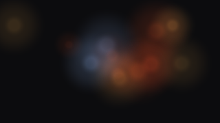

# Tutorial step 1: Ambience

A calm animated ground: a dozen soft lights drifting slowly under every slide. Small, but it
already keeps the whole engine contract.



**What you will build:** `ambience`, a calm animated ground: a dozen soft lights drifting
slowly under every slide.
The complete crate is [`examples/engine-ambience`](../../examples/engine-ambience).

**What you will learn:**

- the frame lifecycle: `update`, then `paint`, then `animating`;
- drawing through the `Painter`, with glow sprites;
- scaling with the slide;
- taking colours from the theme;
- reduced motion and deterministic stills.

**Before you start:** set up the [prerequisites](prerequisites.md), and work through
[Your first engine](tutorial-0-your-first-engine.md) first if you have not written an engine yet.
This step explains a finished engine instead of having you type it: every code block is a
**READ** block, taken from the file its label names, so read them next to that file. To run the
engine yourself, see [Try it](#try-it) at the end.

## The crate

`Cargo.toml` depends on `mdeck-sdk` and nothing else:

**READ** `examples/engine-ambience/Cargo.toml` (the example is part of mdeck's workspace, so it uses a path instead):

```toml
[dependencies]
mdeck-sdk = "2"
```

The crate exports two things mdeck needs: the engine's definition `DEF` and the entry point
`register`.

**READ** `examples/engine-ambience/src/lib.rs`, the definition and `register`:

```rust
// It only decorates: no pictures, no countdown, no end act, and it reads
// no settings from the theme's `engine:` block, so the defaults of
// `EngineDef::new` are all it needs.
pub static DEF: EngineDef = EngineDef::new(
    "ambience",
    "Soft lights drift slowly under every slide.",
    create,
)
.with_ending_caption_delay(1.0);

pub fn register(r: &mut Registry) -> Result<(), RegistryError> {
    r.engine(&DEF)?;
    r.theme("dusk", THEME)
}
```

- `name` is what themes write (`engine: ambience`) and what `--engine ambience` selects.
- `capabilities` says what the core must do differently for this engine. `NONE` means it only
  decorates. Step 2 turns on pictures, the countdown and the end act.
- `create` makes a running engine. mdeck calls it once per presentation and once per export.
- `register` adds the engine and a showcase theme, `dusk`, embedded with `include_str!`. Names are
  unique: registering a name mdeck or another extension already uses is an error that names both.

The theme is plain data:

**READ** `examples/engine-ambience/themes/dusk.yaml`:

```yaml
name: Dusk
extends: dark
engine:
  name: ambience
  cool: "#8fb2ff"
colors:
  background: "#0b1020"
  accent: "#ff7a45"
  secondary: "#f5c26b"
```

## The state

**READ** `examples/engine-ambience/src/lib.rs`, the engine's state:

```rust
pub struct Ambience {
    lights: Vec<Light>,
    clock: f32,        // seconds of motion so far
    age: f32,          // seconds since the engine started, for the fade-in
    settled: bool,     // whether the last frame was a still or under reduced motion
    layer: SpriteLayer // the GPU state behind the glow sprites
}
```

Each `Light` circles a home position on a slow Lissajous path. Its position is a pure function of
the clock:

**READ** `examples/engine-ambience/src/lib.rs`, `Light::at`:

```rust
pub fn at(&self, t: f32) -> [f32; 2] {
    let a = self.phase + self.speed * t;
    [
        self.home[0] + self.reach[0] * a.sin(),
        self.home[1] + self.reach[1] * (a * 0.7 + 1.3).cos(),
    ]
}
```

Positions are **slide fractions** (0..1), not points. The engine never has to care about the
window's size until it paints.

The lights are made once, from their number only, with a small integer hash (`splitmix64`). There
is no random number generator and no wall clock anywhere: the same deck always gets the same
lights. This is the first half of deterministic stills.

## `update`: advance the clock

**READ** `examples/engine-ambience/src/lib.rs`, `update`:

```rust
fn update(&mut self, frame: &Frame, stage: &Stage) {
    self.settled = frame.settled();
    if self.settled {
        // A still (export) or reduced motion: no motion at all, and a
        // pose that depends only on the slide, never on the wall clock.
        self.clock = stage.index as f32 * STILL_SPACING;
        self.age = FADE_IN;
    } else {
        // Clamp dt: after a stall (a laptop waking up) the lights must
        // not leap across the slide.
        let dt = frame.dt.clamp(0.0, 0.1);
        self.clock += dt;
        self.age += dt;
    }
}
```

`frame.settled()` is true for export stills (`frame.still`) and under reduced motion
(`frame.reduced_motion`). In both cases the engine shows a settled pose, and that pose depends
only on the slide number: slide 3 always looks the same, and slide 4 looks different from it
(neighbours should differ). This is the second half of deterministic stills.

Live, the clock advances by `frame.dt`, clamped so a stalled frame never makes the lights jump.

## `paint`: draw under the slide

**READ** `examples/engine-ambience/src/lib.rs`, `paint`:

```rust
fn paint(&mut self, painter: &mut Painter, frame: &Frame, _stage: &Stage) {
    let fade = smoothstep(0.0, FADE_IN, self.age) * frame.opacity;
    if fade <= 0.0 {
        return;
    }
    let tokens = frame.tokens;
    let (blend, strength) = if tokens.light {
        (SpriteBlend::Normal, 0.35)
    } else {
        (SpriteBlend::Additive, 1.0)
    };
    let sprites = self
        .lights
        .iter()
        .map(|l| {
            let [u, v] = l.at(self.clock);
            let c = l.color(tokens).to_f32();
            Sprite {
                center: frame.rect.lerp_inside(u, v),
                size: l.size * frame.scale,
                rgba: [c[0], c[1], c[2], l.glow * strength * fade],
            }
        })
        .collect();
    painter.sprites(&self.layer, sprites, blend);
}
```

Four rules show up here:

1. **Scale.** `frame.rect.lerp_inside(u, v)` turns a slide fraction into points, and every size
   is designed at 1920 by 1080 and multiplied by `frame.scale`. The ground looks the same in a
   small window, on a 4K projector and in a 1280 by 720 export (the crate has a test for this).
2. **Theme colours.** `Light::color` picks `tokens.accent`, `tokens.secondary` or
   `tokens.particle_cool`. The engine never hard-codes a colour, so every theme that selects it
   gets its own palette.
3. **Light pages.** On a light theme, added light disappears into the page. The engine switches to
   normal (ink) blending and draws fainter.
4. **Opacity.** `frame.opacity` fades the layer with the slide during transitions.

`Painter::sprites` draws many soft round lights in one GPU pass with additive blending: the right
tool for glows. For shapes, the painter also has `circle_filled`, `line`, `rect_filled`, `mesh`,
`image` and `text`. The `SpriteLayer` holds the GPU objects between frames; keep one per layer you
draw.

## `animating`: be honest

**READ** `examples/engine-ambience/src/lib.rs`, `animating`:

```rust
fn animating(&self) -> bool {
    !self.settled
}
```

mdeck repaints only while some part of the screen says it moves. A settled ground never needs
another frame, so under reduced motion the engine costs nothing.

## Testing

The unit tests check the contract directly:

**READ** `examples/engine-ambience/src/lib.rs`, a unit test in `mod tests`:

```rust
#[test]
fn stills_are_deterministic_and_differ_by_slide() {
    let a = still(3, 192, 108);
    let b = still(3, 192, 108);
    assert_eq!(a, b);
    let c = still(4, 192, 108);
    assert!(mean_difference(&a, &c).unwrap() > 0.1);
}
```

`still` renders one frame with `mdeck_sdk::testing::Headless`, which draws without a window or a
GPU:

**READ** `examples/engine-ambience/src/lib.rs`, the body of the `still` helper in `mod tests`:

```rust
let mut headless = Headless::new(w, h);
let (tokens, settings) = (Tokens::default(), EngineSettings::new());
let mut frame = Frame::new(headless.rect(), &tokens, &settings);
frame.still = true;
let mut stage = Stage::new(Moment::Slide);
stage.index = index;
headless.render_engine(&mut Ambience::new(), &frame, &stage)
```

The golden tests in `tests/golden.rs` compare a dark and a light still against PNGs committed in
`tests/golden/`:

**READ** `examples/engine-ambience/tests/golden.rs`:

```rust
assert_golden(golden("dark"), &render(&Tokens::default(), 0), GOLDEN_TOLERANCE);
```

Regenerate them after a deliberate change with `MDECK_UPDATE_GOLDEN=1 cargo test -p engine-ambience`.
The comparison is tolerant (a mean channel difference), because headless rendering is close to
the GPU's but not identical.

| Dark theme | Light theme |
|---|---|
|  |  |

## Try it

To run this engine you need a clone of the mdeck repository, the one case where you do: the
examples live there and build against its SDK. **RUN** once, in the folder where you keep code:

```bash
git clone https://github.com/mklab-se/mdeck
cd mdeck
cargo test -p engine-ambience
```

`--mdeck-path .` makes `mdeck build` use the clone's mdeck too (the example depends on the
clone's SDK, and both must be the same). Alternatively, create your own crate with
`mdeck sdk new engine <name>` and copy the example's `src/lib.rs` and theme into it.

Then, **RUN** in `mdeck/`:

```bash
mdeck build --with examples/engine-ambience --mdeck-path .
./target/release/mdeck samples/layouts/code.md --engine ambience
./target/release/mdeck export samples/layouts/code.md --theme dusk --at 4 --output-dir /tmp/dusk
```

Next: [step 2, pictures and moments](tutorial-2-pictures.md), where the engine draws the slide's
picture, the countdown and the end.
