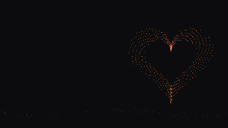
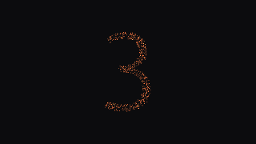
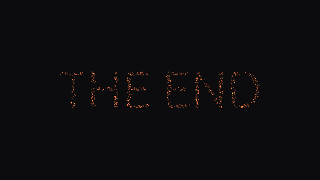

# Tutorial step 2: Pictures and moments

A field of 700 glowing motes that gathers into whatever the slide shows: the slide's picture, the
countdown digit, the end words. Between slides the motes migrate instead of cutting.

| A picture beside the copy | The countdown | The end |
|---|---|---|
|  |  |  |

**What you will build:** `pictures`, a field of 700 glowing motes that gathers into the slide's
picture, the countdown digits and the end words.
The complete crate is [`examples/engine-pictures`](../../examples/engine-pictures).

**What you will learn:**

- to declare capabilities, so the core hands you the picture and the moments;
- to draw a point cloud in your own medium, in the box the design gives it;
- to draw the countdown and the end act from glyph masks;
- to ease between slides, and to skip the easing for stills;
- to stay clear of the copy, and to fall back when there is nothing to draw.

**Before you start:** set up the [prerequisites](prerequisites.md), and work through
[Your first engine](tutorial-0-your-first-engine.md) first if you have not written an engine yet.
This step explains a finished engine instead of having you type it: every code block is a
**READ** block, taken from the file its label names, so read them next to that file. To run the
engine yourself, see [Try it](#try-it) at the end.

## Capabilities

**READ** `examples/engine-pictures/src/lib.rs`, the definition:

```rust
pub static DEF: EngineDef = EngineDef::new(
    "pictures",
    "Glowing motes gather into the slide's picture, the countdown and the end.",
    create,
)
.with_capabilities(
    Capabilities::NONE
        .with_picture()
        .with_countdown()
        .with_ending(),
)
.with_ending_caption_delay(2.5);
```

Each capability changes what the *core* does:

- `picture`: the core resolves the slide's picture (`picture: rocket` in the slide's settings, or
  the deck's default) and puts it on `stage.picture`, placed where the slide's design has a stage.
- `countdown`: the core asks this engine to draw the opening countdown. The stage's moment becomes
  `Moment::Countdown { digit, mask, progress, .. }` for each digit, then `Moment::Burst` as the
  last digit leaves.
- `ending`: after the last slide, the moment becomes `Moment::End { elapsed, words, .. }` and the
  core does not draw its plain "The End". `with_ending_caption_delay` tells it when to fade in the
  small "made with mdeck" caption: after the words have gathered.

`Moment` may gain moments in a later 2.x, so `form` ends its `match` with a wildcard arm that
rests the motes, and patterns its variants with `..`. In tests, build moments with
`Moment::countdown(digit, mask, progress)` and `Moment::end(elapsed, words)`.

An engine without these never sees those moments, and the core draws the countdown and the end
itself.

## One formation at a time

Every mote has a position and a target, both in slide fractions, and a brightness and a target
brightness:

**READ** `examples/engine-pictures/src/lib.rs`, `Mote`:

```rust
pub struct Mote {
    pub pos: [f32; 2],
    pub target: [f32; 2],
    pub glow: f32,
    pub target_glow: f32,
    pub pace: f32, // how fast it eases: motes arrive at different times
}
```

Computing targets is the expensive part, so it happens only when what is shown changes. The
engine keys it on the moment's `Look` (which ignores masks and progress), the slide, the picture
and the size:

**READ** `examples/engine-pictures/src/lib.rs`, in `update`:

```rust
let key = Key {
    look: stage.moment.look(END_WORDS),
    index: stage.index,
    picture: cloud(stage.picture.as_ref()).map(|(c, _)| c.name.clone()),
    size: [rect.width() as i32, rect.height() as i32],
};
if self.key.as_ref() != Some(&key) {
    self.form(stage, rect);
    self.key = Some(key);
}
```

`form` matches on the moment and points every mote somewhere.

## The picture, in your medium

A point cloud is a picture reduced to points in the unit square, **most important first**: any
prefix of the points is a fair sketch of the whole. An engine with 300 particles takes the first
300 and still gets a recognisable shape.

**READ** `examples/engine-pictures/src/lib.rs`, `draw_picture`:

```rust
fn draw_picture(&mut self, index: usize, cloud: &Cloud, pic: &Picture, rect: Rect) {
    let area = pic.place.in_rect(rect);
    // Cloud::aspect is height over width.
    let box_ = fit(area, area.height(), 1.0 / cloud.aspect.max(0.01), 1.0);
    // On a title slide the picture is a large, dim backdrop.
    let glow = if pic.backdrop { 0.3 } else { 0.8 };
    for (i, m) in self.motes.iter_mut().enumerate() {
        match cloud.points.get(i) {
            Some(&[x, y]) => {
                let (u, v) = rect.fraction_of(box_.lerp_inside(x, y));
                m.target = [u, v];
                m.target_glow = glow;
            }
            None => {
                m.target = rest(i, index);
                m.target_glow = 0.25;
            }
        }
    }
}
```

- `pic.place` is the box the **design** gives the picture, in slide fractions. Which slides show a
  picture, and where, is the design's decision, not the engine's: the engine draws into the box.
  This is how the engine stays clear of the copy: the design already put the copy elsewhere.
- `pic.backdrop` is set on title slides, where the picture sits large and dim behind centred copy.
  Dim it: the title must stay readable.
- `fit` keeps the cloud's aspect inside the box. Note that `Cloud::aspect` is height over width,
  while `Mask::aspect` (below) is width over height.

What makes this the engine's *own medium* is only the drawing: here each point becomes a small
glowing mote with a warm tint mixed from `tokens.particle_light` and `tokens.accent`. A laser
engine would trace the points, a blocks engine would drop bricks on them.

### Fall back gracefully

`stage.picture` may also hold a generated artwork (`PictureSource::Artwork`). When the
slide's picture is an image file, mdeck draws it on the stage itself and the engine gets no
picture, only a `Hint::Frame` where the image is (`PictureSource::Image` is reserved for later).
This engine draws only point clouds, so for anything else, and when there is no picture, it shows
its ground: a low band of resting motes. A slide is never left empty
because an optional input is missing.

**READ** `examples/engine-pictures/src/lib.rs`, in `form`:

```rust
Moment::Slide => match cloud(stage.picture.as_ref()) {
    Some((cloud, pic)) => self.draw_picture(stage.index, &cloud, pic, rect),
    None => self.rest(stage.index),
},
```

The resting band sits in the bottom eighth of the slide, below the copy, and its wave rotates by
slide number so neighbouring slides differ.

## The countdown and the end

The core hands over each countdown digit and the end words as a `Mask`: points sampled inside the
glyphs, in the unit square of their ink, shuffled so any prefix covers the whole shape.

**READ** `examples/engine-pictures/src/lib.rs`, in `form`:

```rust
Moment::Countdown { mask, .. } => {
    let box_ = fit(rect, rect.height() * 0.55, mask.aspect, 0.8);
    for (i, m) in self.motes.iter_mut().enumerate() {
        let [x, y] = mask.points[i % mask.points.len().max(1)];
        m.target = place(i, box_.lerp_inside(x, y));
        m.target_glow = 0.9;
    }
}
```

The end works the same way with `words`, for `END_WORDS` seconds; after that the motes sink below
the slide and fade, and `Moment::look` changes from `Look::EndWords` to `Look::EndOut`, which
triggers that formation. `Moment::Burst` sends every mote outward as the last digit leaves.

If you need a mask of your own (a word, a number), `Painter::glyph_points(text, font, n)` samples
one in the theme's fonts.

## Easing between slides

When the targets change, the motes do not jump. Each frame, each mote moves a fraction of the way:

**READ** `examples/engine-pictures/src/lib.rs`, in `update`:

```rust
let dt = frame.dt.clamp(0.0, 0.1);
for m in &mut self.motes {
    // Exponential easing: frame-rate independent, never overshoots.
    let k = 1.0 - (-m.pace * dt).exp();
    m.pos[0] += (m.target[0] - m.pos[0]) * k;
    m.pos[1] += (m.target[1] - m.pos[1]) * k;
    m.glow += (m.target_glow - m.glow) * k;
}
```

`1 - exp(-pace * dt)` gives the same motion at 30, 60 or 144 frames per second. Different paces
per mote make the arrival organic instead of mechanical.

For stills and reduced motion there is no journey: the motes are put on their targets at once.

**READ** `examples/engine-pictures/src/lib.rs`, in `update`:

```rust
if self.settled {
    for m in &mut self.motes {
        m.pos = m.target;
        m.glow = m.target_glow;
    }
    return;
}
```

Because the targets depend only on the stage (and per-mote hashes), a still of slide 5 is the same
image whatever slide you came from.

## `animating`

The motes shimmer while live, so this engine always moves and says so (`!self.settled`). An
engine may do that, but it pays for it with a repaint every frame; step 3 shows an engine that
settles.

## Testing

The unit tests check behaviour, not pixels: one mote per cloud point inside the placed box, a dim
backdrop, the resting band below the copy, easing that arrives, a centred digit, an image falling
back to the ground. The golden tests render the three stills at the top of this page. A countdown
mask comes from the headless painter, exactly as the core makes it:

**READ** `examples/engine-pictures/tests/golden.rs`, the `mask` helper:

```rust
fn mask(h: &mut Headless, text: &str) -> Mask {
    let mut out = None;
    h.paint(|p| out = Some(p.glyph_points(text, Font::display(200.0), 1500)));
    out.unwrap()
}
```

## Try it

To run this engine you need a clone of the mdeck repository, the one case where you do: the
examples live there and build against its SDK. **RUN** once, in the folder where you keep code:

```bash
git clone https://github.com/mklab-se/mdeck
cd mdeck
cargo test -p engine-pictures
```

`--mdeck-path .` makes `mdeck build` use the clone's mdeck too (the example depends on the
clone's SDK, and both must be the same). Alternatively, create your own crate with
`mdeck sdk new engine <name>` and copy the example's `src/lib.rs` and theme into it.

Then, **RUN** in `mdeck/`, with any deck of yours as `my-deck.md`:

```bash
mdeck build --with examples/engine-pictures --mdeck-path .
./target/release/mdeck export my-deck.md --theme fireflies --at 0.5 --moment countdown
./target/release/mdeck export my-deck.md --theme fireflies --at 2 --moment end
```

Next: [step 3, reacting to content](tutorial-3-reactive.md).
