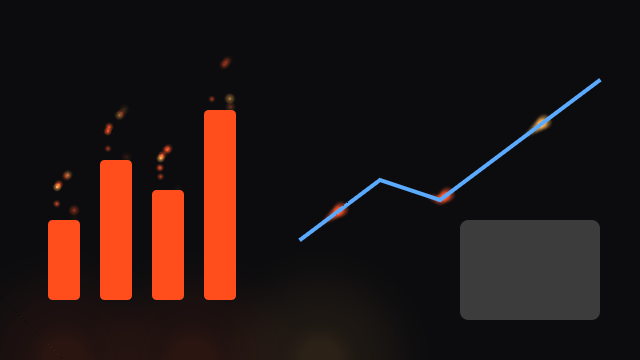

# Tutorial step 3: Reacting to content

An engine that serves the slide's visuals instead of decorating around them: embers rise from the
tops of bars, runners travel along line series, sparks orbit pies, and the engine stays dark
inside images and cards. It reads typed, validated settings from the theme, and it stops asking
for frames when nothing on the slide moves.



**What you will build:** `reactive`, an engine that reacts to the slide's charts and images,
with typed settings a theme can tune.
The complete crate is [`examples/engine-reactive`](../../examples/engine-reactive).

**What you will learn:**

- to read the geometry visuals publish (bars, paths, circles, frames);
- to derive state only when that geometry changes;
- to declare typed settings, read them, validate them and report problems to `--check`;
- to declare what the engine needs from the theme;
- to keep `animating` honest, and other performance habits.

**Before you start:** set up the [prerequisites](prerequisites.md), and work through
[Your first engine](tutorial-0-your-first-engine.md) first if you have not written an engine yet.
This step explains a finished engine instead of having you type it: every code block is a
**READ** block, taken from the file its label names, so read them next to that file. To run the
engine yourself, see [Try it](#try-it) at the end.

## Published geometry

Visuals (charts, diagrams) and design sets publish what they drew as `Hint`s. The core collects
them and hands them to the engine on the next frame as `stage.geometry`:

| Hint | Published by | What this engine does |
|---|---|---|
| `Bar(rect)` | bar charts, progress bars | embers rise from the top edge |
| `Path(points)` | line series, routed edges, timelines | runners travel from the first point to the last |
| `Circle { center, radius }` | pies, donuts, radar rings, Venn sets | sparks orbit the rim |
| `Point(pos)` | scatter dots, timeline events | (ignored here) |
| `Frame(rect)` | images, cards, nodes | stays dark inside |
| `Copy(rect)` | the design, around the slide's copy | (ignored here; the particles engine moves its clusters off it) |
| `Text { .. }` | headings, as laid out | (ignored here; an engine can form titles from them) |

The engine turns hints into a `Scene` it can draw quickly:

**READ** `examples/engine-reactive/src/lib.rs`, `Scene::from_hints`:

```rust
pub fn from_hints(hints: &[Hint]) -> Self {
    let mut s = Scene::default();
    for h in hints {
        match h {
            Hint::Bar(r) => s.bars.push((Pos2::new(r.center().x, r.top()), r.width())),
            Hint::Path(p) if p.len() > 1 => s.routes.push(Route::new(p.clone())),
            Hint::Circle { center, radius } => s.rings.push((*center, *radius)),
            Hint::Frame(r) => s.frames.push(*r),
            _ => {}
        }
    }
    s
}
```

`Route` measures a path once (the distance to each point), so a runner can be placed at any
fraction of its length with a binary search instead of walking the path every frame.

### Derive only on change

Visuals publish their geometry every frame, and reveal animations move it slightly. Rebuilding
the scene every frame would waste time, so the engine keys it on `stage.geometry_key`, a
fingerprint of the hints quantised to 4-point steps (sub-pixel jitter does not change it):

**READ** `examples/engine-reactive/src/lib.rs`, the start of `update`:

```rust
fn update(&mut self, frame: &Frame, stage: &Stage) {
    if self.key != Some(stage.geometry_key) {
        self.scene = Scene::from_hints(stage.geometry);
        self.key = Some(stage.geometry_key);
    }
    // ... clock as in step 1
}
```

### Stay dark inside frames

Every light passes through one function, which drops it when it would land inside a frame:

**READ** `examples/engine-reactive/src/lib.rs`, in `sprites`:

```rust
let mut light = |center: Pos2, size: f32, glow: f32, i: usize| {
    // Dark inside frames: never draw over an image or a card.
    if glow <= 0.0 || self.scene.in_frame(center, size * 0.25) {
        return;
    }
    // ...
};
```

The engine paints *under* the content, so it cannot hide an image; but a glow under a
semi-transparent card or behind a photo's edge reads as noise. Staying out keeps content readable.

### Motion as a function of time

Embers, runners and sparks are not simulated: each is a pure function of the clock and its own
hash. An ember's age is `(t * rate + phase).fract()`, its height is its age times the rise, and
its brightness is `sin(pi * age)`, so it fades in and out. Pure functions make stills trivially
deterministic (pick a clock value) and need no per-frame allocation.

## Typed settings

A theme configures an engine in its `engine:` block:

**READ** `examples/engine-reactive/themes/signal.yaml`, its `engine:` block:

```yaml
engine:
  name: reactive
  glow: 1.2
  runners: true
  palette: accent
```

The engine declares each setting it reads, with a type and one sentence of help:

**READ** `examples/engine-reactive/src/lib.rs`, `SETTINGS`:

```rust
pub const SETTINGS: &[SettingSpec] = &[
    SettingSpec::new(
        "glow",
        SettingKind::Number,
        "How bright the lights are, from 0 to 2 (default 1).",
    ),
    SettingSpec::new(
        "runners",
        SettingKind::Bool,
        "Send runners along line series and edges (default true).",
    ),
    SettingSpec::new(
        "palette",
        SettingKind::OneOf(&["accent", "warm", "cool"]),
        "Which theme colours the lights take (default accent).",
    ),
    SettingSpec::new(
        "tint",
        SettingKind::Color,
        "One colour for every light, overriding the palette.",
    ),
];
```

`DEF.settings = SETTINGS` lets mdeck check a theme without running the engine
(`EngineDef::check_settings`, used by `mdeck theme check`) and list the settings in the docs.

`create` reads them into a typed struct once:

**READ** `examples/engine-reactive/src/lib.rs`, `Settings::read`:

```rust
pub fn read(settings: &EngineSettings) -> Self {
    let d = Settings::default();
    let mut glow = settings.f32_or("glow", d.glow);
    if !(0.0..=2.0).contains(&glow) {
        settings.report("glow", format!("should be between 0 and 2, not {glow}"));
        glow = glow.clamp(0.0, 2.0);
    }
    let palette = match settings.one_of("palette", &["accent", "warm", "cool"]) {
        Some("warm") => Palette::Warm,
        Some("cool") => Palette::Cool,
        _ => d.palette,
    };
    Settings {
        glow,
        runners: settings.bool_or("runners", d.runners),
        palette,
        tint: settings.color("tint"),
    }
}
```

`EngineSettings` does the bookkeeping:

- a typed getter (`f32`, `bool`, `str`, `color`, `one_of`) that finds a value of the wrong type
  records a problem and reads it as absent, so the default applies;
- `report(key, message)` records a problem the types cannot catch, such as a number out of range;
- every key the engine never read is reported as an unknown setting (a typo, or a setting for a
  different engine).

After `create`, mdeck calls `settings.problems()` and shows them in `--check` and the startup
summary, at the `engine:` block's line in the theme, along these lines:

**READ** what `mdeck --check` prints for a theme with bad settings:

```text
themes/signal.yaml line 6: engine: `glow` should be between 0 and 2, not 9
themes/signal.yaml line 6: engine: `palette` should be one of accent, warm, cool, not `neon`
themes/signal.yaml line 6: engine: unknown setting `sparkle`
```

The rule: never fail on a bad setting. Report it, use the default (or clamp), and present.

## What the engine needs from the theme

**READ** `examples/engine-reactive/src/lib.rs`, in `DEF`:

```rust
.with_needs(Needs::NONE)
```

This engine adds light on a dark ground and needs nothing. An ink engine that draws on paper would
say `.with_needs(Needs::NONE.with_page())`: the theme must then have a `page:` block (the slide becomes a sheet on a surface),
and `mdeck theme check` reports a theme that selects the engine without one.

## An honest `animating`

**READ** `examples/engine-reactive/src/lib.rs`, `animating`:

```rust
fn animating(&self) -> bool {
    !self.settled && (self.age < FADE_IN || self.scene.moves(&self.settings))
}
```

On a slide of plain text this engine has nothing to animate once the ground has faded in, so it
returns `false` and mdeck stops repainting. On a chart it keeps going. This matters: a presenter's
laptop on battery should not run the GPU flat out behind a static bullet list.

## Performance habits

The engine budget is 60 frames per second at 4K on an integrated GPU. The habits that keep an
engine inside it:

1. **Derive on change**, keyed on `geometry_key`, the moment's `Look` or the slide index, never
   every frame.
2. **Draw lights with `Painter::sprites`**: one GPU pass for thousands of glows, instead of one
   shape per light.
3. **Bound your counts**: a fixed number of embers per bar, runners per path, sparks per ring.
   Work grows with the content, so cap the total if your effect is expensive and a slide may hold
   a large chart.
4. **Allocate little per frame**: pure functions of time need no simulation state.
5. **Settle when you can**, and say so in `animating`.

## Testing

The unit tests cover every rule on this page: defaults, typed reading, bad values reported with the
theme's line, `check_settings` without running, route measurement, nothing drawn inside a frame,
and `animating` in all four cases (fading in, nothing to do, embers rising, reduced motion). The
golden test draws the content the hints stand for over the engine's layer, so the image shows the
reaction in context.

## Try it

To run this engine you need a clone of the mdeck repository, the one case where you do: the
examples live there and build against its SDK. **RUN** once, in the folder where you keep code:

```bash
git clone https://github.com/mklab-se/mdeck
cd mdeck
cargo test -p engine-reactive
```

`--mdeck-path .` makes `mdeck build` use the clone's mdeck too (the example depends on the
clone's SDK, and both must be the same). Alternatively, create your own crate with
`mdeck sdk new engine <name>` and copy the example's `src/lib.rs` and theme into it.

Then, **RUN** in `mdeck/`:

```bash
mdeck build --with examples/engine-reactive --mdeck-path .
./target/release/mdeck samples/visualizations/all.md --engine reactive
./target/release/mdeck samples/visualizations/all.md --check
```

That completes the tutorial. For drawing whole slides, see
[design sets and board engines](design-sets.md); for new chart kinds, see [visuals](visuals.md).
