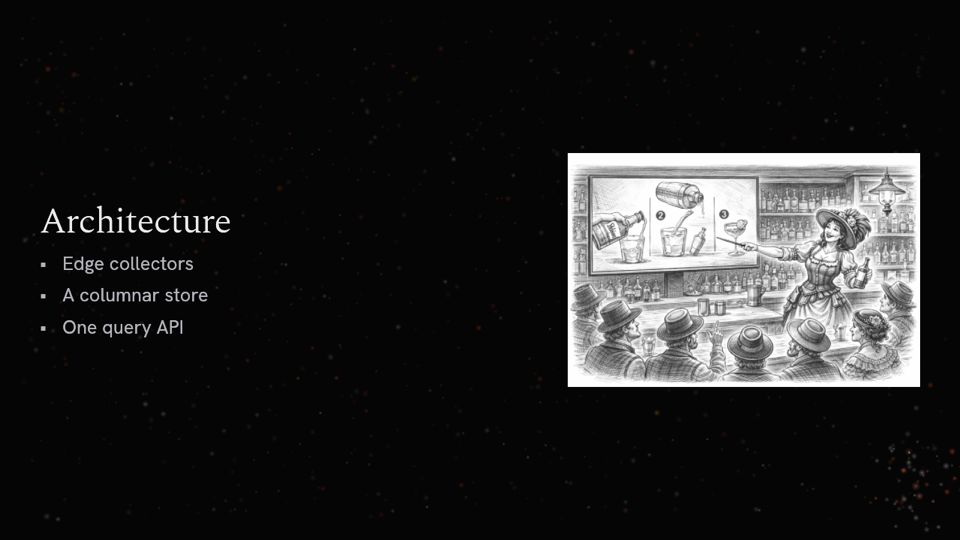

# 03. Slide designs

What kinds of slide mdeck shows, how it recognises which one a slide is, and how a theme makes
each one its own.

## Today

### The layouts

`Layout` (`crates/mdeck/src/parser/layout.rs`) has 11 values:

- Title, Section, Bullet, Content, Code, TwoColumn
- Quote, Image, Gallery, Diagram, Visualization

The layout is decided once, when the slide is parsed. `@layout: name` overrides it. Names are
exact; an unknown value silently becomes Content. The spec documents a `blank` layout that does
not exist.

### How a layout is recognised

`infer_layout` (`layout.rs:98`) checks these rules in order; the first match wins.

| # | Layout | Content that triggers it |
|---|---|---|
| 1 | Diagram | any `@architecture` block, whatever else is on the slide |
| 2 | Visualization | any chart fence, including `@thermal` |
| 3 | TwoColumn | any `+++` line |
| 4a | Section | exactly one H1, at most 2 headings, and nothing else |
| 4b | Title | one H1 plus exactly one H2 or one paragraph under 120 characters |
| 5 | Section | exactly one heading of any level and nothing else |
| 6 | Image | exactly 1 image; no list, code, quote or table; at most 1 other non-heading block |
| 7 | Gallery | 2 or more images; no list, code, quote, table or paragraph |
| 8 | Quote | 1 or more quotes; no list, code or table; at most 1 image |
| 9 | Code | 1 or more code blocks; no list, quote or table; at most 1 image |
| 10 | Bullet | a heading and a list; no code or quote; at most 1 image (tables and paragraphs allowed) |
| 11 | Content | everything else |

Some consequences:

- A single `# Title` (the start of most READMEs) is a Section, not a Title.
- The most common slide in a document, **`## Heading` + a short paragraph, is Content**: a small
  paragraph left in a 70% column.
- H1 + a paragraph of 120 characters or more is Content.
- Heading + list + image is Bullet with the image in a side panel.
- Heading + two images + text is Content: the first image goes to a side panel and the second is
  inline in the text column.

### Where the borders are

| Content | Becomes |
|---|---|
| Heading + text | Content (or Title if it is H1 + a short line) |
| Heading + bullets | Bullet |
| Heading + bullets + image | Bullet with side image (55% text, 40% image) |
| Heading + image (+ caption) | Image |
| Heading + 2 images | Gallery |
| Heading + 2 images + text | Content with a side image and an inline image |
| Comparison | Only with `+++` between the two halves (inferred; `@layout` is not needed, though the spec says it is) |
| Anything + a diagram | Diagram, and everything but the first heading is dropped |

### What each layout draws, and what it drops

Bullet, Content and Code are the same renderer (`layouts/stacked.rs`) with different column widths
(70%, 70%, 75%). They stack all blocks, centred vertically, with the first image in a right panel.

Every other layout picks *some* blocks and silently drops the rest:

| Layout | Draws | Drops |
|---|---|---|
| Title | the last H1, plus the last H2 or the first paragraph | everything else |
| Section | the first heading only | everything else |
| Quote | the last heading, the last quote, the last paragraph after the quote (attribution) | earlier quotes and headings |
| Image | the first heading before the image, the first image, the first paragraph after it | a paragraph *before* the image (export confirmed) |
| Gallery | the first heading, all images | captions, later headings |
| Diagram | the first heading, the first diagram | everything else, including bullets |
| Visualization | the first heading, the other text, the first chart | second and later charts; text written after the chart moves above it |

### What a theme can change

Nothing about the geometry. A theme sets colours, fonts and sizes. Everything else is Rust
constants (`render/layouts/mod.rs:19-46` plus literals scattered in the layouts):

- column fractions 0.70, 0.75 and 0.80
- padding 80, 60 and 50
- the 55/5/40 image split
- the title size multiplier 1.1, section 1.2, quote 1.3, caption 0.9
- the opacities 0.8, 0.7 and 0.6
- the gallery grid
- the quote bar position

The bullet glyph is a hardcoded `•`.

### Standard and editorial: the two looks a slide can have today

mdeck already has two complete ways of arranging the same slide. This spec calls them **design
sets**, the word the code never had:

- **Standard** is how mdeck arranges slides on the `plain` engine (themes `dark`, `light`, `nord`,
  `spring`, `summer`). It is a classic slide layout:
  - the content is a block centred on the slide (a column 70% of the width for text);
  - the heading sits on top of it, and everything is vertically centred;
  - there is no decoration.
- **Editorial** is the Ember look, inspired by the MKLab website (code: `render::ember`). It reads
  like a magazine spread:
  - the text sits in a narrow column on the **left** (44% wide, 7% in from the edge);
  - a small **eyebrow** above the heading (a Roman numeral and the deck title, in tracked
    monospace capitals);
  - a serif display heading, accent-coloured bullet dots and a soft "pillow" behind the text;
  - the elements **fade up one after another** when the slide is entered;
  - the right side of the slide is deliberately empty: it is the **stage**, where the engine
    draws the slide's picture (particles forming a rocket, an LED illustration, a sketch).

The same markdown in both sets:

| | Standard (`dark`, plain engine) | Editorial (`ember`, particles engine) |
|---|---|---|
| Heading + bullets |  |  |
| Quote + attribution |  |  |

Side by side:

| | Standard | Editorial |
|---|---|---|
| Text position | centred column (70% wide) | left column (44% wide), right side left for the stage |
| Above the heading | nothing | eyebrow: slide numeral and deck title |
| Heading | theme's display font, plain | theme's display font with editorial sizing and spacing |
| Bullets | `•` in the text colour, nesting at every level | accent-coloured dots, one nesting level, ordered lists show dots |
| Quote | centred, curly quotes, bar in the accent colour, attribution right-aligned with a leading dash | left column, italic, bar beside the text, attribution in small tracked capitals |
| Title slide | centred title and subtitle | centred, 62% wide, with a "Space to begin" hint on slide 1 |
| Section slide | centred heading | heading low on the slide (14% from the bottom) |
| Entering a slide | appears at once (the transition moves it) | text fades up in a stagger (120 ms apart) |
| Slide chrome | optional footer | eyebrow numerals, beat ticks, a progress hairline |

**Who decides which set a slide gets today: the engine, not the theme.** This is where it gets
confusing:

1. **Editorial is switched on by the engine.** Every engine with the `editorial` capability
   (particles, LED, laser, blocks, thermal, and the five art engines) uses editorial. The `plain`
   engine never does. The theme has no say: Ember's colours and fonts on the plain engine give
   standard arrangements in Ember's style, without the column, eyebrow or stagger:

   

2. **Editorial only covers some slides.** Editorial handles:
   - title, section and quote slides;
   - bullet and content slides that have no image, code, table or diagram.

   Every other slide falls back to standard, even on Ember. So an Ember deck mixes the two
   sets: its bullet slide with an image has no eyebrow, a different bullet style and a centred
   image panel:

   

3. **Editorial recognises slides a little differently:**
   - it treats slide 1 as a title whenever it starts with an H1 and has no list, code or image
     (`ember::is_title`);
   - it shows one level of nesting;
   - a chart forced onto a content slide with `@layout` disappears.

The split-flap engine is a third set: it draws every slide itself, as text on a character grid.

## Assessment

1. **There is no concept of a slide design**, only an inference function, renderers with
   constants, and a second hidden renderer selected by engine. A designer cannot answer "what does
   a quote slide look like in my theme?" without reading Rust.
2. **Recognition misses the most common slide.** A heading with a sentence or two is the
   backbone of most talks and gets the least designed treatment.
3. **Content is silently dropped.** This is the most serious defect in the area: an author can
   write a paragraph and never see it, and nothing tells them.
4. **The borders are arbitrary.** For example: "at most 1 other non-heading block", "fewer than
   120 characters", "a table makes a quote slide a content slide".
5. **Themes cannot be different where it counts.** The most visible difference between Ember and
   Dark is the editorial design set, and that comes from the engine, not the theme. Editorial also
   covers only some slides, so one deck mixes two looks. Today it is
   impossible to have the editorial layouts on a still theme, or the standard layouts with
   particles.
6. **Overflow handling is uneven.** Code shrinks to fit; prose never does; the Gallery
   measurement assumes stacked 400 px images, so galleries that fit can still show a scroll cue.

## Requirements

### A catalogue of designs

- **DES-01** MUST `new`: mdeck has a fixed, documented catalogue of slide designs. Each design
  defines:
  - its **roles** (the named places content can go);
  - its **recogniser** (which content matches it);
  - how it **overflows**;
  - its default **arrangement** in each built-in design set.
- **DES-02** MUST `new`: The v2 catalogue is the following list, including the new `statement` and
  `table` designs (decided). Roles are in *italics*; `?` means
  optional.

| Design | Purpose | Roles | Recognised when the slide has |
|---|---|---|---|
| `title` | Opens the deck or a part | *title*, *subtitle?*, *byline?* | an H1 with at most one short line (an H2 or a paragraph). The **first slide** with an H1 and no other content is always `title` (byline from frontmatter `author`). |
| `section` | Divider | *title*, *kicker?* | a lone heading (any level), or a heading with a single short line that is not the first slide. |
| `statement` | One idea, said big | *title?*, *statement* | a heading and one or two short paragraphs, and nothing else. **New:** today this is Content. |
| `points` | Heading and a list | *title*, *lead?*, *list* | a heading and one list, optionally a lead paragraph before the list. |
| `split` | Text beside a picture | *title*, *body*, *media* | one image plus text (paragraphs or a list). **New name** for today's implicit side panel. |
| `media` | One image, large | *title?*, *media*, *caption?* | one image, optionally a heading and a caption paragraph. |
| `gallery` | Several images | *title?*, *media+*, *captions?* | two or more images and no other text except a heading. Captions come from alt text. |
| `quote` | A quotation | *title?*, *quote*, *attribution?* | one quote, optionally a heading and an attribution paragraph. |
| `code` | Code with context | *title?*, *lead?*, *code* | one code block, optionally a heading and a short paragraph. |
| `visual` | A chart or diagram | *title?*, *lead?*, *visual* | one visual block, optionally a heading and a short paragraph. |
| `columns` | Side by side, comparison | *title?*, *column+* | a column separator. Each column is a small stack of its own. |
| `table` | Tabular data | *title?*, *lead?*, *table* | a heading and a table. **New:** today it is Bullet or Content. |
| `content` | Anything else | *title?*, *body* | anything not matched above, in reading order. Always holds all content. |

- **DES-03** MUST `new`: Recognition is a single ordered table, documented in the user-facing
  format reference and printed by `mdeck spec`. Its thresholds ("short" is defined once, in
  characters or lines) are part of the specification, not constants in code.
- **DES-04** MUST `new`: **No design drops content.** A slide whose content does not fit any
  design's roles is a `content` slide. A design chosen by the author that cannot hold all of a
  slide's content shows the rest in its body role, or falls back to `content`. In either case
  `--check` reports it.
- **DES-05** MUST `keep`: The author can choose a design for a slide (today `@layout`, in v2 a
  slide setting named `design`; see [07](07-authoring-language.md)). An unknown design name is a
  `--check` error that lists the valid names.
- **DES-06** MUST `new`: `mdeck --check -v` prints each slide's design and why it was recognised.
  The rule that matched is named in the output, for example `slide 4: statement (heading + 1
  short paragraph)`.
- **DES-07** MUST `remove`: A visual block no longer forces its design and drops everything else.
  A slide with a diagram *and* bullets is a `content` slide (or a `split`-like arrangement chosen
  by the design set) that shows both.
- **DES-08** SHOULD `new`: Two or more visuals on one slide are shown, not dropped (stacked or side
  by side, as the design set decides).

### Arrangements: how a theme makes designs its own

- **DES-09** MUST `new`: How a design looks is decided by an **arrangement**. Every theme has one
  for every design, through its design set and its own overrides.
- **DES-10** MUST `new`: mdeck ships two design sets, both defined as data:
  - `standard`: the classic slide. Content centred, heading on top, no ornament, no entry motion.
    Today's plain-engine layouts, with their constants made into arrangement values.
  - `editorial`: the magazine spread. A left copy column, an eyebrow, display typography, a
    staggered entry and a stage on the right for the picture. Today's `render::ember`.

  A theme picks one with `designs: standard | editorial`, **independently of its engine**. Ember
  on a still screen (`designs: editorial`, `engine: plain`) and the particles field behind
  centred slides (`designs: standard`, `engine: particles`) both become possible.
- **DES-10a** MUST `new`: A design set covers **every** design in the catalogue. A deck never
  mixes sets: on an editorial theme, a slide with an image, code, a table or a chart is arranged
  editorially too (eyebrow, column, entry), not handed back to standard as it is today.
- **DES-10b** MUST `new`: Both design sets recognise slides with the same recogniser (DES-03).
  A design set changes how a design looks, never which design a slide is.
- **DES-11** MUST `new`: A theme can override any design's arrangement with data only. What can
  be set:
  - region geometry, in fractions of the slide: where each role sits, column widths, the
    split ratio, which side the media goes on;
  - alignment: left, centre or right; top, middle or bottom;
  - role styling: font role, size token, colour token, opacity, case, letter spacing;
  - ornaments: quote marks, the quote bar, the bullet glyph, rules, the eyebrow, numbering;
  - the entry motion: none, fade, rise or stagger, with timing;
  - the stage: whether the design leaves room for a picture, and where.
- **DES-12** MUST `new`: An arrangement override is partial. A theme states only what differs
  from its design set, and `extends` merges arrangements key by key, as it does with colours.
- **DES-13** MUST `new`: Every hardcoded geometry constant in today's layouts becomes either part
  of an arrangement (themeable) or a documented invariant of the design (not themeable, with a
  reason).
- **DES-14** MUST `new`: A code extension can provide a whole design set (see
  [08](08-extensibility.md)). A board engine supplies its design set this way, and must declare
  which designs and blocks it cannot show, so `--check` can report them.

An illustrative sketch of an arrangement override (the schema is decided when this is built):

```yaml
designs: editorial
arrangements:
  quote:
    quote: { region: [0.12, 0.25, 0.76, 0.5], align: center, size: h2, font: display }
    attribution: { align: right, color: muted, style: italic }
    ornament: { marks: hanging, bar: none }
  points:
    list: { bullet: "◆", color: text, marker-color: accent, spacing: 1.4 }
    stage: right
  title:
    title: { region: [0.07, 0.55, 0.6, 0.3], align: left, case: upper }
    entry: { kind: stagger, step-ms: 120 }
```

### Overflow

- **DES-15** MUST `keep`: Content that does not fit scrolls smoothly, with fade cues.
- **DES-16** MUST `change`: Before scrolling, every design tries to fit:
  - code shrinks (as today);
  - prose and lists may shrink to a documented floor (new);
  - visuals scale to their role (as today).
- **DES-17** MUST `change`: The measurement that decides scrolling is the same computation as
  drawing, for every design (today Gallery and Visualization measure with nominal sizes, and the
  reveal auto-scroll uses its own width).
