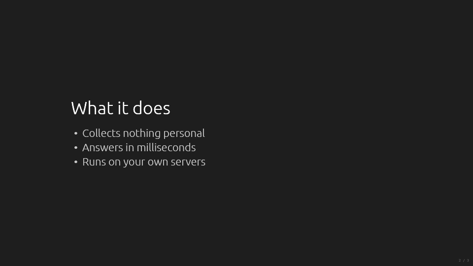
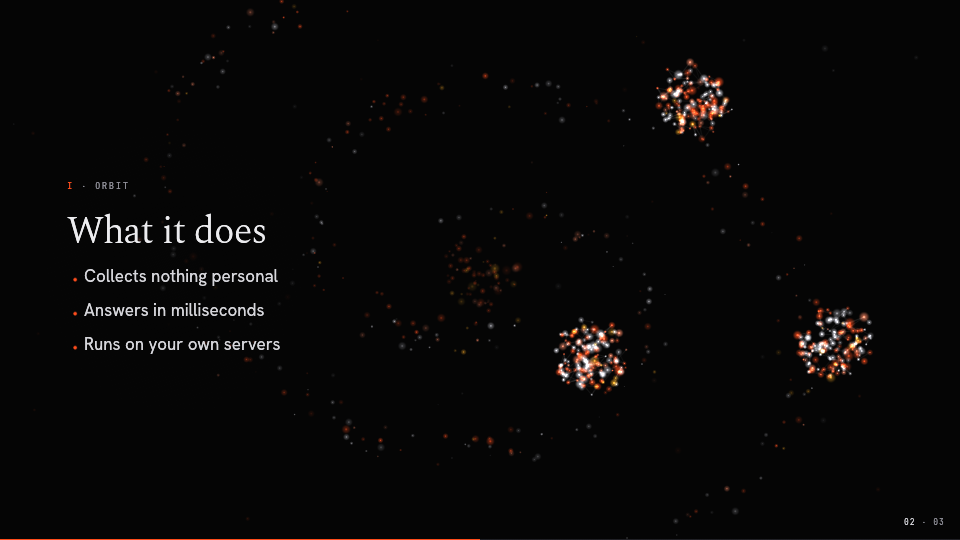
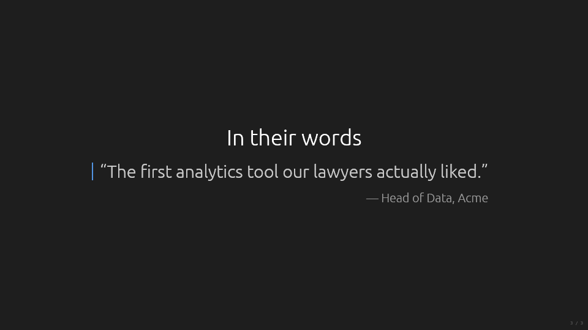
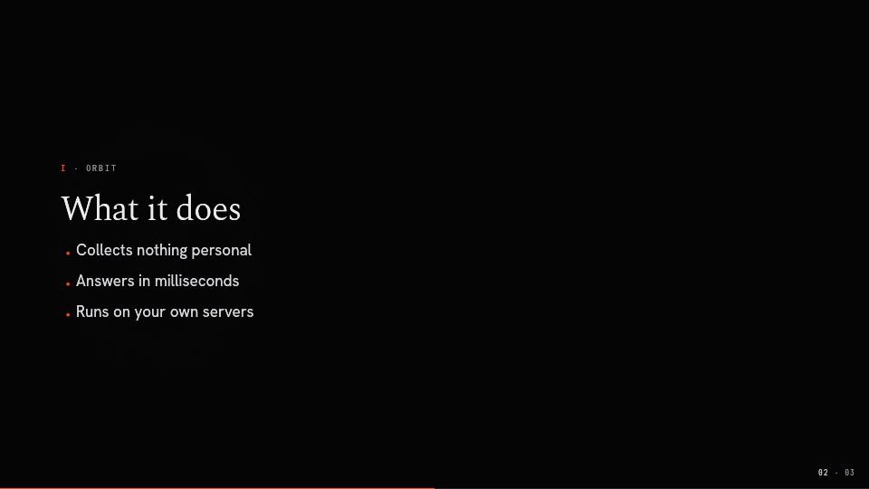
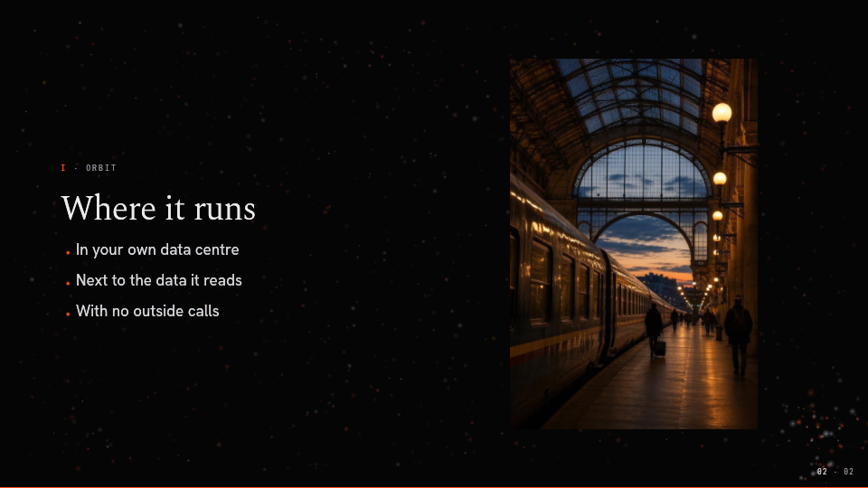

# 03. Slide designs

What kinds of slide mdeck shows, how it recognises which one a slide is, and how a theme makes
each one its own.

## The model in brief

Every slide is one of 13 **designs**. mdeck **recognises** the design from the slide's content
with one ordered table, or the author chooses one with `<!-- design: name -->`. A design names
the **roles** its content fills (title, lead, list, media, ...). How those roles are placed and
styled is the design's **arrangement**, and a complete set of arrangements is a **design set**.

mdeck ships two design sets, both YAML files embedded in the binary
(`crates/mdeck/designs/standard.yaml`, `crates/mdeck/designs/editorial.yaml`):

- **Standard** is the classic slide: the copy centred on the slide, the heading on top, no
  ornament and no entry motion. It is what the default theme (`dark`) and the other plain looks
  use.
- **Editorial** is the magazine spread of the Ember look. The copy sits in a narrow column on
  the left with a small **eyebrow** over the heading (the slide's Roman numeral and the deck
  title in tracked monospace capitals), display typography, accent-coloured bullet dots, a soft
  pillow behind the text and a staggered entry when the slide is entered. The right side is the
  **stage**, where the engine draws the slide's picture.

The same markdown in both sets:

| | Standard (`dark`, plain engine) | Editorial (`ember`, particles engine) |
|---|---|---|
| Heading + bullets |  |  |
| Quote + attribution |  |  |

The theme picks the design set, independently of its engine. Ember's colours and editorial
designs on the still `plain` engine:



An editorial theme arranges every design editorially, slides with images, code, tables and
charts included. A heading with bullets and an image is a `split` slide with the eyebrow,
column and entry of the set:



A board engine (split-flap) is the one exception: it draws every slide itself, in its own
design set, and declares what it cannot show.

## Requirements

### A catalogue of designs

- **DES-01** MUST `implemented`: mdeck has a fixed, documented catalogue of slide designs. Each
  design defines:
  - its **roles** (the named places content can go);
  - its **recogniser** (which content matches it);
  - how it **overflows**;
  - its default **arrangement** in each built-in design set.
- **DES-02** MUST `implemented`: The catalogue is the following list. Roles are in *italics*;
  `?` means optional. The recognition column is a summary; DES-03's table is the rule.

| Design | Purpose | Roles | Recognised when the slide has |
|---|---|---|---|
| `title` | Opens the deck or a part | *title*, *subtitle?*, *byline?* | an H1 with at most one short line (an H2 or a paragraph). The **first slide** with a lone H1 is always `title`; its byline is the frontmatter `author`. |
| `section` | Divider | *title*, *kicker?* | a lone heading (any level), or a heading with a deeper heading as its kicker. |
| `statement` | One idea, said big | *title?*, *statement* | at most a heading and one or two short paragraphs, and nothing else. |
| `points` | Heading and a list | *title*, *lead?*, *list* | a heading and one list, optionally a lead paragraph before the list. |
| `split` | Text beside a picture | *title?*, *body*, *media* | one image plus text (paragraphs or one list). |
| `media` | One image, large | *title?*, *lead?*, *media*, *caption?* | one image, optionally a heading, a lead paragraph before it and a caption paragraph after it. |
| `gallery` | Several images | *title?*, *media+*, *captions?* | two or more images and no other text except a heading. Captions come from alt text. |
| `quote` | A quotation | *title?*, *quote*, *attribution?* | one quote, optionally a heading and an attribution paragraph after it. |
| `code` | Code with context | *title?*, *lead?*, *code* | one code block, optionally a heading and a short paragraph. |
| `visual` | A chart or diagram | *title?*, *lead?*, *visual* | one visual block, optionally a heading and a short paragraph. |
| `columns` | Side by side, comparison | *title?*, *column+* | a column separator (`+++`). Each column is a small stack of its own. |
| `table` | Tabular data | *title?*, *lead?*, *table* | one table, optionally a heading and a short paragraph. |
| `content` | Anything else | *title?*, *body* | anything not matched above, in reading order. Always holds all content. |

- **DES-03** MUST `implemented`: Recognition is a single ordered table (`parser::design::RULES`),
  generated into the user-facing format reference and printed by `mdeck spec`. Its thresholds
  are named constants and part of the format reference: a short line is at most 120 characters;
  a statement has at most 2 paragraphs of at most 240 characters; the lead of a code, visual or
  table slide is at most 240 characters.
- **DES-04** MUST `implemented`: **No design drops content.** A slide whose content does not fit
  any design's roles is a `content` slide. A design chosen by the author that cannot hold all of
  a slide's content shows the rest in its body, in reading order; one chosen without its core
  block (a `quote` without a quote) falls back to `content`. In either case `--check` reports it
  (category `settings`).
- **DES-05** MUST `implemented`: The author can choose a design for a slide with the slide
  setting `design` (`<!-- design: quote -->`; see [07](07-authoring-language.md)). `--check`
  reports an unknown design name and lists the valid names.
- **DES-06** MUST `implemented`: `mdeck --check -v` prints each slide's design and why: the rule
  that matched, for example `slide 4: statement (at most a heading + 1 or 2 short paragraphs)`,
  or that the design was chosen.
- **DES-07** MUST `implemented`: A visual block never forces its design or drops other content. A
  slide with a diagram *and* bullets is a `content` slide that shows both.
- **DES-08** SHOULD `implemented`: Two or more visuals on one slide are all shown, stacked in
  reading order on a `content` slide.

### Arrangements: how a theme makes designs its own

- **DES-09** MUST `implemented`: How a design looks is decided by an **arrangement**. Every theme
  has one for every design, through its design set and its own overrides.
- **DES-10** MUST `implemented`: mdeck ships two design sets, both defined as data:
  - `standard`: the classic slide. Content centred, heading on top, no ornament, no entry motion.
  - `editorial`: the magazine spread. A left copy column, an eyebrow, display typography, a
    staggered entry and a stage on the right for the picture.

  A theme picks one with `designs: standard | editorial`, **independently of its engine**. Ember
  on a still screen (`designs: editorial`, `engine: plain`) and the particles field behind
  centred slides (`designs: standard`, `engine: particles`) both work. There is no `editorial`
  engine capability. Further design sets can be added as data (a `designs/` folder in the user
  folder or a pack, see [08](08-extensibility.md)).
- **DES-10a** MUST `implemented`: A design set covers **every** design in the catalogue. A deck
  never mixes sets: on an editorial theme, a slide with an image, code, a table or a chart is
  arranged editorially too (eyebrow, column, entry).
- **DES-10b** MUST `implemented`: Both design sets recognise slides with the same recogniser
  (DES-03). A design set changes how a design looks, never which design a slide is.
- **DES-11** MUST `implemented`: A theme can override any design's arrangement with data only,
  under `arrangements:` (per design, or `all:` for every design). What can be set:
  - regions, in fractions of the slide: the copy region, the plate region (the image, code,
    table or visual) and whether the plate sits below or beside the copy;
  - alignment: left, center or right; top, middle or bottom;
  - role styling (eyebrow, title, heading, subtitle, kicker, byline, statement, lead, body, list,
    nested, quote, attribution, caption): font role, size token, scale, colour token, opacity,
    case, letter spacing, line height, gap, italic;
  - ornaments: the bullet glyph and its colour, indents, numbering, quote marks, the quote bar,
    a title rule, emphasis style, the pillow, the attribution dash, the eyebrow, the byline;
  - the entry motion (`none`, `fade`, `rise` or `stagger`, with timing) and how revealed items
    come in;
  - the stage: `none`, `right`, `left` or `backdrop`.
- **DES-12** MUST `implemented`: An arrangement override is partial. A theme states only what
  differs from its design set, and `extends` merges arrangements key by key, as it does with
  colours. Unknown keys and out-of-range values are theme errors.
- **DES-13** MUST `implemented`: Layout geometry is either part of an arrangement (themeable) or a
  documented invariant of the design renderer (the fit floors of DES-16, the gallery grid).
- **DES-14** MUST `implemented`: A code extension can provide a whole design set (see
  [08](08-extensibility.md), EXT-05): a theme's `designs:` names it, and it draws every slide on
  any engine. A board engine supplies its own design set the same way. Either declares which
  designs and blocks it cannot show, so `--check` reports them. (The built-in `standard` and
  `editorial` sets are data, not registered through the SDK; VIS-18.)

An arrangement override, as a theme writes it:

```yaml
designs: editorial
arrangements:
  all:
    ornaments: { bullet: "◆", bullet-color: accent }
  quote:
    copy: { region: [0.12, 0.25, 0.76, 0.5], align: center }
    roles:
      attribution: { color: muted, italic: true }
    ornaments: { quote-marks: true, quote-bar: none }
  title:
    copy: { align: left }
    entry: { kind: stagger, step-ms: 120 }
```

### Overflow

- **DES-15** MUST `implemented`: Content that does not fit scrolls smoothly, with fade cues.
- **DES-16** MUST `implemented`: Before scrolling, every design tries to fit:
  - code shrinks, down to 40% of its size;
  - then prose and lists shrink, down to 80%;
  - visuals scale to their role.
- **DES-17** MUST `implemented`: The measurement that decides scrolling, and the reveal
  auto-scroll, are the same computation as drawing, for every design (one plan in
  `render::designs` feeds `measure`, `revealed_bottom` and `render`).
