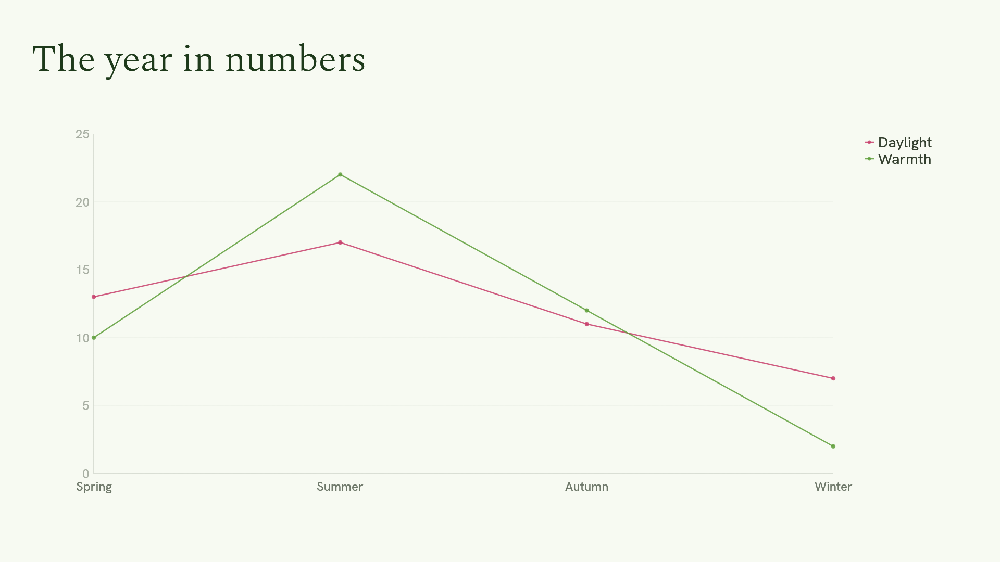
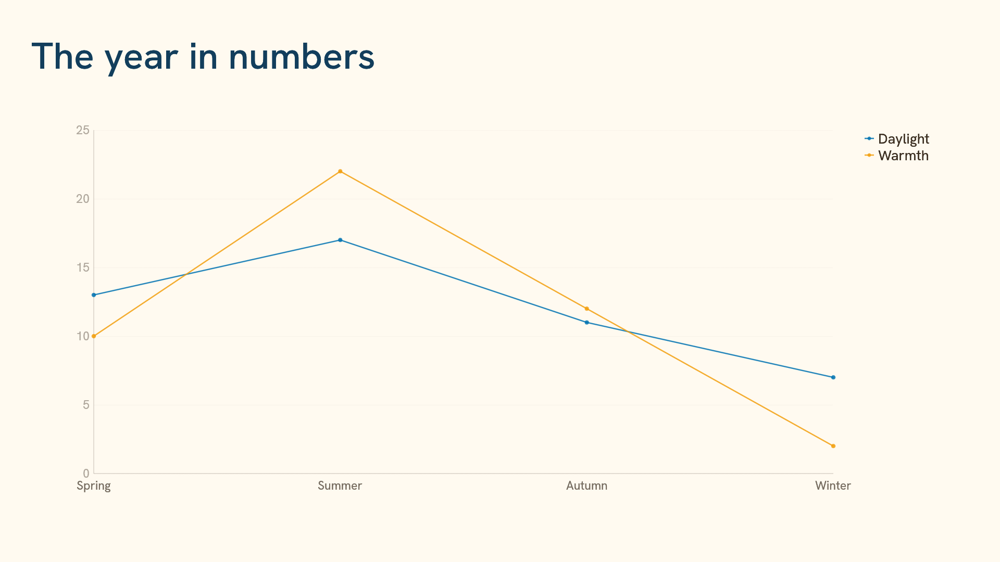
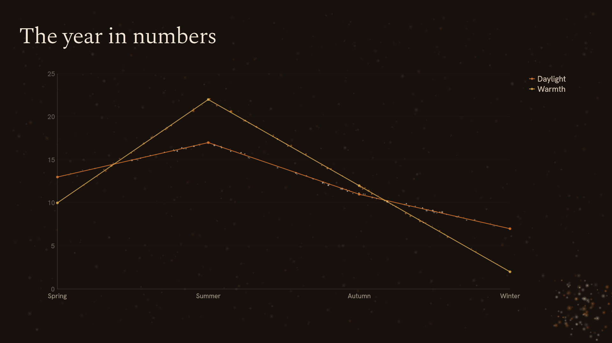
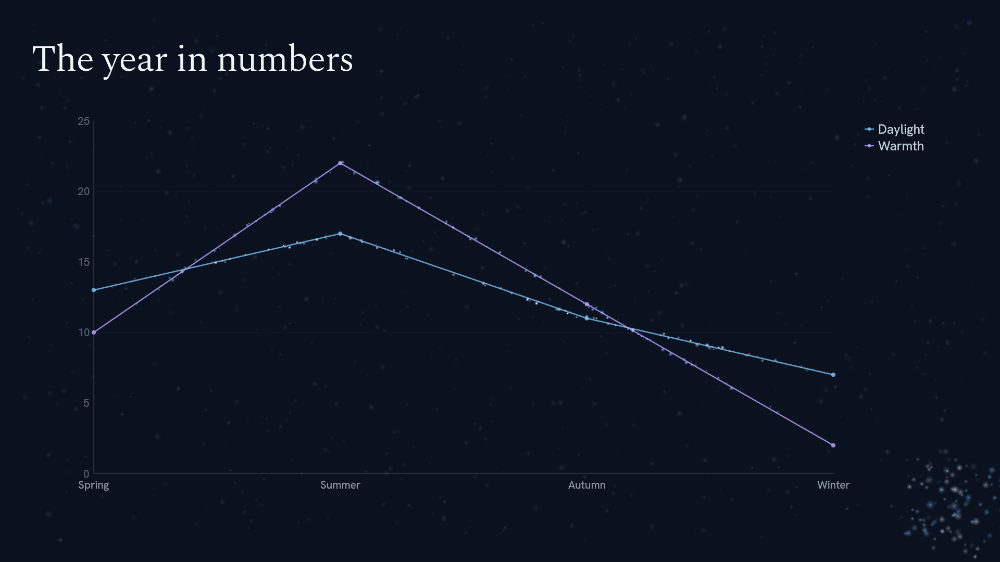

<p align="center"><a href="../README.md">MDeck</a> &middot; <a href="tutorial.md">Tutorial</a> &middot; <a href="install.md">Install</a> &middot; <a href="writing-slides.md">Writing slides</a> &middot; <a href="visualizations.md">Visualizations</a> &middot; <a href="themes.md">Themes</a> &middot; <a href="engines.md">Engines</a> &middot; <a href="presenting.md">Presenting</a> &middot; <a href="export.md">Export</a> &middot; <a href="ai.md">AI</a> &middot; <a href="commands.md">Commands</a></p>

# Themes

A theme is everything about how a deck looks: colours, the chart palette,
fonts, sizes, a logo, the countdown and its engine. Pick a built-in one with a
line of frontmatter, or write your own in a few lines of YAML.

## Built-in themes and transitions

Seventeen built-in themes: **light**, **dark**, **nord**, **ember**, four
seasons, **spring**, **summer**, **autumn** and **winter**, and a showcase
theme for each engine, **marquee** (LED), **departures** (split-flap),
**stack** (blocks), **blueprint** (generated line art on a
drafting sheet), **sketchbook** (generated drawings, pencilled in),
**chalkboard** (generated line art in chalk), **watercolour** (generated
paintings that bloom), **darkroom** (generated photographs that develop) and
**thermal** (a thermal instrument: headings form in heat, see
[Thermal](engines.md#thermal-the-deck-through-a-thermal-camera)). Transitions are
**slide**, **fade**, **spatial**, and **none**. Set them in the frontmatter or
cycle them live with `Shift+T` and `T`. Every theme draws symbols (①, ✓, →) from
bundled fallback faces, and Chinese, Japanese and Korean from a font on your
system (`mdeck --check` tells you if none was found):

```yaml
---
theme: winter
transition: spatial
---
```

<p align="center">
  &nbsp;&nbsp;
  
</p>
<p align="center">
  &nbsp;&nbsp;
  
</p>

## Your own theme

**Your own themes are YAML files**, and the built-in ones are written the same
way. Put `themes/acme.yaml` next to a deck (or in `~/.config/mdeck/themes/`) and
set `theme: acme`; everything you leave out comes from the theme it extends:

```yaml
name: Acme
extends: light
colors:
  background: "#fbfaf7"
  text: "#2b2d42"
  heading: "#14213d"
  accent: "#e85d04"
  series: ["#e85d04", "#14213d", "#2a9d8f", "#e9c46a"]
fonts:
  display: spectral-light      # a bundled face, or a .ttf/.otf in the theme folder
engine: plain                  # or particles, for Ember's living field in your colours
```

A theme sets colours, the chart palette, fonts by role, sizes, the syntax
theme, the countdown, the engine and a **logo**. Themes are data only, so a deck can never
run code. Custom themes work everywhere a built-in one does: presenting,
`Shift+T`, PNG and PDF export, and `--check`.

**Engines.** The engine is what a theme does beyond colours and type: the
particle field, the LED wall, the departure board, the falling
blocks, or the generated pictures of a blueprint or a chalkboard (both the line engine), a sketchbook, a watercolour or a darkroom. See [Engines](engines.md).

## Pages and art

A `page:` block lays every slide on a sheet with a surface around it: paper
on a desk, a blueprint on a drafting table. It works on every engine.

```yaml
page:
  surface: "#0a1b33"     # around the sheet
  margin: 26             # px on a 1920x1080 slide
  shadow: 0.7            # 0 to 1
  grain: 0.25            # paper fibre, 0 to 1
  radius: 2
```

On an art engine, an `art:` block sets the house style of the generated
pictures, so a brand's illustration style is theme data like its colours:

```yaml
art:
  kind: line             # line (ink the engine draws) or tonal (a finished picture)
  style: "detailed graphite and ink, cross-hatching, old craft meets modern technology"
  references: [refs/teacup.jpg, refs/street.jpg]   # your own style swatches
```

## Logos

**Logos.** A PNG (with transparency) or SVG in a corner of every slide, in
presenting and in export. A theme carries its brand's logo (`logo:` with
`file`, `position`, `height` and `opacity`), and any deck can add or replace
one without a custom theme:

```yaml
---
theme: dark
logo: brand/logo-white.svg
logo-position: bottom-right   # default top-right
logo-opacity: 40%             # default 60%
---
```

`logo: none` in the frontmatter hides a theme's logo for the whole deck. Under a
slide's heading, `logo: none` hides it on that slide and `logo: partner.svg`
shows another logo there.

## Background images

An image behind the slides, on any theme, without a custom theme. Set it once
in the frontmatter, and override it on a slide under its heading:

```markdown
---
background: images/texture.jpg   # relative to the deck
background-opacity: 25%          # default 30%
---

# Welcome
<!--
background: images/stage.jpg
background-opacity: 60%
-->

# The code
<!-- background: none -->
```

The image covers the slide (scaled, centred, cropped, never stretched) and
sits on the theme's background colour under everything else, so a low
opacity keeps text readable on light and dark themes. A slide that sets only
`background-opacity` shows the deck's image with that opacity. PNG, JPEG,
WebP and SVG work; `mdeck --check` reports files that are missing or
unreadable. See `samples/features/backgrounds.md` and spec section 9.8.

## From a design system

**From a design system.** If your brand already lives in a design system (a
Claude Design export, CSS tokens, a Tailwind config, W3C design tokens),
`mdeck theme new acme --from path/to/design-system` reads its rules and tokens,
copies its fonts and logos into the theme folder, and writes the theme with AI.
Then look at it and adjust:

```bash
mdeck theme new acme                       # a commented starter theme in themes/
mdeck theme new acme --from ./brand        # convert a design system (AI)
mdeck theme check acme                     # errors, fallbacks, hard-to-read colours
mdeck theme preview acme -o /tmp/acme      # a sampler deck as PNGs
mdeck theme list                           # every theme visible from here
mdeck export talk.md --theme acme          # any deck in any theme
```

Section 9.4 of the spec (`mdeck spec`) documents every key and the mapping
from design-system roles to slide roles, so an AI agent can do the conversion
too. `samples/themes/` has a converted design system and a hand-written theme.
