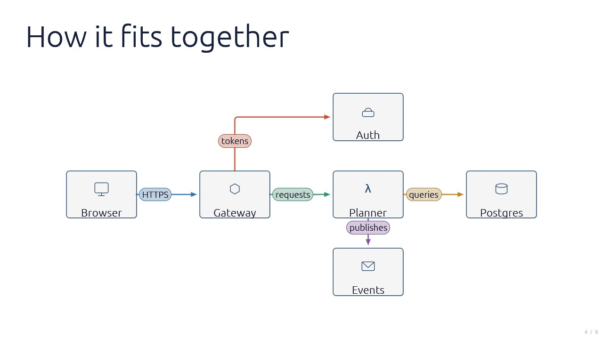
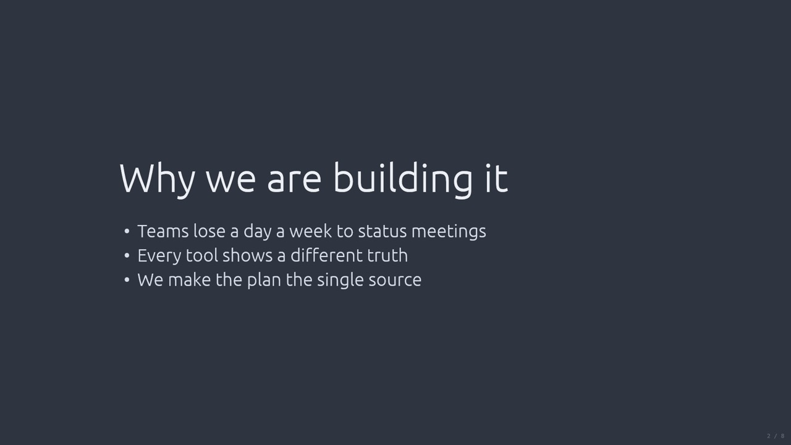
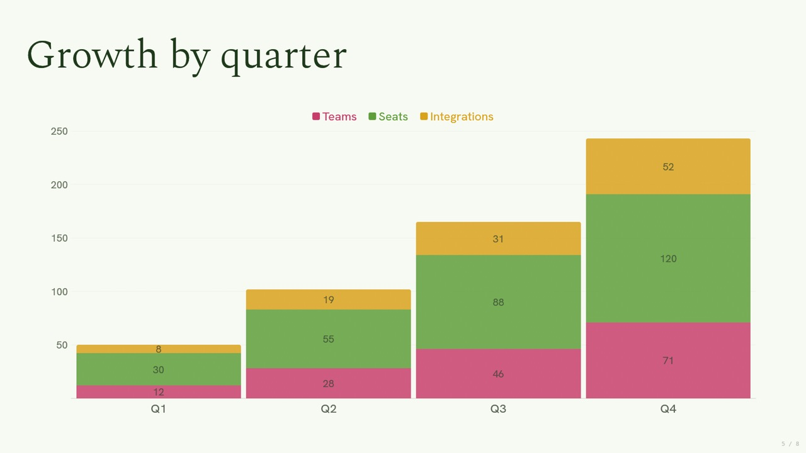
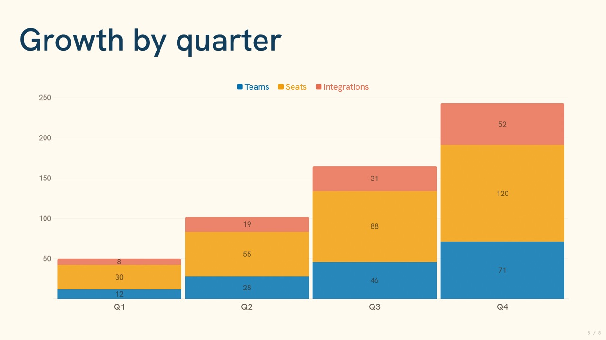
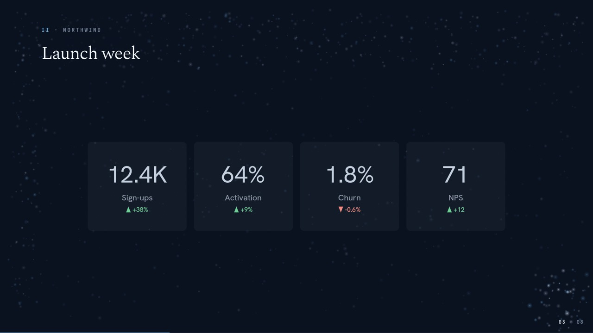
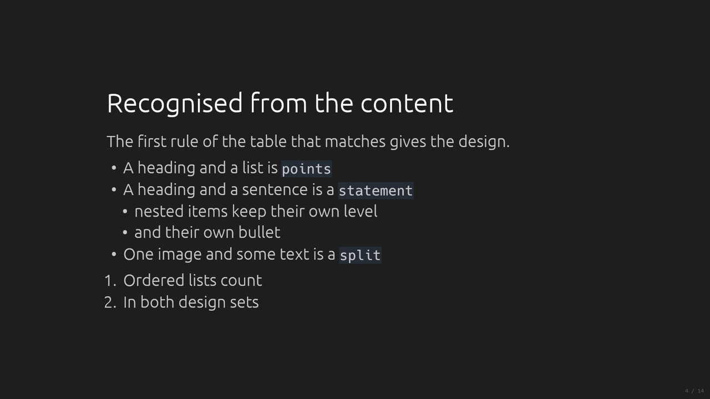
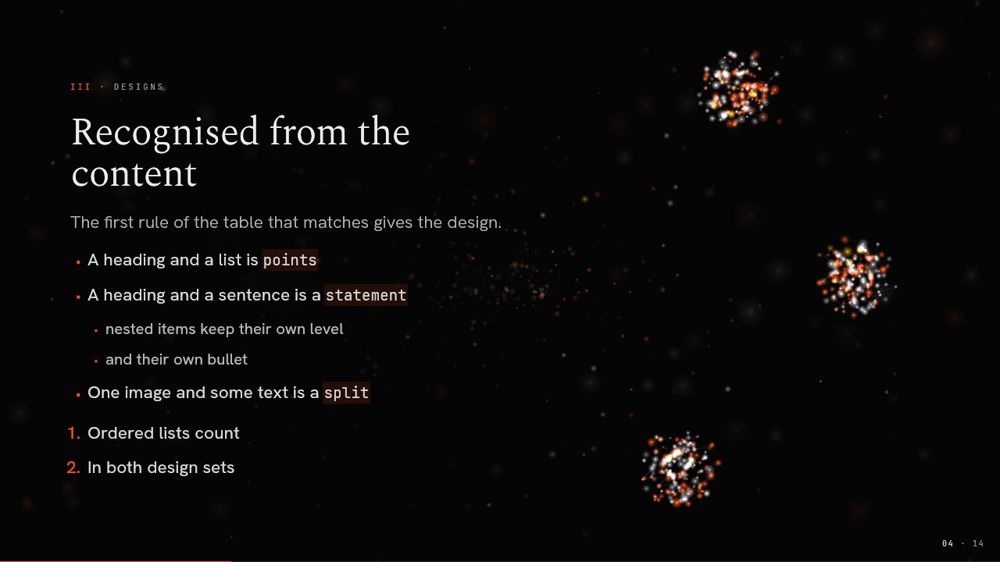

<p align="center"><a href="../README.md">MDeck</a> &middot; <a href="tutorial.md">Tutorial</a> &middot; <a href="install.md">Install</a> &middot; <a href="writing-slides.md">Writing slides</a> &middot; <a href="visualizations.md">Visualizations</a> &middot; <a href="themes.md">Themes</a> &middot; <a href="engines.md">Engines</a> &middot; <a href="presenting.md">Presenting</a> &middot; <a href="export.md">Export</a> &middot; <a href="ai.md">AI</a> &middot; <a href="commands.md">Commands</a></p>

# Themes

A theme is everything about how a deck looks and moves: colours, the chart palette, fonts,
sizes, spacing, the design set that arranges each slide, the engine and its settings, the
default transition, the countdown and a logo. Pick a built-in theme with one line of frontmatter,
or write your own in a few lines of YAML.

```yaml
---
theme: ember
---
```

## Built-in themes

`mdeck theme list` and `Shift+T` show the themes first, then the variants.

| Theme | Engine | Designs | What it is |
|---|---|---|---|
| **dark** | plain | standard | The default: plain dark, a bright foreground, fades, no countdown |
| **light** | plain | standard | Dark text on white |
| **nord** | plain | standard | The Nord palette |
| **ember** | particles | editorial | Graphite on near-black, one ember accent, a living particle field |
| **thermal** | thermal | editorial | A thermal instrument: headings form in heat |
| **marquee** | led | editorial | A wall of LEDs |
| **departures** | splitflap | board | A split-flap departure board |
| **stack** | blocks | editorial | Pictures built from falling blocks |
| **blueprint** | line | editorial | Line art inked on a drafting sheet |
| **chalkboard** | line | editorial | Line art in chalk on a slate |
| **sketchbook** | sketch | editorial | Graphite drawings, pencilled in |
| **watercolour** | watercolour | editorial | Paintings that bloom onto paper |
| **darkroom** | darkroom | editorial | Photographs that develop under a safelight |

**Variants** are recolourings of a theme: **spring** and **summer** of `light`, **autumn** and
**winter** of `ember`.

<table>
  <tr>
    <td width="33%"><br><sub>light</sub></td>
    <td width="33%"><br><sub>nord</sub></td>
    <td width="33%"><br><sub>spring</sub></td>
  </tr>
  <tr>
    <td><br><sub>summer</sub></td>
    <td><br><sub>autumn</sub></td>
    <td><br><sub>winter</sub></td>
  </tr>
</table>

The engine themes are on the [Engines](engines.md) page. A deck without a `theme` gets `dark`,
or your configured default (`mdeck config set defaults.theme nord`). Press `Shift+T` while
presenting to try every theme on your deck without editing it, or present and export with
`--theme <name>`.

**Transitions** are `fade` (the default), `slide`, `spatial` and `none`, and a slide with
`zoom-to` is entered by zooming into a thermal spot. They come from the deck's `transition`, then the theme's
`transition:`, then `defaults.transition` in your config, then `fade`; `T` cycles them live.

Every theme draws symbols (①, ✓, →) from bundled fallback faces, and Chinese, Japanese and
Korean from a font on your system (`mdeck --check` tells you if none was found).

## Your own theme

Your own themes are YAML files, written the same way as the built-in ones. Put
`themes/acme.yaml` next to a deck and set `theme: acme`:

```yaml
name: Acme
extends: light
colors:
  background: "#fbfaf7"
  text: "#2b2d42"
  heading: "#14213d"
  accent: "#c2410c"
  muted: "#5c5f6e"
  series: ["#c2410c", "#14213d", "#2a9d8f", "#e9c46a"]
fonts:
  display: spectral-light      # a bundled face, or a .ttf/.otf in the theme folder
```

Everything you leave out comes from the theme it `extends`, and a theme without `extends` extends
`dark`. A theme can set colours and the chart palette, fonts by role, sizes, spacing and corner
radius, the syntax theme, the countdown (`on` or `off`), the default transition, the design set
and its arrangements, the engine and its settings, a page and a logo. Unknown keys are errors, so
a typo never goes unnoticed. Themes are data only: a theme can never make mdeck run code.

**Where themes are found**, first match wins:

1. `themes/` next to the deck (`<name>.yaml`, or `<name>/theme.yaml` when it carries fonts);
2. your user folder: `~/Library/Application Support/mdeck/themes/` on macOS,
   `~/.config/mdeck/themes/` on Linux, `%APPDATA%\mdeck\themes\` on Windows;
3. the `themes/` folders of installed [packs](#packs);
4. the built-ins.

`theme` may also be a path to a file (`theme: brand/acme.yaml`). A theme of your own may reuse a
built-in name to replace it. Custom themes work everywhere a built-in one does: presenting,
`Shift+T`, PNG and PDF export, and `--check`.

**Variants.** A theme that is a recolouring of another says `variant-of: <theme>` and is then
listed with the variants.

**Spacing and corners.** `spacing:` is the scale of gaps the slide designs use (`xs`, `sm`, `md`,
`lg`, `xl`, px on a 1920x1080 slide; 8, 16, 24, 40 and 64 by default), and `radius:` the corner
radius of code blocks, tables and callouts (8 by default). Change them to make every slide airier
or tighter at once:

```yaml
spacing: { md: 32, lg: 56 }
radius: 4
```

The complete key list, with every default, is section 9.4 of the
[format specification](../crates/mdeck/doc/mdeck-spec.md), and `mdeck theme new acme` writes a
starter theme with every key commented.

## Designs and arrangements

A theme decides how each of the thirteen [designs](writing-slides.md#designs) looks, with data
only.

<table>
  <tr>
    <td width="50%"><br><sub><code>designs: standard</code> (dark)</sub></td>
    <td width="50%"><br><sub><code>designs: editorial</code> (ember)</sub></td>
  </tr>
</table>

**Design sets.** `designs: standard` (the default) is the classic slide: content centred, the
heading on top, no ornament, no entry motion. `designs: editorial` is the magazine spread of
Ember: a copy column on the left, an eyebrow with the slide's numeral and the deck title, display
type, a soft pillow behind the copy, a staggered entry, and a stage on the right where the engine
draws the slide's picture. Both sets arrange every design and recognise slides the same way. The
set does not depend on the engine: `designs: editorial` with `engine: plain` is Ember's look on a
still screen, and `designs: standard` with `engine: particles` puts centred slides over the
particle field.

**Your own design sets.** `designs:` can also name a set file, `designs/<name>.yaml`, in the
deck's `designs/` folder, the `designs/` folder of your user folder or an installed
[pack](#packs), looked up in that order before the built-ins. A set file has the keys of
`arrangements:` split in two, `base` (every design) and `designs` (per design), merged over the
set it `extends` (`standard` when it names none), so it only says what differs:

```yaml
# designs/roomy.yaml
extends: editorial
base:
  roles:
    body: { color: accent }
designs:
  quote:
    ornaments: { quote-marks: true }
```

**Arrangements.** Override anything about a design under `arrangements:`, naming only what
differs; `all:` applies to every design. Overrides merge key by key through `extends`, like
colours.

```yaml
designs: editorial
arrangements:
  all:
    ornaments: { bullet: "◆" }
  quote:
    copy: { region: [0.12, 0.25, 0.76, 0.5], align: center }
    roles:
      attribution: { color: accent }
    ornaments: { quote-bar: none, quote-marks: true }
  title:
    entry: { kind: fade, duration-ms: 900 }
```

An arrangement sets where the copy goes (`copy`, in fractions of the slide, with `align` and
`valign`), where the plate goes (the image, code, table, chart or columns: `plate`), where the
engine may draw a picture (`stage`), the eyebrow, the entry motion (`entry`), every role's type
(`roles.title`, `roles.list`, `roles.quote`, ... with font, size, colour, opacity, case,
tracking, line height and gap) and the ornaments (bullet glyph and colour, numbering, quote marks
and bar, title rule, emphasis, pillow). The full key list is in the format specification section
9.9, and every value of the two built-in sets is in
[`standard.yaml`](../crates/mdeck/designs/standard.yaml) and
[`editorial.yaml`](../crates/mdeck/designs/editorial.yaml).
[`samples/features/designs.md`](../samples/features/designs.md) shows every design with a
deck-local theme that overrides a few arrangements.

## The engine and its settings

The engine is what a theme does beyond colours and type ([Engines](engines.md)). `engine: plain`
names one; a block names it and gives its settings:

```yaml
engine:
  name: thermal
  palette: iron          # iron, white-hot, black-hot, rainbow, arctic, lava
  drift: true            # embers drifting through the dark on ordinary slides
```

| Setting | Read by | What it does |
|---|---|---|
| `light`, `cool` | particles, led, blocks, line, sketch | the brightest tint, and a cool tint beside the accents |
| `palette`, `drift` | thermal | the heat field's palette; embers drifting |
| `surface` | line | `sheet` (a drafting sheet) or `slate` (chalk) |
| `kind`, `style`, `references` | line, sketch, watercolour, darkroom | the house style of generated pictures (below) |

A theme that extends another and names the same engine (or none) inherits its settings key by
key; one that names a different engine starts from its own settings only. When a deck's `engine`
or `--engine` runs another engine, the theme's settings are not used. `mdeck theme check` warns
about a setting the engine does not read.

**Art style.** On an art engine the engine block sets the house style of the generated pictures,
so a brand's illustration style is theme data like its colours:

```yaml
engine:
  name: sketch
  kind: line             # line (ink the engine draws) or tonal (a finished picture)
  style: "detailed graphite and ink, cross-hatching, old craft meets modern technology"
  references: [refs/teacup.jpg, refs/street.jpg]   # your own style swatches, in the theme folder
```

## Pages

A `page:` block lays every slide on a sheet with a surface around it: paper on a desk, a
blueprint on a drafting table. It works on every engine, and everything on the slide, the
engine's layer included, draws on the sheet.

```yaml
page:
  surface: "#0a1b33"     # around the sheet
  margin: 26             # px on a 1920x1080 slide (0 to 300)
  shadow: 0.7            # 0 to 1
  grain: 0.25            # paper fibre, 0 to 1
  radius: 2
```

The line, sketch and watercolour engines are made to draw on a page; `mdeck theme check` warns
when a theme picks one of them without a `page:`.

## Logos

A PNG (with transparency) or SVG in a corner of every slide, in presenting and in export. A theme
carries its brand's logo (`logo:` with `file`, `position`, `height` and `opacity`), and any deck
can add or replace one without a custom theme:

```yaml
---
theme: dark
logo: brand/logo-white.svg
logo-position: bottom-right   # default top-right
logo-opacity: 40%             # default 60%
---
```

`logo: none` in the frontmatter hides a theme's logo for the whole deck. In a slide's settings,
`<!-- logo: none -->` hides it on that slide and `<!-- logo: partner.svg -->` shows another one.
See [`samples/themes/logo.md`](../samples/themes/logo.md).

## Background images

An image behind the slides, on any theme. Set it once in the frontmatter, and override it on a
slide:

```markdown
---
background: images/texture.jpg   # relative to the deck
background-opacity: 25%          # default 30%
---

# Welcome
<!--
background: images/stage.jpg
background-opacity: 60%
-->

# The code
<!-- background: none -->
```

The image covers the slide (scaled, centred, cropped, never stretched) and sits on the theme's
background colour under everything else, so a low opacity keeps text readable on light and dark
themes. A slide that sets only `background-opacity` shows the deck's image with that opacity.
PNG, JPEG, WebP and SVG work; `mdeck --check` reports files that are missing or unreadable. See
[`samples/features/backgrounds.md`](../samples/features/backgrounds.md).

## Tools

```bash
mdeck theme new acme                       # a starter theme in ./themes, every key commented (--user)
mdeck theme check acme                     # errors, fallbacks, contrast, keys that do nothing
mdeck theme preview acme -o /tmp/acme      # one slide per design, as PNGs
mdeck theme list                           # every theme visible from here
mdeck export talk.md --theme acme          # any deck in any theme
mdeck ai theme acme --from ./brand         # a theme from a design system (AI)
```

`mdeck theme check` reports errors and fallbacks, contrast below WCAG AA for every text colour the
theme draws (body text, headings, bold, links, muted captions and eyebrows, code, every design
role at the size and opacity it is drawn), and keys that do nothing: an engine setting the engine
does not read, `fonts.lead` when no design in the theme's design set uses it, or a paper engine
without a `page:`.

**From a design system.** If your brand already lives in a design system (a Claude Design
export, CSS tokens, a Tailwind config, W3C design tokens), `mdeck ai theme acme --from
path/to/design-system` reads its rules and tokens, copies its fonts and logos into the theme
folder, and writes the theme with AI. Then check and preview it, and adjust. Section 9.4 of the
format specification documents the mapping from design-system roles to slide roles, so an AI
agent can do the conversion too. [`samples/themes/`](../samples/themes/) has a converted design
system and a hand-written theme.

## Packs

A **pack** shares themes, design sets, point clouds, AI styles and fonts as plain files, no
compiler needed: a folder (or a `.zip` of one, or a git repository) with an `mdeck-pack.yaml`
manifest and any of these folders:

- `themes/`: themes, chosen by name like your own (`theme: acme`).
- `designs/`: design sets a theme names with `designs:` (see
  [your own design sets](#designs-and-arrangements)).
- `point-clouds/`: `.mdpc` point clouds, used by name (`<!-- picture: name -->`).
- `styles/`: named AI styles, one `<name>.yaml` each, usable wherever a style name is
  (`--style`, `image-style`, `icon-style`, `defaults.image_style`) and listed by
  `mdeck ai style list` with `(pack)`. Your own styles of the same name win.
- `fonts/`: font files the pack's own themes name. A pack theme writes
  `fonts: { body: AcmeSans-Regular.ttf }` and mdeck finds the file in the theme's folder or,
  failing that, in the pack's `fonts/`.

```yaml
# styles/brand.yaml
prompt: Flat shapes in Acme orange and navy, soft grain, no text
kind: image                    # image (the default) or icon
references: [refs/look.png]    # optional, relative to styles/
```

```yaml
# mdeck-pack.yaml
name: acme-brand          # lowercase letters, digits, hyphens
version: 1.2.0
description: Acme's themes and pictures
min-mdeck: "2.0"          # optional: older mdecks refuse the pack
```

```bash
mdeck pack install ./acme-brand        # into your user folder
mdeck pack install acme-brand.zip --deck   # into ./packs/, so the deck carries it
mdeck pack list
mdeck pack remove acme-brand
```

A pack's themes, design sets and point clouds are found after the deck's own and your user
folder's, and before the built-ins (the deck's packs before your user packs). A deck that depends
on a pack can say so with `requires: [acme-brand]` in its frontmatter; `mdeck --check` then warns
when it is not installed, and about pack style files it cannot read (category `assets`).

Themes are data. For a new engine, visual or design set in code, see the [SDK](sdk/README.md).
