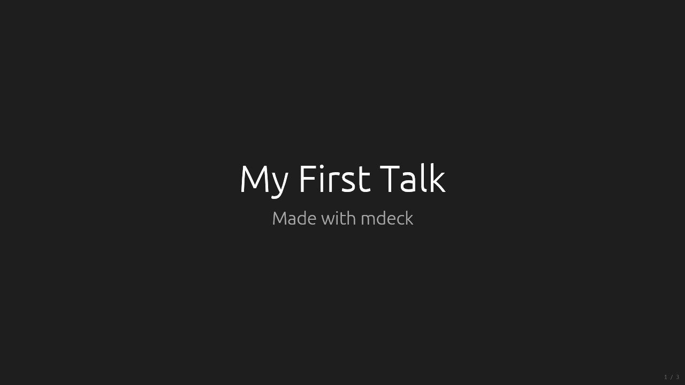
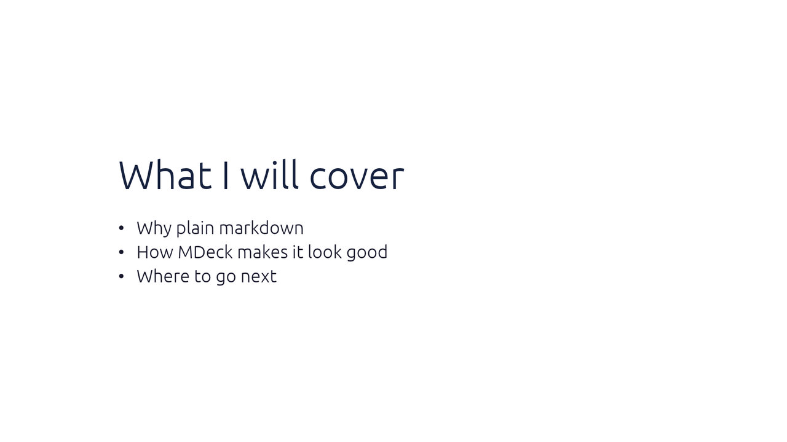
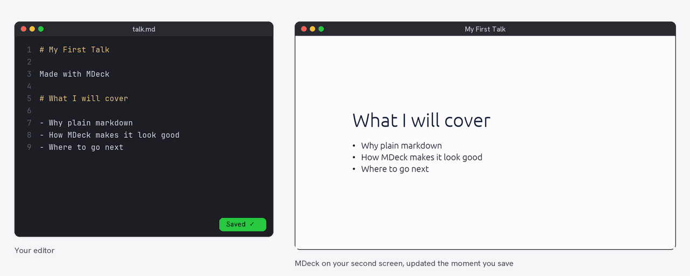
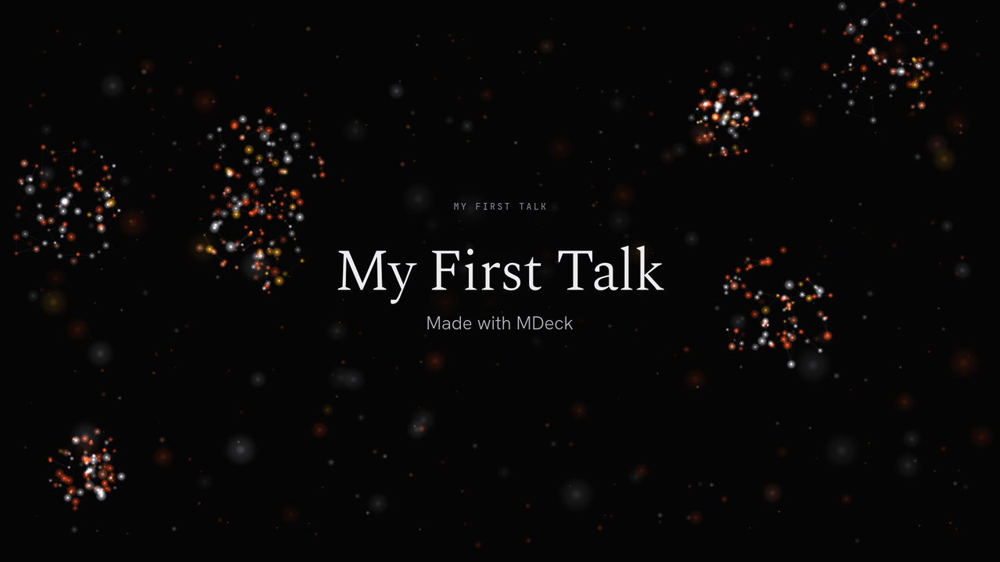
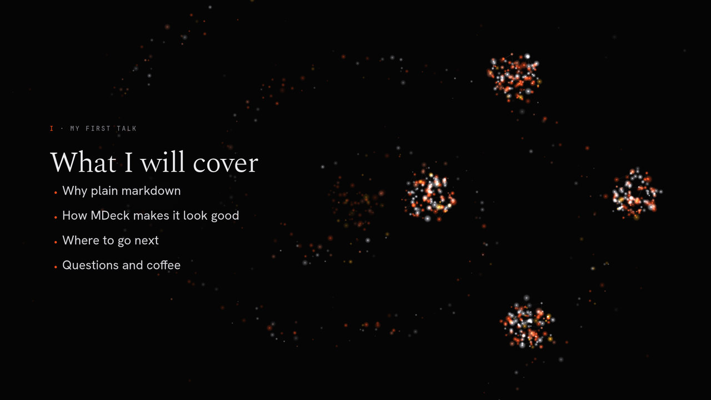
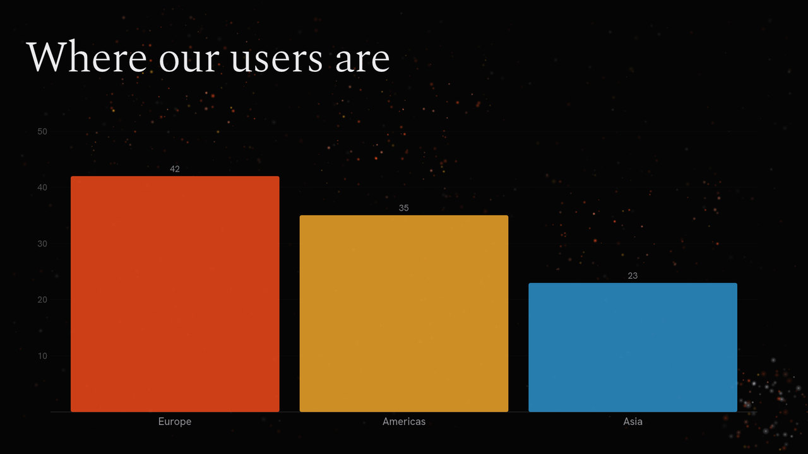
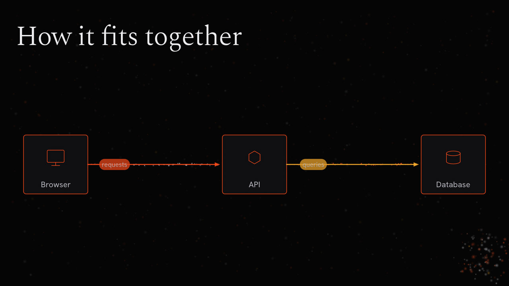

<p align="center"><a href="../README.md">MDeck</a> &middot; <a href="tutorial.md">Tutorial</a> &middot; <a href="install.md">Install</a> &middot; <a href="writing-slides.md">Writing slides</a> &middot; <a href="visualizations.md">Visualizations</a> &middot; <a href="themes.md">Themes</a> &middot; <a href="engines.md">Engines</a> &middot; <a href="presenting.md">Presenting</a> &middot; <a href="export.md">Export</a> &middot; <a href="ai.md">AI</a> &middot; <a href="commands.md">Commands</a></p>

# Your first presentation

In about fifteen minutes you will go from an empty file to this, with a
theme, a chart, a diagram and an illustration, in plain markdown:

<p align="center">
  
</p>

Every picture in this tutorial is a real export of the deck at that step.
The finished deck is [`samples/tutorial/talk.md`](../samples/tutorial/talk.md).

---

## 1. Install MDeck

```bash
brew install mklab-se/tap/mdeck      # macOS and Linux
cargo install mdeck                  # anywhere with Rust
```

Windows binaries and other options are on the [Install](install.md) page.
Check that it works with `mdeck version`.

## 2. Write two slides

Create a file called `talk.md` in any editor:

```markdown
# My First Talk

Made with MDeck

# What I will cover

- Why plain markdown
- How MDeck makes it look good
- Where to go next
```

and present it:

```bash
mdeck talk.md
```

<table>
  <tr>
    <td width="50%"></td>
    <td width="50%"></td>
  </tr>
</table>

That is a presentation already. Each `#` heading starts a new slide, and each
slide picks its layout from what is on it: a heading with a line under it is a
title slide, a heading with a list is a bullet slide. Press Space to go
forward and Esc twice to quit.

**Press `H` at any time** for help: a panel with every keyboard shortcut. Press
`H` again to hide it. You never need to remember a key; this tutorial mentions
the ones worth knowing as you go.

## 3. Keep MDeck open while you write

This is the way to work with MDeck: put your editor on one screen and MDeck
on the other, and just keep writing. **Every time you save, MDeck reloads the
file and updates the slide you are looking at.** It stays on the same slide,
keeps what you have revealed, and picks up a new theme or engine the moment you
change it.

<p align="center">
  
</p>

- **Two screens:** run `mdeck talk.md`, then press `M` until MDeck sits on the
  screen you want. It opens fullscreen and remembers that screen next time.
- **One screen:** run `mdeck talk.md --windowed` and put the window beside
  your editor. `F` toggles fullscreen.

Keep it running for the rest of this tutorial: every step below is an edit
and a save.

## 4. Give it a theme

Add a block of settings at the very top of the file, called the frontmatter:

```markdown
---
title: "My First Talk"
@theme: ember
---
```

<table>
  <tr>
    <td width="50%"></td>
    <td width="50%"></td>
  </tr>
</table>

Same content, a new look: Ember's editorial typography and a living field of
particles that follows your content.

**Try them all without editing anything.** While presenting, press
`Shift+T`: the deck switches to the next theme, and a short note in the
corner names it. Keep pressing to cycle through every built-in theme (and your
own, if you have any). The switch is temporary: your file does not change, and
the next time you start MDeck it opens in the theme your frontmatter names.
When you find one you like, write its name after `@theme:`. `T` does the same
for the transition between slides.

The [Themes](themes.md) page lists every theme and shows how to make your own.

## 5. Reveal points one at a time

Start a list item with `+` instead of `-` and it appears on the next key press:

```markdown
- Why plain markdown
+ How MDeck makes it look good
+ Where to go next
+ Questions and coffee
```

<p align="center">
  
</p>

## 6. Add a chart

A fenced block tagged `@barchart` becomes a chart. Each line is a bar:

````markdown
# Where our users are

```@barchart
- Europe: 42
- Americas: 35
- Asia: 23
```
````

<p align="center">
  
</p>

There are seventeen kinds, from line and pie charts to timelines and Gantt
charts: see [Visualizations](visualizations.md).

## 7. Add a diagram

List the boxes and the arrows between them; MDeck places them and routes the
arrows:

````markdown
# How it fits together

```@architecture
- Browser  (icon: browser)
- API      (icon: api)
- Database (icon: database)

- Browser -> API: requests
- API -> Database: queries
```
````

<p align="center">
  
</p>

## 8. Add an illustration

Put `@illustration:` and a name on the line under a slide's heading:

```markdown
# Ready for launch
@illustration: rocket

- Ship small, ship often
- Measure everything
- Celebrate the wins
```

<p align="center">
  
</p>

On Ember the particles settle into a rocket beside your copy. Thirty-eight
illustrations are built in, `person`, `laptop`, `server`, `lightbulb`, `globe`
and more; `mdeck illustration list` shows them all.

## 9. Try another engine

The engine decides how a theme brings slides to life. Add one line to the
frontmatter:

```markdown
@engine: led
```

<p align="center">
  
</p>

The same slide on a wall of LEDs that light up your illustration. Try
`splitflap` (a departure board), `laser` and `blocks` too, or run
`mdeck talk.md --engine laser` to try one without touching the file. The
[Engines](engines.md) page shows them all.

## 10. Add speaker notes

Everything after a line with `???` is a note for you, never shown on screen:

```markdown
# Ready for launch
@illustration: rocket

- Ship small, ship often
- Measure everything
- Celebrate the wins

???

Thank everyone for coming. Mention that the whole deck is one markdown file.
```

Print them with your slides using `mdeck export talk.md --format pdf --notes`.

## 11. Check your deck

Before you present, let MDeck look for mistakes. Here it catches a typo in a
directive:

```text
$ mdeck talk.md --check
Checking talk.md (5 slides)...
  slide 5: [directive] @ilustration is not a directive and shows as text; did you mean @illustration?

1 warning(s) found.
```

Add `-v` to see how MDeck understood each slide:

```text
$ mdeck talk.md --check -v
Checking talk.md (5 slides)...
  slide   1: title        2 blocks, 0 steps  "My First Talk"
  slide   2: bullet       2 blocks, 3 steps  "What I will cover"
  slide   3: visualization  2 blocks, 0 steps  "Where our users are"
  slide   4: diagram      2 blocks, 0 steps  "How it fits together"
  slide   5: bullet       2 blocks, 0 steps  "Ready for launch"  [notes]

No issues found.
```

## 12. Present

| Key | What it does |
|---|---|
| Space, Right, Enter | Next slide or next point |
| Left, Backspace | Back |
| G | All slides at a glance; click one to jump to it |
| Drag the mouse | Draw on the slide (right-drag draws an arrow) |
| `.` or B | Black out the screen |
| Shift+T, T | Try the next theme, the next transition (not saved) |
| M | Move to the next screen |
| H | Show every shortcut |
| Esc twice | Quit |

Clickers work out of the box. More in [Presenting](presenting.md).

## 13. Share it

```bash
mdeck export talk.md --format pdf            # export/talk.pdf, one page per slide
mdeck export talk.md --format pdf --notes    # with your speaker notes under each slide
mdeck export talk.md                         # a PNG per slide, 1920x1080
```

The PDF looks exactly like the presentation. See [Export](export.md) for 4K,
single slides and more.

---

## Where next

- [Writing slides](writing-slides.md): layouts, two columns, images, math
- [Visualizations](visualizations.md): every chart and diagram
- [Themes](themes.md): your brand as a theme, logos, design systems
- [Engines](engines.md): stories, illustrations and all six engines
- [AI features](ai.md): a whole deck from a PDF, a document or one sentence
- [Gallery](../GALLERY.md): what everything looks like
