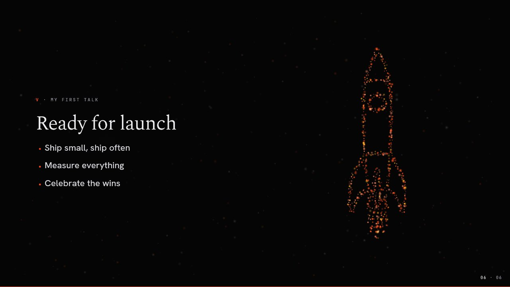
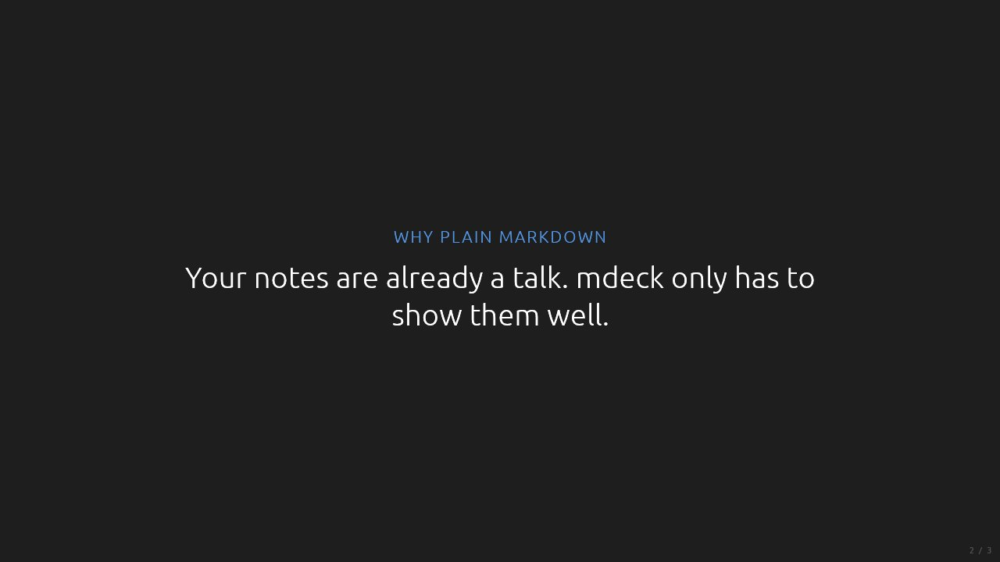
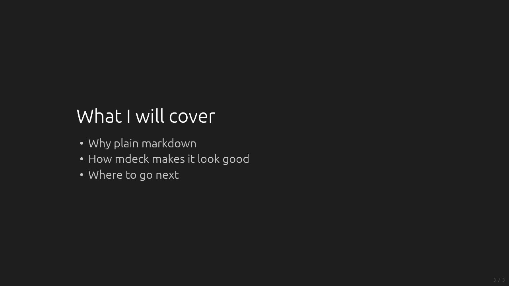
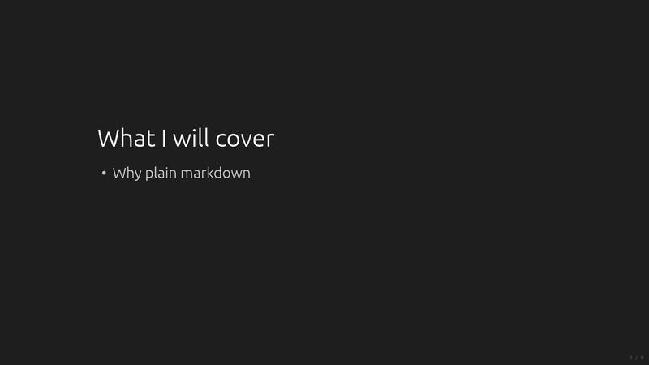
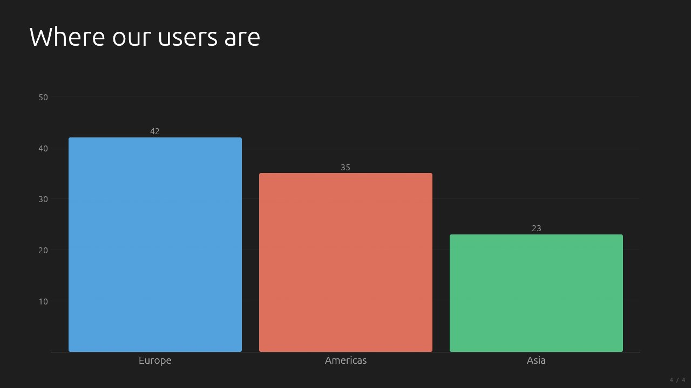
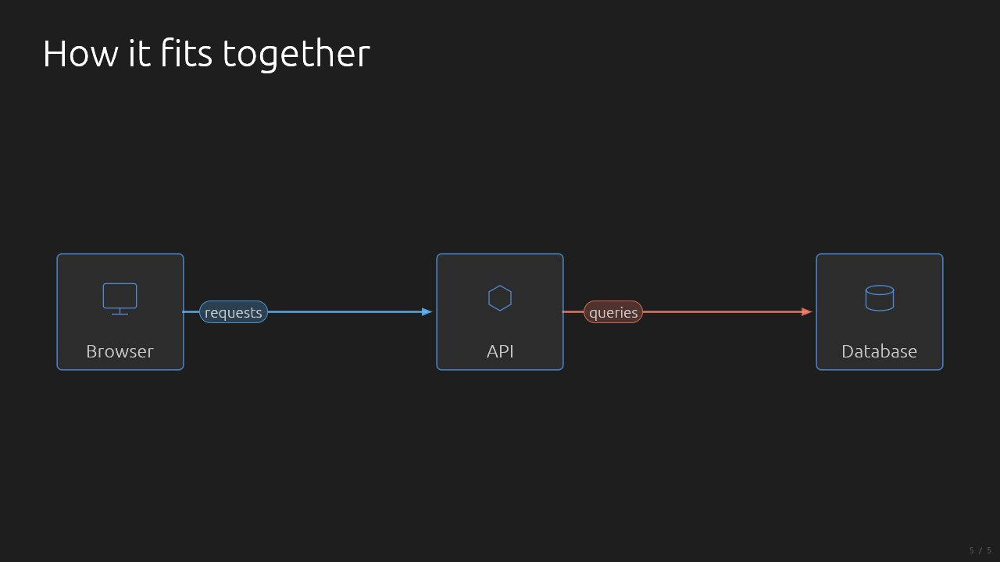
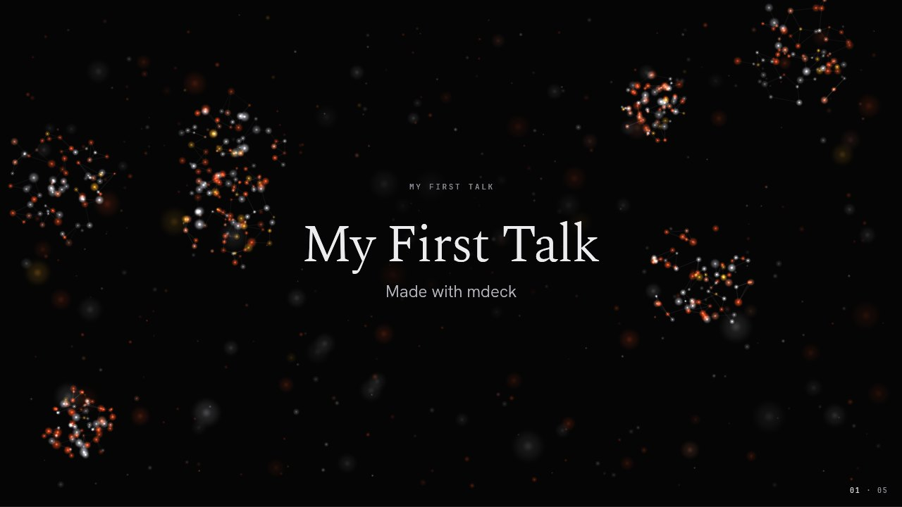
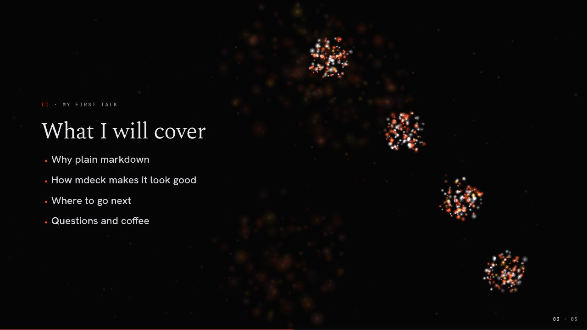
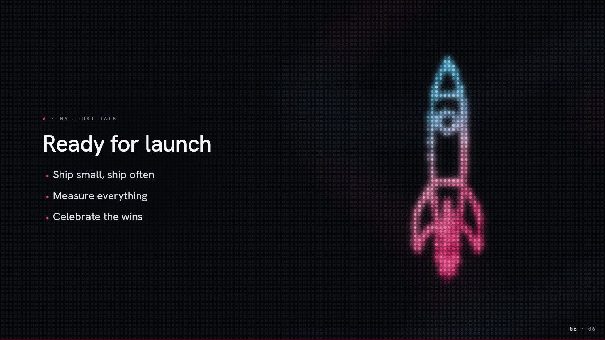
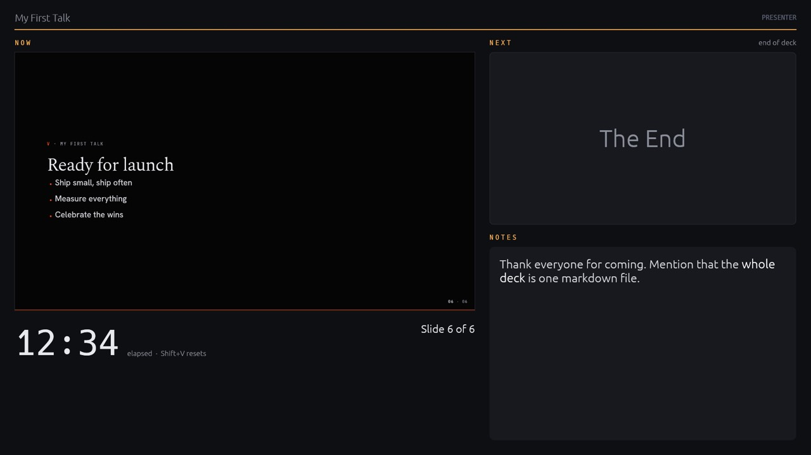

<p align="center"><a href="../README.md">MDeck</a> &middot; <a href="tutorial.md">Tutorial</a> &middot; <a href="install.md">Install</a> &middot; <a href="writing-slides.md">Writing slides</a> &middot; <a href="visualizations.md">Visualizations</a> &middot; <a href="themes.md">Themes</a> &middot; <a href="engines.md">Engines</a> &middot; <a href="presenting.md">Presenting</a> &middot; <a href="export.md">Export</a> &middot; <a href="ai.md">AI</a> &middot; <a href="commands.md">Commands</a></p>

# Your first presentation

Ten minutes, one markdown file, and you will have this:

<p align="center">
  
</p>

Every picture on this page is a real export of the deck at that step. The finished deck is
[`samples/tutorial/talk.md`](../samples/tutorial/talk.md).

---

## 1. Install

```bash
brew install mklab-se/tap/mdeck      # macOS and Linux
cargo install mdeck                  # anywhere with Rust
```

Windows binaries and other options are on the [Install](install.md) page.

## 2. Write three slides

Create `talk.md` in any editor:

```markdown
# My First Talk

Made with mdeck

## Why plain markdown

Your notes are already a talk. mdeck only has to show them well.

## What I will cover

- Why plain markdown
- How mdeck makes it look good
- Where to go next
```

and present it:

```bash
mdeck talk.md
```

<table>
  <tr>
    <td width="33%"></td>
    <td width="33%"></td>
    <td width="33%"></td>
  </tr>
</table>

That is a presentation. Each heading starts a slide, and mdeck recognises what each slide is
from what is on it: the `#` heading with one line under it is the **title**, a heading with a
sentence is a **statement** in large type, a heading with a list is **points**. You never say
which; you write what you mean.

Space goes forward, Left goes back, and Esc twice quits. **Press `H`** for a panel with every
shortcut.

## 3. Keep it open while you write

Put your editor on one screen and mdeck on the other. **Every time you save, mdeck reloads the
file** and stays on the slide you are looking at, with what you have revealed.

- **Two screens:** run `mdeck talk.md` and press `M` until mdeck sits on the screen you want.
  It remembers that screen next time.
- **One screen:** run `mdeck talk.md --windowed` and put the window beside your editor. `F`
  toggles fullscreen.

Every step below is an edit and a save.

## 4. One point at a time

Start a list item with `+` instead of `-` and it waits for the next key press:

```markdown
- Why plain markdown
+ How mdeck makes it look good
+ Where to go next
+ Questions and coffee
```

<p align="center">
  
</p>

Items keep their place while they wait, so nothing on the slide moves when one appears.

## 5. A chart

A fenced block tagged `@bar` is a bar chart. Each item is a bar:

````markdown
## Where our users are

```@bar
- Europe: 42
- Americas: 35
- Asia: 23
```
````

<p align="center">
  
</p>

There are twenty kinds, from line and pie charts to timelines, Gantt charts and thermal images.
On GitHub the block still reads as a list of numbers. See [Visualizations](visualizations.md).

## 6. A diagram

List the boxes, then the arrows between them. mdeck places the boxes and routes the arrows:

````markdown
## How it fits together

```@architecture
- Browser  (icon: browser)
- API      (icon: api)
- Database (icon: database)

- Browser -> API: requests
- API -> Database: queries
```
````

<p align="center">
  
</p>

## 7. One line for a different look

So far the deck uses the default theme, `dark`: plain, bright and still. Add a few lines at
the very top of the file (the frontmatter):

```markdown
---
title: My First Talk
theme: ember
---
```

<table>
  <tr>
    <td width="50%"></td>
    <td width="50%"></td>
  </tr>
</table>

Same markdown, a new look: Ember lays every slide out as a magazine spread, with a serif
display face, and runs a living field of glowing particles behind it that follows your content.

**Try every theme without editing anything:** press `Shift+T` while presenting. A short note
names each theme as it arrives. The switch lasts until you quit; when you find one you like,
write its name after `theme:`. `T` does the same for the transition between slides. The
[Themes](themes.md) page lists them all.

## 8. A picture

Put a `picture` setting in an HTML comment under a slide's heading:

```markdown
## Ready for launch
<!-- picture: rocket -->

- Ship small, ship often
- Measure everything
- Celebrate the wins
```

<p align="center">
  
</p>

The particles settle into a rocket beside your copy. Thirty-eight pictures are built in
(`person`, `laptop`, `server`, `lightbulb`, `globe` and more; `mdeck point-cloud list` shows
them all). The comment is invisible on GitHub, so the file stays a clean markdown document.

On the default `dark` theme the same picture shows as a still stipple of dots beside the copy.
Try `theme: marquee` for the same slide on a wall of LEDs:

<p align="center">
  
</p>

Or run `mdeck talk.md --theme departures` to see the whole deck on a split-flap board without
touching the file. The [Engines](engines.md) page shows all ten engines.

## 9. Speaker notes and the presenter view

A fenced block tagged `@notes` is for you. It never shows on the slides:

````markdown
## Ready for launch
<!-- picture: rocket -->

- Ship small, ship often
- Measure everything
- Celebrate the wins

```@notes
Thank everyone for coming. Mention that the **whole deck** is one markdown file.
```
````

Press `V` while presenting (or start with `mdeck talk.md --presenter`) and the presenter view
opens on your other screen: the current slide, the next one, your notes and a timer.

<p align="center">
  
</p>

With one screen, `V` shows the notes at the bottom of the slides instead.

## 10. Check before you present

`--check` reads the deck without opening a window and tells you about anything that will not
show as you meant it. Here it catches a typo in a setting:

```text
$ mdeck talk.md --check
Checking talk.md (6 slides)...
  slide 6 (line 41): [settings] `pictur` is not a setting, so this comment is ignored; did you mean `picture`?

1 warning(s) found.
```

Add `-v` to see how mdeck understood each slide:

```text
$ mdeck talk.md --check -v
Checking talk.md (6 slides)...
  slide   1: title (an H1 + one short line, an H2 or a paragraph), 2 blocks, 0 steps  "My First Talk"
  slide   2: statement (at most a heading + 1 or 2 short paragraphs), 2 blocks, 0 steps  "Why plain markdown"
  slide   3: points (a heading + one list, optionally a lead paragraph before it), 2 blocks, 3 steps  "What I will cover"
  slide   4: visual (one chart or diagram, optionally a heading and a short paragraph), 2 blocks, 0 steps  "Where our users are"
  slide   5: visual (one chart or diagram, optionally a heading and a short paragraph), 2 blocks, 0 steps  "How it fits together"
  slide   6: points (a heading + one list, optionally a lead paragraph before it), 2 blocks, 0 steps  "Ready for launch"  [notes]
               picture: rocket

No issues found.
```

## 11. Present

| Key | What it does |
|---|---|
| Space, Right, Enter | Next slide or next point |
| Left, Backspace | Back |
| `7` `Enter` | Jump to slide 7 |
| G | Every slide at a glance; click one to go there |
| Drag the mouse | Draw on the slide (right-drag draws an arrow) |
| `.` or B | Black out the screen |
| V | Presenter view |
| Shift+T, T | Next theme, next transition (for this session) |
| M | Move to the next screen |
| H | Every shortcut |
| Esc twice | Quit |

Clickers work out of the box. More in [Presenting](presenting.md).

## 12. Share it

```bash
mdeck export talk.md --format pdf            # export/talk.pdf, one page per slide
mdeck export talk.md --format pdf --notes    # export/talk-notes.pdf, with your notes under each slide
mdeck export talk.md                         # a PNG per slide, 1920x1080
```

The export looks exactly like the presentation. See [Export](export.md) for 4K, single slides
and stills of the motion.

---

## Where next

- [Writing slides](writing-slides.md): designs, settings, steps, columns, images, math
- [Visualizations](visualizations.md): every chart and diagram
- [Themes](themes.md): your brand as a theme, design sets, logos
- [Engines](engines.md): the ten engines and their pictures
- [AI features](ai.md): a deck from a document, images, a drawing for every slide
- [Gallery](../GALLERY.md): what everything looks like
