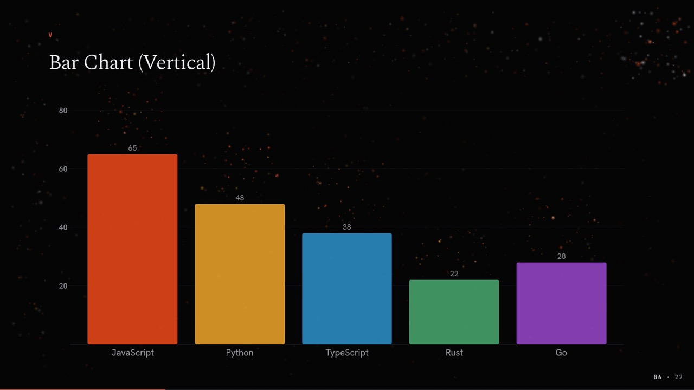
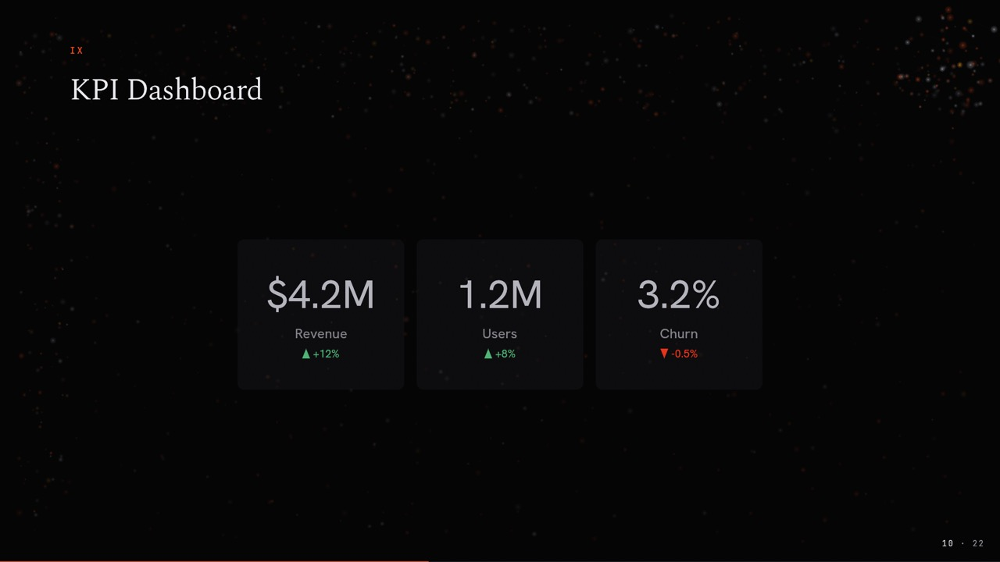
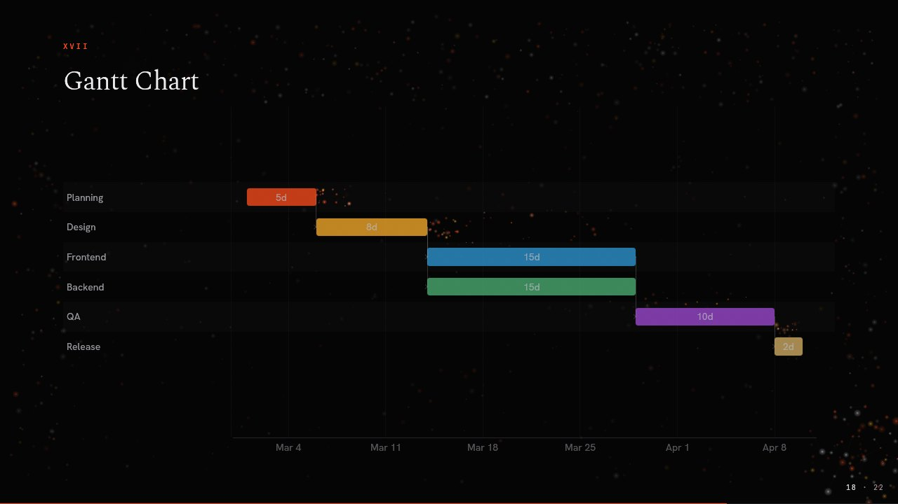
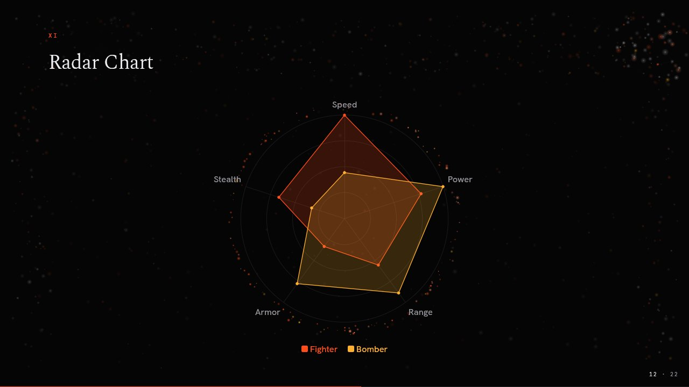
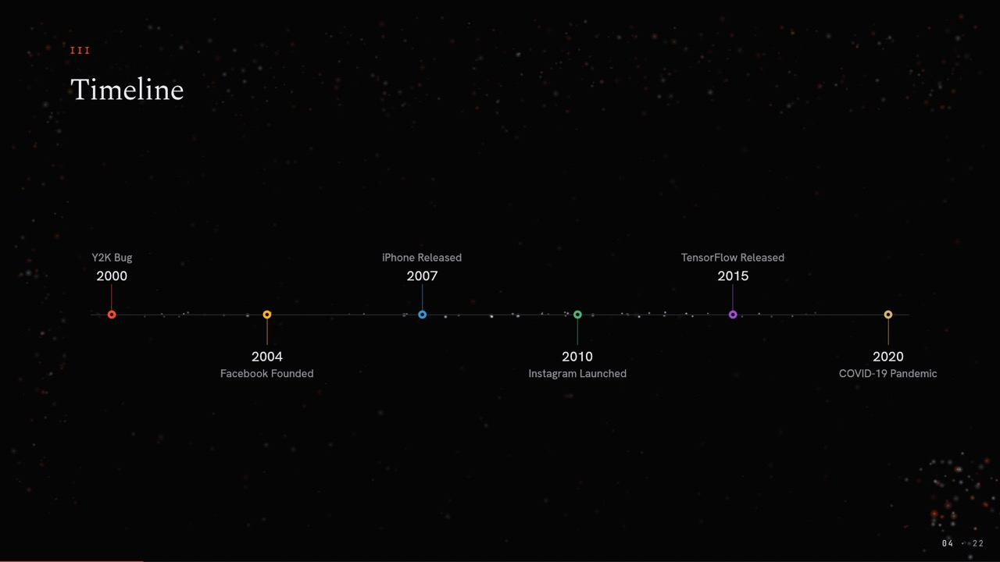
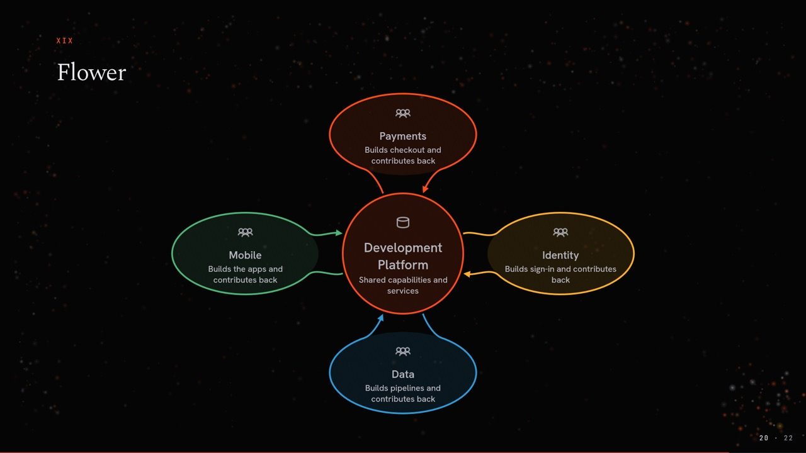
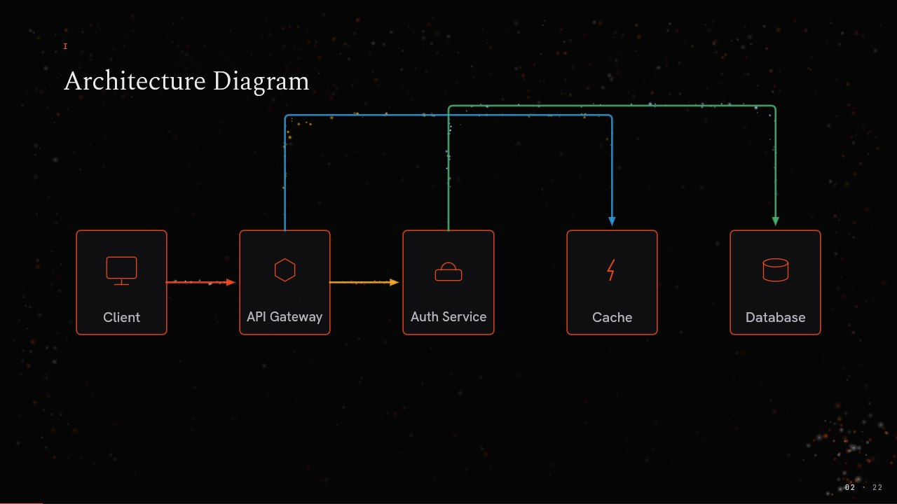
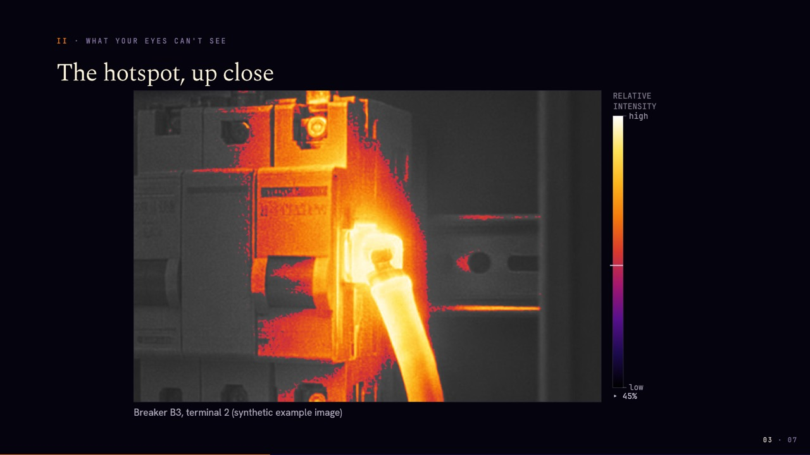

<p align="center"><a href="../README.md">MDeck</a> &middot; <a href="tutorial.md">Tutorial</a> &middot; <a href="install.md">Install</a> &middot; <a href="writing-slides.md">Writing slides</a> &middot; <a href="visualizations.md">Visualizations</a> &middot; <a href="themes.md">Themes</a> &middot; <a href="engines.md">Engines</a> &middot; <a href="presenting.md">Presenting</a> &middot; <a href="export.md">Export</a> &middot; <a href="ai.md">AI</a> &middot; <a href="commands.md">Commands</a></p>

# Visualizations

Twenty charts and diagrams from plain text. On GitHub each block still reads as
data. Every one animates in and supports step-by-step reveal with the same `+`
markers as lists, counted with the rest of the slide's steps. See all of them in
the [Gallery](../GALLERY.md) and in
[`samples/visualizations/all.md`](../samples/visualizations/all.md).

## Charts

Fenced code blocks with an `@` tag become charts:

| Type | Tag | Example line |
|------|-----|--------------|
| Bar chart | `@bar` | `- Python: 48` |
| Line chart | `@line` | `- Revenue: 100, 150, 200` |
| Pie chart | `@pie` | `- Frontend: 35%` |
| Donut chart | `@donut` | `- Complete: 78` |
| Stacked bar | `@stackedbar` | `- Product A: 40, 45, 50` |
| Scatter plot | `@scatter` | `- Alice: 80, 90` |
| Radar chart | `@radar` | `- Speed: 9, 7, 5, 3` |
| Funnel | `@funnel` | `- Visitors: 10000` |
| KPI cards | `@kpi` | `- Revenue: $4.2M (trend: +12%)` |
| Progress bars | `@progress` | `- Design: 100%` |
| Timeline | `@timeline` | `- 2024: Project launch` |
| Word cloud | `@wordcloud` | `- AI (size: 50)` |
| Venn diagram | `@venn` | `- Design & Business: Product` |
| Org chart | `@orgchart` | `- CEO -> CTO` |
| Gantt chart | `@gantt` | `- Design: 8d, after Research` |
| Git graph | `@gitgraph` | `- branch main -> develop` |
| Flower | `@flower` | `- petal Payments: Takes the money` |
| Artifact flow | `@artifactflow` | `- Build Team -> Registry: image v1.2` |
| Thermal image | `@thermal` | `+ lens 76% 43% 16%` |
| Architecture | `@architecture` | `- Client -> Server: requests` |

Values may carry units and separators (`$4,200`, `12%`, `40 users`). Charts
pick round axis limits, size their labels to fit, and share one colour palette
per theme.

<table>
  <tr>
    <td width="33%"></td>
    <td width="33%"></td>
    <td width="33%"></td>
  </tr>
  <tr>
    <td></td>
    <td></td>
    <td></td>
  </tr>
</table>

## One grammar inside every block

Every visual reads its block the same way:

- **Settings** are `key: value` lines before the first item, such as
  `x-label: Year`, `orientation: horizontal` or `axes: Speed, Power`.
- **Items** are list lines (`- ` shows at once, `+ ` on the next step) with
  optional `(key: value, ...)` attributes at the end: `- AI (size: 50)`.
  A visual's verbs are the first word of an item: `- petal Payments`,
  `+ lens 76% 43% 16%`, `- commit main`.
- **Relations** are items of the form `- A -> B: label`.
- **`#` starts a comment**, on a line of its own or after a space at the end
  of a line.

`mdeck --check` reports every line a visual cannot read (category `visual`):
stray lines, unknown settings and attributes, and values that do not parse.
The [format spec](../crates/mdeck/doc/mdeck-spec.md) lists each visual's
settings and items.

## Architecture diagrams

````markdown
```@architecture
- Browser   (icon: browser,  pos: 1,1)
- API       (icon: api,      pos: 2,1)
- Database  (icon: database, pos: 2,2)

- Browser -> API: requests
- API -> Database: queries
```
````

<p align="center"></p>

Grid or automatic placement, 20+ built-in icons, five arrow types
(`->`, `<-`, `<->`, `--`, `-->`), colour-coded labels, and A* routed edges
that avoid nodes and each other. Node icons can also be AI-generated.

## Thermal images

A `@thermal` block shows one thermal image and helps explain it. Ordinary
images are never treated as thermal; only an image in the block is.

````markdown
```@thermal
image: cabinet.png               # grayscale export, brighter is hotter
visible: cabinet-visible.jpg     # the same scene as a photo
label: Cabinet 4, breaker row B
+ lens 76% 43% 16%               # a lens finds the problem in the photo
+ reveal                         # the thermal image fills the frame
+ spot Hotspot 76% 43%
+ above 85%                      # colour only the hottest part
```
````

- **Palettes:** iron (default), white-hot, black-hot, rainbow, arctic, lava;
  `palette:` per block, `palette` for the deck, `C` while presenting.
- **What a picture can claim:** a plain export gets a *relative intensity*
  legend and author spot text marked `†`. With `mapping: linear 18..92 °C`
  or a `data:` file (16-bit PNG plus a `.yaml` sidecar with unit, scale and
  offset), the legend shows values, spots are measured (`≈` for a mapping)
  and thresholds can be in degrees.
- **Comparisons:** two blocks on a slide with `thermal-window: 25..90 °C`
  share one scale, even with different mappings.
- **Zoom:** `<!-- zoom-to: Hotspot -->` on the next slide enters it by zooming
  into that spot.
- **Colour exports** are shown as they are (with a warning); the lens still
  works with them.

<p align="center"></p>

`samples/features/thermal.md` shows every option, and the
[format spec](../crates/mdeck/doc/mdeck-spec.md) (section 14.20) the full
rules.
